# AKS Flex Node - Architecture & API Documentation

## Table of Contents

### Quick Navigation

**For Decision Makers & Architects (Conceptual Understanding):**
- [Overview](#overview) - What problem does this solve?
- [High-Level Architecture](#high-level-architecture) - How does it work conceptually?
- [System Components](#system-components) - What are the major parts?
- [Data Flow & Lifecycle](#data-flow--lifecycle) - What happens when?
- [Azure Integration](#azure-integration) - Why Azure services?

**For Developers & Operators (Technical Implementation):**
- [Azure API Reference](#azure-api-reference) - Which APIs, what they do
- [Security & Authentication](#security--authentication) - Auth strategy, security model
- [Detailed Component Specifications](#detailed-component-specifications) - Implementation details, code, configurations

---

### Document Structure

**Part 1: Conceptual Architecture** (What & Why - No Implementation Details)
1. [Overview](#overview)
2. [High-Level Architecture](#high-level-architecture)
3. [System Components](#system-components)
4. [Data Flow & Lifecycle](#data-flow--lifecycle)
5. [Azure Integration](#azure-integration)
6. [Azure API Reference](#azure-api-reference)
7. [Security & Authentication](#security--authentication)

**Part 2: Technical Specifications** (How - Implementation Details)
8. [Detailed Component Specifications](#detailed-component-specifications)
   - Authentication & Credential Flow
   - Azure API Interactions (endpoints, SDKs, code)
   - Bootstrap Process Details (11 steps)
   - Component Architecture (files, patterns)
   - Network Security Details

---

## Overview

AKS Flex Node is a Go-based service that transforms non-Azure Ubuntu VMs into fully managed Azure Kubernetes Service (AKS) worker nodes through Azure Arc integration. The service acts as a bridge between edge/on-premises infrastructure and Azure's managed Kubernetes control plane.

**Key Technologies:**
- **Language:** Go 1.24+
- **Target Platform:** Ubuntu 22.04.5 LTS (x86_64)
- **Container Runtime:** containerd + runc
- **Kubernetes Components:** kubelet, kubectl, kubeadm
- **Azure Integration:** Azure Arc, Azure RBAC, Managed Identity

---

## High-Level Architecture

### System Overview

```mermaid
graph TB
    subgraph UserLayer["👤 User Layer"]
        Operator[Operator]
    end

    subgraph CloudLayer["☁️ Azure Cloud Services"]
        Arc[Azure Arc]
        AAD[Azure AD]
        RBAC[Azure RBAC]
        AKS[AKS Cluster]
    end

    subgraph VMLayer["💻 VM / Node"]
        Agent[AKS Flex Node Agent]
        ArcAgent[Arc Agent]
        Kubelet[kubelet]
        Containerd[containerd]
        CNI[CNI Plugins]
    end

    subgraph WorkloadLayer["📦 Workload"]
        Pods[Pods & Containers]
    end

    %% Phase 1: Identity Setup - Thick solid lines
    Operator ==>|"1: Start bootstrap"| Agent
    Agent ==>|"2: Register VM"| Arc
    Agent ==>|"3: Assign roles"| RBAC
    Arc ==>|"4: Create identity"| AAD

    %% Phase 2: Installation - Dashed lines
    Agent -.->|"5: Download config"| AKS
    Agent -.->|"6: Install Arc agent"| ArcAgent
    Agent -.->|"7: Install kubelet"| Kubelet
    Agent -.->|"8: Install containerd"| Containerd
    Agent -.->|"9: Install CNI"| CNI

    %% Phase 3: Activation - Thin solid lines
    RBAC -->|"10: Grant access"| AKS
    Kubelet -->|"11: Get token"| AAD
    Kubelet -->|"12: Join cluster"| AKS

    %% Runtime: Continuous - Dotted lines
    ArcAgent -..-|"Provide tokens"| Arc
    ArcAgent -..-|"Supply credentials"| Kubelet
    Kubelet -..-|"Report status"| AKS
    AKS -..-|"Schedule workloads"| Kubelet
    Kubelet -..-|"Manage containers"| Containerd
    Containerd -..-|"Network setup"| CNI
    Kubelet -..-|"Run pods"| Pods
    Pods -..-|"Execute in"| Containerd

    %% Styling - More vibrant colors with better contrast
    classDef userStyle fill:#bbdefb,stroke:#0d47a1,stroke-width:3px,color:#000,font-weight:bold
    classDef cloudStyle fill:#fff3e0,stroke:#e65100,stroke-width:3px,color:#000,font-weight:bold
    classDef vmStyle fill:#c8e6c9,stroke:#1b5e20,stroke-width:3px,color:#000,font-weight:bold
    classDef workloadStyle fill:#e1bee7,stroke:#4a148c,stroke-width:3px,color:#000,font-weight:bold

    class Operator userStyle
    class Arc,AAD,RBAC,AKS cloudStyle
    class Agent,ArcAgent,Kubelet,Containerd,CNI vmStyle
    class Pods workloadStyle
```



**How to Read This Diagram:**

The diagram shows 4 **layers** (boxes) and 3 **phases** (line styles) plus runtime operations:

**Layers** (spatial - WHERE components exist):
- 👤 **Blue** = User Layer
- ☁️ **Yellow** = Azure Cloud Services
- 💻 **Green** = VM/Node (your machine)
- 📦 **Purple** = Workloads (containers)

**Phases** (temporal - WHEN operations happen):
- **⟹ Steps 1-4**: Identity Setup - Create Azure Arc identity
- **- - → Steps 5-9**: Installation - Install runtime components
- **→ Steps 10-12**: Activation - Join node to cluster
- **···· Unlabeled**: Runtime - Continuous operations

**Key Bootstrap Steps:**
1. Start → 2. Register VM → 3. Assign roles → 4. Create identity → 5. Download config → 6-9. Install components → 10. Grant access → 11. Get token → 12. Join cluster

After bootstrap, the dotted lines show continuous runtime operations between components.

### Operational Phases


**Phase 1: Identity Setup**
- Authenticate user credentials
- Register VM with Azure Arc (creates managed identity)
- Assign RBAC permissions to the identity
- Verify permissions are active

**Phase 2: Installation**
- Configure system (kernel settings, directories)
- Install container runtime
- Install Kubernetes components
- Setup container networking

**Phase 3: Activation**
- Download cluster configuration from AKS
- Configure kubelet to use Arc identity
- Start container runtime and kubelet services
- Node automatically joins cluster and becomes ready

---

## System Components

### Component Responsibilities

| Component | What It Does | When It Runs |
|-----------|--------------|--------------|
| **AKS Flex Node Agent** | Orchestrates VM transformation | Bootstrap phase only |
| **Azure Arc Agent** | Manages VM identity and authentication | Bootstrap + Runtime |
| **Container Runtime** | Executes containerized applications | Runtime phase |
| **Kubelet** | Communicates with AKS control plane | Runtime phase |
| **CNI Plugins** | Enables pod-to-pod networking | Runtime phase |

### Component Interactions


**Bootstrap Sequence (①-⑧):** Solid lines show one-time setup operations
- **①** User initiates the transformation process
- **②** Agent registers VM with Azure Arc (creates identity)
- **③** Agent assigns RBAC permissions to the identity
- **④** Agent downloads cluster configuration
- **⑤** Agent installs and configures Azure Arc Agent
- **⑥** Agent installs containerd runtime
- **⑦** Agent configures kubelet
- **⑧** Agent sets up CNI networking plugins

**Runtime Operations (⑨-⑬):** Dashed lines show ongoing interactions
- **⑨** Arc Agent provides identity tokens to kubelet
- **⑩** Kubelet authenticates using Arc identity
- **⑪** Kubelet registers as node with AKS cluster
- **⑫** Kubelet manages container lifecycle
- **⑬** Containers use CNI for pod networking

> **Implementation details:** See [Detailed Component Specifications](#detailed-component-specifications) for file locations, versions, and configuration options.

---

## Data Flow & Lifecycle

### Bootstrap Workflow


### Phase Breakdown

**Phase 1: Identity Setup (1-5 minutes)**
- **Purpose**: Establish trust between VM and AKS cluster
- **Steps**:
  1. User authenticates with Azure (Service Principal or Azure CLI)
  2. Agent registers VM with Azure Arc
  3. Arc creates a managed identity for the VM
  4. Agent assigns necessary RBAC roles to the identity
  5. Agent waits for permissions to become active
- **Outcome**: VM has cloud identity with cluster permissions

**Phase 2: Installation (5-10 minutes)**
- **Purpose**: Prepare VM to run Kubernetes workloads
- **Steps**:
  1. Configure kernel parameters and system settings
  2. Install container runtime (containerd and runc)
  3. Install Kubernetes binaries (kubelet, kubectl, kubeadm)
  4. Setup CNI plugins for pod networking
- **Outcome**: All required software installed and configured

**Phase 3: Activation (1-2 minutes)**
- **Purpose**: Connect VM to AKS cluster
- **Steps**:
  1. Download cluster configuration from AKS
  2. Configure kubelet to authenticate using Arc identity
  3. Start container runtime service
  4. Start kubelet service
  5. Kubelet automatically registers with cluster
- **Outcome**: Node is running and accepting workload assignments

**Runtime Operation (Continuous)**
- **Purpose**: Execute workloads assigned by cluster
- **Behavior**:
  - Kubelet retrieves authentication tokens from Arc agent
  - Kubelet sends heartbeats to cluster every 10 seconds
  - Cluster schedules pods on the node
  - Kubelet starts/stops containers as directed
  - Container runtime executes the workloads
- **Duration**: Until node is decommissioned

> **Detailed workflow:** See [Detailed Component Specifications - Bootstrap Process](#bootstrap-process-details) for the complete 11-step sequence with code references.

---

## Azure Integration

### Azure Services Used

| Service | Purpose | Role |
|---------|---------|------|
| **Azure Arc** | VM Identity Management | Provides cloud identity for non-Azure VMs |
| **Azure RBAC** | Access Control | Controls what VM can access in Azure |
| **Azure AD** | Authentication | Verifies identity when accessing resources |
| **AKS API** | Cluster Management | Provides cluster configuration and workload scheduling |

### Integration Points


### Why Each Service?

**Azure Arc**
- Challenge: Non-Azure VMs have no Azure identity
- Solution: Arc provides managed identity for any VM
- Benefit: VM can authenticate like native Azure resource

**Azure RBAC**
- Challenge: Need to control cluster access
- Solution: Role-based permissions on cluster resources
- Benefit: Secure, auditable access control

**Azure AD**
- Challenge: Need to verify identity for each access
- Solution: Industry-standard authentication service
- Benefit: Centralized, secure authentication

**AKS API**
- Challenge: Node needs cluster configuration
- Solution: Programmatic access to cluster settings
- Benefit: Automated, consistent configuration

> **API specifications and examples:** See [Azure API Reference](#azure-api-reference) for endpoints, SDKs, and code samples.

---

## Azure API Reference

### APIs at a Glance

| API | What It Provides | When Used |
|-----|------------------|-----------|
| **Arc Machines API** | VM registration and identity | Bootstrap - VM registration |
| **Authorization API** | Permission management | Bootstrap - Access control setup |
| **Container Service API** | Cluster configuration | Bootstrap - Cluster information |
| **Identity Service (HIMDS)** | Runtime authentication tokens | Runtime - Ongoing authentication |

### API Purposes

**Arc Machines API**
- Registers VM with Azure Arc
- Creates managed identity for VM
- Returns identity information

**Authorization API**
- Assigns permissions to VM identity
- Verifies permission status
- Lists current role assignments

**Container Service API**
- Provides cluster connection details
- Returns cluster configuration
- Supplies authentication requirements

**Identity Service (HIMDS)**
- Issues short-lived authentication tokens
- Runs locally on VM (no external calls)
- Refreshes tokens automatically

> **Complete API specifications:** See [Detailed Component Specifications - Azure API Interactions](#azure-api-interactions) for endpoints, request/response formats, SDK usage, and code examples.

---

## Security & Authentication

### Authentication Strategy


### Two Authentication Modes

**Bootstrap Authentication**
- Who: Human operator or service account
- Purpose: Perform one-time setup
- Methods: Service Principal OR Azure CLI
- Permissions: Create identities, assign roles, read cluster config

**Runtime Authentication**
- Who: VM itself (using its identity)
- Purpose: Ongoing cluster communication
- Method: Managed Identity tokens
- Permissions: Read cluster metadata, manage workloads

### Security Principles

**Least Privilege**
- Bootstrap credentials: Temporary, setup-only
- Runtime identity: Limited to node operations
- No permanent credentials stored

**Credential Isolation**
- Bootstrap credentials: Never used after setup
- Runtime credentials: Auto-rotated, short-lived
- Tokens: Scoped to specific resources

**Defense in Depth**
- Identity layer: VM must prove identity
- Authorization layer: Permissions verified each access
- Network layer: Encrypted communication (HTTPS/TLS)

### Network Requirements

**Outbound Connectivity Required:**
- Azure Management APIs (setup only)
- Azure AD (authentication)
- AKS Cluster API (ongoing)
- Container Registry (as needed)

**Inbound Connectivity:**
- None required (VM initiates all connections)

**Local Services:**
- Identity service runs on VM (no external access)

> **Detailed security information:** See [Detailed Component Specifications - Security Model](#credential-security) for file permissions, encryption details, and security best practices.

---

## Conceptual Summary

### Complete System View


### Key Relationships

**Bootstrap Phase:**
1. User runs AKS Flex Node Agent
2. Agent registers VM with Azure Arc → creates managed identity
3. Agent assigns RBAC roles → grants cluster access
4. Agent downloads cluster config from AKS API
5. Agent installs and configures all runtime components

**Runtime Phase:**
- Azure Arc Agent provides local identity service
- Kubelet gets authentication tokens from Arc Agent
- Kubelet authenticates to Azure AD
- Kubelet registers with AKS as a cluster node
- AKS schedules pods on the node
- Kubelet manages containers via containerd
- containerd uses CNI for pod networking

---

---

# PART 2: TECHNICAL SPECIFICATIONS

> The sections below provide implementation details for developers and operators.
> For conceptual understanding, refer to Part 1 above.

---

## Detailed Component Specifications

> This section provides in-depth technical details for developers and operators who need to understand the internal workings of AKS Flex Node.

### Authentication & Credential Flow


### Authentication Contexts

#### 1. User Credentials (Bootstrap Phase)
**Used For:** Arc registration, RBAC assignment, kubeconfig download
**Methods:** Service Principal OR Azure CLI
**Scope:** `https://management.azure.com/.default`

**Service Principal Authentication:**
```go
// pkg/auth/auth.go:41-51
cred, err := azidentity.NewClientSecretCredential(
    cfg.Azure.ServicePrincipal.TenantID,
    cfg.Azure.ServicePrincipal.ClientID,
    cfg.Azure.ServicePrincipal.ClientSecret,
    nil,
)
```

**Azure CLI Authentication:**
```go
// pkg/auth/auth.go:55-60
cred, err := azidentity.NewAzureCLICredential(nil)
```

#### 2. Arc Managed Identity (Runtime Phase)
**Used For:** Kubelet authentication to AKS API
**Method:** Azure Arc HIMDS (Hybrid Instance Metadata Service)
**Endpoint:** `http://127.0.0.1:40342/metadata/identity/oauth2/token`

**Token Retrieval Process:**
```bash
# pkg/components/kubelet/kubelet_installer.go:364-392
# 1. Get challenge token from HIMDS
CHALLENGE_TOKEN_PATH=$(curl -s -D - -H Metadata:true $TOKEN_URL | \
    grep Www-Authenticate | cut -d "=" -f 2)

# 2. Read challenge token (requires root)
CHALLENGE_TOKEN=$(cat $CHALLENGE_TOKEN_PATH)

# 3. Get AAD token with challenge
curl -s -H Metadata:true \
    -H "Authorization: Basic $CHALLENGE_TOKEN" \
    $TOKEN_URL
```

**Kubeconfig Exec Credential:**
```yaml
# pkg/components/kubelet/kubelet_installer.go:436-454
users:
- name: arc-user
  user:
    exec:
      apiVersion: client.authentication.k8s.io/v1beta1
      command: /var/lib/kubelet/token.sh
      env: null
      provideClusterInfo: false
```

### Required Azure Permissions

**For User/Service Principal (Bootstrap):**
- `Azure Connected Machine Onboarding` - Arc machine registration
- `User Access Administrator` or `Owner` - RBAC role assignment on AKS cluster
- `Azure Kubernetes Service Cluster Admin Role` - Kubeconfig download

**For Arc Managed Identity (Runtime):**
- `Reader` - Read AKS cluster metadata
- `Azure Kubernetes Service RBAC Cluster Admin` - Full K8s RBAC access
- `Azure Kubernetes Service Cluster Admin Role` - K8s API server access

---

## Azure API Interactions

### API Endpoints & SDK Usage

#### 1. Azure Arc - Hybrid Compute API

**SDK:** `github.com/Azure/azure-sdk-for-go/sdk/resourcemanager/hybridcompute/armhybridcompute`

**Endpoint:** `https://management.azure.com/subscriptions/{subscriptionId}/resourceGroups/{resourceGroupName}/providers/Microsoft.HybridCompute/machines/{machineName}`

**Operations:**

| Operation | Method | Location | Purpose |
|-----------|--------|----------|---------|
| Register Machine | CLI | `pkg/components/arc/arc_installer.go:167-207` | Registers VM with Azure Arc via `azcmagent connect` |
| Get Machine | GET | `pkg/components/arc/arc_base.go:40-65` | Retrieves Arc machine details and managed identity |
| Delete Machine | DELETE | `pkg/components/arc/arc_uninstaller.go` | Removes Arc registration |

**API Documentation:**
- [Azure Arc-enabled servers REST API](https://learn.microsoft.com/rest/api/hybridcompute/)
- [Hybrid Compute Machines API](https://learn.microsoft.com/rest/api/hybridcompute/machines)
- [Azure Arc Overview](https://learn.microsoft.com/azure/azure-arc/servers/overview)

**Example Code:**
```go
// pkg/components/arc/arc_base.go:40-65
client, err := armhybridcompute.NewMachinesClient(subscriptionID, cred, nil)
result, err := client.Get(ctx, resourceGroup, machineName, nil)
machine := result.Machine

// Extract managed identity principal ID
principalID := *machine.Identity.PrincipalID
```

#### 2. Azure RBAC - Authorization API

**SDK:** `github.com/Azure/azure-sdk-for-go/sdk/resourcemanager/authorization/armauthorization/v3`

**Endpoint:** `https://management.azure.com/{scope}/providers/Microsoft.Authorization/roleAssignments/{roleAssignmentId}`

**Operations:**

| Operation | Method | Location | Purpose |
|-----------|--------|----------|---------|
| Create Role Assignment | PUT | `pkg/components/arc/arc_installer.go:264-322` | Assigns RBAC roles to Arc managed identity |
| List Role Assignments | GET | `pkg/components/arc/arc_base.go:113-142` | Verifies existing role assignments |
| Check Permissions | GET | `pkg/components/arc/arc_base.go:68-102` | Validates required permissions |

**Role Definition IDs:**
```go
// pkg/components/arc/consts.go:4-11
roleDefinitionIDs = map[string]string{
    "Reader":              "acdd72a7-3385-48ef-bd42-f606fba81ae7",
    "Azure Kubernetes Service RBAC Cluster Admin":
        "b1ff04bb-8a4e-4dc4-8eb5-8693973ce19b",
    "Azure Kubernetes Service Cluster Admin Role":
        "0ab0b1a8-8aac-4efd-b8c2-3ee1fb270be8",
}
```

**API Documentation:**
- [Azure RBAC REST API](https://learn.microsoft.com/rest/api/authorization/)
- [Role Assignments API](https://learn.microsoft.com/rest/api/authorization/role-assignments)
- [Azure Built-in Roles](https://learn.microsoft.com/azure/role-based-access-control/built-in-roles)

**Example Code:**
```go
// pkg/components/arc/arc_installer.go:286-294
assignment := armauthorization.RoleAssignmentCreateParameters{
    Properties: &armauthorization.RoleAssignmentProperties{
        PrincipalID:      &principalID,
        RoleDefinitionID: &fullRoleDefinitionID,
    },
}
_, err = client.Create(ctx, scope, roleAssignmentName, assignment, nil)
```

#### 3. Azure Container Service (AKS) API

**SDK:** `github.com/Azure/azure-sdk-for-go/sdk/resourcemanager/containerservice/armcontainerservice/v5`

**Endpoint:** `https://management.azure.com/subscriptions/{subscriptionId}/resourceGroups/{resourceGroupName}/providers/Microsoft.ContainerService/managedClusters/{resourceName}`

**Operations:**

| Operation | Method | Location | Purpose |
|-----------|--------|----------|---------|
| List Cluster Admin Credentials | POST | `pkg/azure/azure.go:14-46` | Downloads admin kubeconfig with cluster CA cert and API server URL |

**API Documentation:**
- [AKS REST API](https://learn.microsoft.com/rest/api/aks/)
- [Managed Clusters API](https://learn.microsoft.com/rest/api/aks/managed-clusters)
- [List Cluster Admin Credentials](https://learn.microsoft.com/rest/api/aks/managed-clusters/list-cluster-admin-credentials)

**Example Code:**
```go
// pkg/azure/azure.go:21-32
clientFactory, err := armcontainerservice.NewClientFactory(subscriptionID, cred, nil)
mcClient := clientFactory.NewManagedClustersClient()

resp, err := mcClient.ListClusterAdminCredentials(
    ctx,
    resourceGroup,
    clusterName,
    nil,
)
kubeconfigData := resp.Kubeconfigs[0].Value
```

#### 4. Azure Arc HIMDS (Hybrid Instance Metadata Service)

**Endpoint:** `http://127.0.0.1:40342/metadata/identity/oauth2/token`

**Protocol:** HTTP (local-only, non-routable)

**Operations:**

| Operation | Method | Location | Purpose |
|-----------|--------|----------|---------|
| Get Challenge Token | GET | `pkg/components/kubelet/kubelet_installer.go:385-390` | Initiates authentication flow |
| Get AAD Token | GET | `pkg/components/kubelet/kubelet_installer.go:392` | Retrieves access token for AKS |

**API Documentation:**
- [Azure Arc Managed Identity](https://learn.microsoft.com/azure/azure-arc/servers/managed-identity-authentication)
- [HIMDS Endpoint Documentation](https://learn.microsoft.com/azure/azure-arc/servers/managed-identity-authentication#using-a-managed-identity)

**Request Flow:**
```bash
# 1. Initial request (receives challenge)
curl -s -D - -H "Metadata: true" \
  "http://127.0.0.1:40342/metadata/identity/oauth2/token?api-version=2019-11-01&resource=<resource>"

# Response header: Www-Authenticate: Basic realm=/path/to/challenge/token

# 2. Read challenge token (root-only file)
CHALLENGE_TOKEN=$(cat /path/to/challenge/token)

# 3. Authenticated request
curl -s -H "Metadata: true" \
     -H "Authorization: Basic $CHALLENGE_TOKEN" \
     "http://127.0.0.1:40342/metadata/identity/oauth2/token?api-version=2019-11-01&resource=<resource>"

# Response:
{
  "access_token": "eyJ0eXAiOiJKV1QiLCJhbGc...",
  "expires_on": "1234567890",
  "resource": "https://management.azure.com/",
  "token_type": "Bearer"
}
```

**Resource IDs:**
```go
// pkg/components/kubelet/consts.go
const AKSServiceResourceID = "6dae42f8-4368-4678-94ff-3960e28e3630"
```

#### 5. Kubernetes API Server

**Endpoint:** Retrieved from downloaded kubeconfig (e.g., `https://<cluster-fqdn>:443`)

**Authentication:** Arc Managed Identity (via exec credential plugin)

**Operations:**

| Operation | Client | Purpose |
|-----------|--------|---------|
| Node Registration | kubelet | Registers node with K8s control plane |
| Heartbeats | kubelet | Sends node status updates every 10s |
| Pod Lifecycle | kubelet | Receives pod assignments, reports status |
| Log/Exec Streaming | kubelet | Handles kubectl logs/exec commands |

**API Documentation:**
- [Kubernetes API Reference](https://kubernetes.io/docs/reference/kubernetes-api/)
- [Kubelet API](https://kubernetes.io/docs/reference/command-line-tools-reference/kubelet/)
- [Node API](https://kubernetes.io/docs/reference/kubernetes-api/cluster-resources/node-v1/)

---

## Bootstrap Process Details

### Sequential Execution Flow

The bootstrap process executes 11 steps in strict order (fail-fast on error):


### Step-by-Step Breakdown

#### Step 1: Arc Registration (`pkg/components/arc/arc_installer.go:43-103`)

**Purpose:** Register VM with Azure Arc to establish managed identity

**Key Operations:**
1. Validate `azcmagent` is installed
2. Run `azcmagent connect` with access token authentication
3. Wait for Arc machine registration to complete (10s)
4. Retrieve Arc machine details from Azure API
5. Assign RBAC roles to Arc managed identity (if `autoRoleAssignment: true`)
6. Poll for RBAC permissions to become effective (up to 30 minutes)

**Configuration Used:**
- `azure.arc.machineName` - Arc machine name
- `azure.arc.resourceGroup` - Resource group for Arc machine
- `azure.arc.location` - Azure region
- `azure.arc.tags` - Tags to apply
- `azure.arc.autoRoleAssignment` - Enable auto RBAC assignment

**Azure APIs Called:**
- Arc: `azcmagent connect` (via CLI)
- Arc: `GET /machines/{machineName}` (via SDK)
- Authorization: `PUT /roleAssignments/{guid}` (via SDK) × 3 roles
- Authorization: `GET /roleAssignments?filter=...` (via SDK)

#### Step 2: Service Stop (`pkg/components/services/services_uninstaller.go`)

**Purpose:** Stop kubelet if running from previous installation

**Key Operations:**
1. Check if kubelet service exists
2. Stop kubelet service: `systemctl stop kubelet`
3. Continue even if service doesn't exist

#### Step 3: Directories (`pkg/components/directories/directories_installer.go`)

**Purpose:** Create required filesystem structure

**Directories Created:**
```
/etc/kubernetes/           # K8s configuration
/etc/kubernetes/manifests/ # Static pod manifests
/etc/cni/net.d/           # CNI network configs
/opt/cni/bin/             # CNI plugin binaries
/var/lib/kubelet/         # Kubelet state
/var/lib/kubelet/pods/    # Pod directories
/var/log/pods/            # Pod logs
/etc/containerd/          # Containerd config
```

#### Step 4: System Configuration (`pkg/components/system_configuration/system_configuration_installer.go`)

**Purpose:** Configure kernel and system settings for Kubernetes

**Key Operations:**
1. Disable swap: `swapoff -a` + remove from `/etc/fstab`
2. Load kernel modules:
   - `overlay` - OverlayFS for container layers
   - `br_netfilter` - Bridge netfilter for pod networking
3. Set sysctl parameters:
   - `net.bridge.bridge-nf-call-iptables=1` - Enable bridge traffic filtering
   - `net.ipv4.ip_forward=1` - Enable IP forwarding for pod routing
   - `net.bridge.bridge-nf-call-ip6tables=1` - IPv6 bridge filtering

#### Step 5: Runc (`pkg/components/runc/runc_installer.go`)

**Purpose:** Install low-level container runtime

**Key Operations:**
1. Download runc binary from `https://github.com/opencontainers/runc/releases/download/v{version}/runc.amd64`
2. Install to `/usr/local/sbin/runc`
3. Set executable permissions: `chmod +x`
4. Verify installation: `runc --version`

**Configuration Used:**
- `runc.version` - Runc version (e.g., "1.1.12")
- `runc.url` - Download URL template

#### Step 6: Containerd (`pkg/components/containerd/containerd_installer.go`)

**Purpose:** Install high-level container runtime

**Key Operations:**
1. Download containerd tarball from `https://github.com/containerd/containerd/releases/download/v{version}/containerd-{version}-linux-amd64.tar.gz`
2. Extract binaries to `/usr/local/bin/`:
   - `containerd`
   - `containerd-shim`
   - `containerd-shim-runc-v2`
   - `ctr`
3. Create `/etc/containerd/config.toml`:
   ```toml
   version = 2
   [plugins."io.containerd.grpc.v1.cri"]
     [plugins."io.containerd.grpc.v1.cri".containerd]
       [plugins."io.containerd.grpc.v1.cri".containerd.runtimes.runc]
         runtime_type = "io.containerd.runc.v2"
         [plugins."io.containerd.grpc.v1.cri".containerd.runtimes.runc.options]
           SystemdCgroup = true
     [plugins."io.containerd.grpc.v1.cri".cni]
       bin_dir = "/opt/cni/bin"
       conf_dir = "/etc/cni/net.d"
   [plugins."io.containerd.grpc.v1.cri".registry]
     config_path = "/etc/containerd/certs.d"
   ```
4. Create systemd service: `/etc/systemd/system/containerd.service`

**Configuration Used:**
- `containerd.version` - Containerd version (e.g., "1.7.13")
- `containerd.pauseImage` - Pause container image
- `paths.cni.binDir` - CNI plugin directory
- `paths.cni.confDir` - CNI config directory

#### Step 7: Kubernetes Components (`pkg/components/kubernetes_components/kubernetes_components_installer.go`)

**Purpose:** Install Kubernetes binaries

**Key Operations:**
1. Download kubectl: `{urlTemplate}/kubectl`
2. Download kubelet: `{urlTemplate}/kubelet`
3. Download kubeadm: `{urlTemplate}/kubeadm`
4. Install to `/usr/local/bin/`
5. Set executable permissions
6. Verify: `kubectl version --client`, `kubelet --version`

**Configuration Used:**
- `kubernetes.version` - K8s version (e.g., "1.29.2")
- `kubernetes.urlTemplate` - Download URL (e.g., `https://dl.k8s.io/release/v{version}/bin/linux/amd64`)

#### Step 8: CNI (`pkg/components/cni/cni_installer.go`)

**Purpose:** Setup Container Network Interface plugins

**Key Operations:**
1. Download CNI plugins tarball
2. Extract to `/opt/cni/bin/`:
   - `bridge` - Bridge networking
   - `host-local` - IPAM
   - `loopback` - Loopback interface
   - `portmap` - Port mapping
   - And more...
3. Create CNI network configs in `/etc/cni/net.d/`

#### Step 9: Cluster Credentials (`pkg/components/cluster_credentials/cluster_credentials_installer.go:42-73`)

**Purpose:** Download AKS cluster admin kubeconfig

**Key Operations:**
1. Get user credentials (SP or CLI)
2. Call Azure AKS API: `ListClusterAdminCredentials()`
3. Extract kubeconfig bytes from response
4. Save to `/etc/kubernetes/admin.conf` (0644 permissions)

**Azure API Called:**
```go
clientFactory, err := armcontainerservice.NewClientFactory(subscriptionID, cred, nil)
resp, err := mcClient.ListClusterAdminCredentials(ctx, resourceGroup, clusterName, nil)
kubeconfigData := resp.Kubeconfigs[0].Value
```

**Configuration Used:**
- `azure.targetCluster.resourceId` - AKS cluster resource ID
- `azure.targetCluster.name` - Cluster name (parsed from resourceId)
- `azure.targetCluster.resourceGroup` - Resource group (parsed from resourceId)

#### Step 10: Kubelet Configuration (`pkg/components/kubelet/kubelet_installer.go:35-136`)

**Purpose:** Configure kubelet service with Arc MSI authentication

**Key Operations:**

1. **Create `/etc/default/kubelet`** - Kubelet environment variables
   - Node labels
   - Cgroup driver (systemd)
   - Authorization mode (Webhook)
   - Pod limits and resource reservations
   - TLS cipher suites

2. **Create `/var/lib/kubelet/token.sh`** - Arc token retrieval script (0755)
   ```bash
   #!/bin/bash
   # Fetches AAD token from Arc HIMDS
   TOKEN_URL="http://127.0.0.1:40342/metadata/identity/oauth2/token?..."
   CHALLENGE_TOKEN_PATH=$(curl -s -D - -H Metadata:true $TOKEN_URL | ...)
   CHALLENGE_TOKEN=$(cat $CHALLENGE_TOKEN_PATH)
   curl -s -H Metadata:true -H "Authorization: Basic $CHALLENGE_TOKEN" $TOKEN_URL | jq ...
   ```

3. **Create `/var/lib/kubelet/kubeconfig`** - Exec credential kubeconfig (0600)
   ```yaml
   apiVersion: v1
   kind: Config
   clusters:
   - cluster:
       certificate-authority-data: <base64-ca-cert>
       server: https://<cluster-api-server>:443
     name: <cluster-name>
   users:
   - name: arc-user
     user:
       exec:
         apiVersion: client.authentication.k8s.io/v1beta1
         command: /var/lib/kubelet/token.sh
   ```

4. **Create `/etc/systemd/system/kubelet.service.d/10-containerd.conf`**
   ```ini
   [Service]
   Environment=KUBELET_CONTAINERD_FLAGS="--runtime-request-timeout=15m --container-runtime-endpoint=unix:///run/containerd/containerd.sock"
   ```

5. **Create `/etc/systemd/system/kubelet.service.d/10-kubeadm.conf`**
   ```ini
   [Service]
   Environment=KUBELET_TLS_BOOTSTRAP_FLAGS="--kubeconfig /var/lib/kubelet/kubeconfig"
   ```

6. **Create `/etc/systemd/system/kubelet.service`**
   ```ini
   [Unit]
   Description=Kubelet
   [Service]
   EnvironmentFile=/etc/default/kubelet
   ExecStart=/usr/local/bin/kubelet \
     --enable-server \
     --node-labels="${KUBELET_NODE_LABELS}" \
     $KUBELET_TLS_BOOTSTRAP_FLAGS \
     $KUBELET_CONTAINERD_FLAGS \
     $KUBELET_FLAGS
   [Install]
   WantedBy=multi-user.target
   ```

7. **Reload systemd**: `systemctl daemon-reload`

**Configuration Used:**
- `node.maxPods` - Maximum pods per node
- `node.labels` - Node labels
- `node.kubelet.kubeReserved` - Resources reserved for K8s
- `node.kubelet.evictionHard` - Eviction thresholds
- `containerd.pauseImage` - Pause container image

#### Step 11: Service Start (`pkg/components/services/services_installer.go`)

**Purpose:** Start containerd and kubelet services

**Key Operations:**
1. Enable containerd: `systemctl enable containerd`
2. Start containerd: `systemctl start containerd`
3. Verify containerd is running
4. Enable kubelet: `systemctl enable kubelet`
5. Start kubelet: `systemctl start kubelet`
6. Verify kubelet is running

**Post-Start Behavior:**
- Kubelet executes `/var/lib/kubelet/token.sh` to get Arc MSI token
- Kubelet connects to AKS API server with token
- Node registers with Kubernetes control plane
- Kubelet begins sending heartbeats every 10 seconds
- AKS cluster can now schedule pods on the node

---

## Component Architecture

### Executor Interface Pattern

All components implement the `Executor` interface for consistent lifecycle management:

```go
// pkg/bootstrapper/executor.go:14-23
type Executor interface {
    Execute(ctx context.Context) error
    IsCompleted(ctx context.Context) bool
    GetName() string
}

type StepExecutor interface {
    Executor
    Validate(ctx context.Context) error
}
```

### Component Structure

Each component follows a consistent structure:

```
pkg/components/<component>/
├── <component>_installer.go   # Bootstrap installation logic
├── <component>_uninstaller.go # Cleanup/removal logic
├── <component>_base.go        # Shared functionality
├── consts.go                  # Constants and configuration
└── helpers.go                 # Utility functions
```

### Configuration Management

Global singleton pattern for configuration access:

```go
// pkg/config/config.go
var globalConfig *Config

func GetConfig() *Config {
    return globalConfig
}

func SetConfig(cfg *Config) {
    globalConfig = cfg
}
```

### Logging Architecture

Context-based logger propagation:

```go
// pkg/logger/logger.go
func SetupLogger(ctx context.Context, level, logDir string) context.Context {
    logger := logrus.New()
    // Configure logger...
    return context.WithValue(ctx, loggerKey, logger)
}

func GetLoggerFromContext(ctx context.Context) *logrus.Logger {
    return ctx.Value(loggerKey).(*logrus.Logger)
}
```

---

## Security Model

### Privilege Separation

1. **Bootstrap Phase (root required):**
   - Installing system binaries
   - Creating system directories
   - Modifying kernel parameters
   - Managing systemd services

2. **Runtime Phase:**
   - Kubelet runs as root (systemd service)
   - Token script requires root (reads root-only Arc challenge token)
   - Containers run with configured security contexts

### Credential Security

1. **User Credentials:**
   - Service Principal: Stored in config file (should be 0600 permissions)
   - Azure CLI: Stored in `~/.azure` (managed by Azure CLI)
   - Never logged or exposed in output

2. **Arc Managed Identity:**
   - Challenge token: Root-only file (`/var/opt/azcmagent/tokens/...`)
   - AAD tokens: Short-lived (typically 1 hour), never persisted
   - Token script: Executable only by root (`0755`)

3. **Kubernetes Credentials:**
   - Admin kubeconfig: `/etc/kubernetes/admin.conf` (0644)
   - Kubelet kubeconfig: `/var/lib/kubelet/kubeconfig` (0600)
   - No static tokens or passwords

### Network Security

1. **Arc HIMDS:**
   - Local-only endpoint: `127.0.0.1:40342`
   - Not routable outside the VM
   - Requires root-readable challenge token

2. **AKS API Server:**
   - TLS encrypted: `https://<cluster-fqdn>:443`
   - Certificate validation via CA cert in kubeconfig
   - Token-based authentication

3. **Azure Management APIs:**
   - All calls over HTTPS to `management.azure.com`
   - Azure SDK handles certificate validation
   - Token-based authentication

---

### Network Security

#### Protocol Security

1. **Arc HIMDS:**
   - Local-only endpoint: `127.0.0.1:40342`
   - Not routable outside the VM
   - Requires root-readable challenge token

2. **AKS API Server:**
   - TLS encrypted: `https://<cluster-fqdn>:443`
   - Certificate validation via CA cert in kubeconfig
   - Token-based authentication

3. **Azure Management APIs:**
   - All calls over HTTPS to `management.azure.com`
   - Azure SDK handles certificate validation
   - Token-based authentication

#### Network Flow Summary

```
Bootstrap Phase:
User Credentials → Azure AD → Azure Management API
                            → Arc Registration
                            → RBAC Assignment
                            → AKS Kubeconfig Download

Runtime Phase:
Kubelet → Arc HIMDS (local) → Azure AD → AKS API Server
      → Pod Management
      → Status Reports
      → Log Streaming
```

---

## References

### Azure Documentation

- [Azure Arc-enabled servers](https://learn.microsoft.com/azure/azure-arc/servers/overview)
- [Azure Arc managed identity](https://learn.microsoft.com/azure/azure-arc/servers/managed-identity-authentication)
- [Azure RBAC](https://learn.microsoft.com/azure/role-based-access-control/overview)
- [AKS REST API](https://learn.microsoft.com/rest/api/aks/)

### Kubernetes Documentation

- [Kubelet Configuration](https://kubernetes.io/docs/reference/command-line-tools-reference/kubelet/)
- [Exec Credential Plugin](https://kubernetes.io/docs/reference/access-authn-authz/authentication/#client-go-credential-plugins)
- [Node API](https://kubernetes.io/docs/reference/kubernetes-api/cluster-resources/node-v1/)

### Container Runtime Documentation

- [containerd](https://containerd.io/)
- [runc](https://github.com/opencontainers/runc)
- [CNI Specification](https://github.com/containernetworking/cni)

### Code Repository

- [AKS Flex Node Source Code](https://github.com/Azure/AKSFlexNode)
- [Azure SDK for Go](https://github.com/Azure/azure-sdk-for-go)

---

## Document Information

**Version:** 1.0
**Last Updated:** 2025-11-27
**Project:** AKS Flex Node
**Repository:** https://github.com/Azure/AKSFlexNode

**Document Structure:**
- High-level abstractions at the top for quick understanding
- Detailed specifications in dedicated sections for deep dives
- Extensive cross-referencing for easy navigation
- Mermaid diagrams for visual comprehension

**Feedback & Contributions:**
Please report issues or suggest improvements via [GitHub Issues](https://github.com/Azure/AKSFlexNode/issues)

