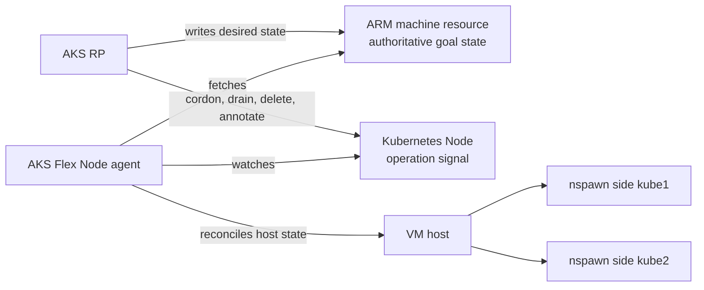
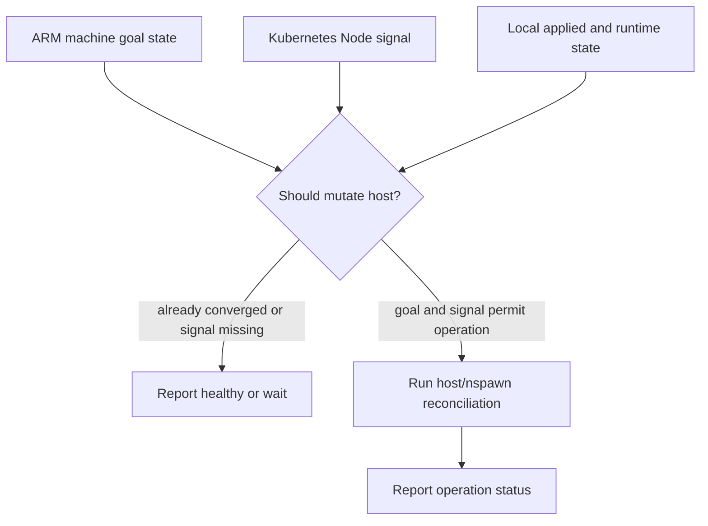
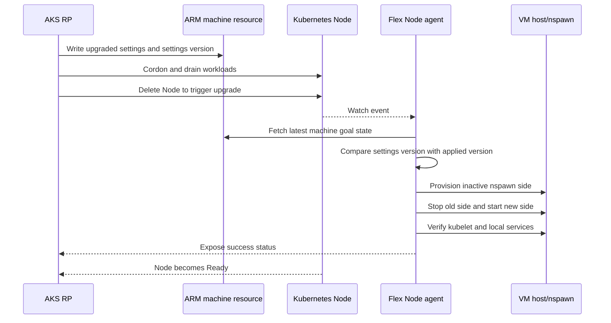
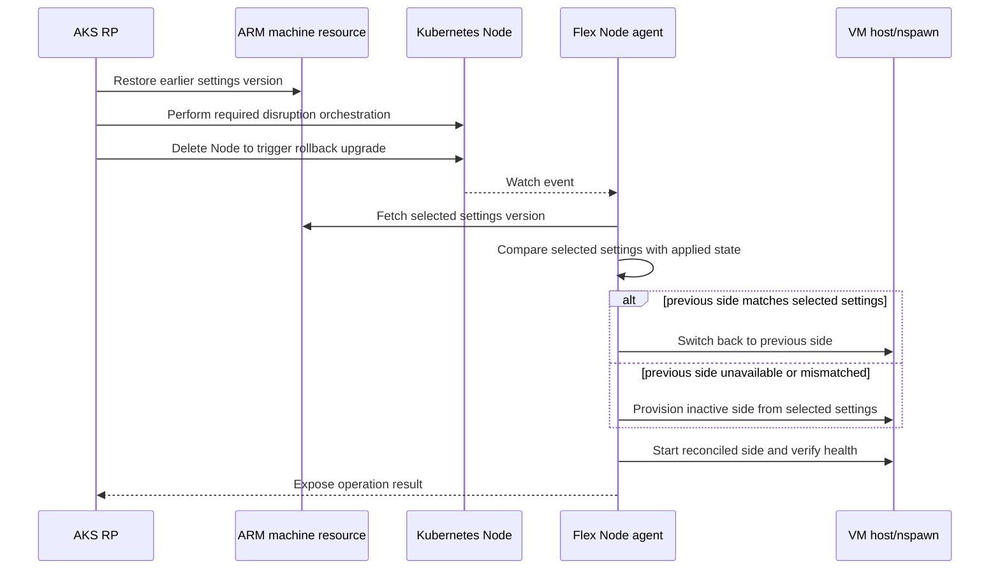
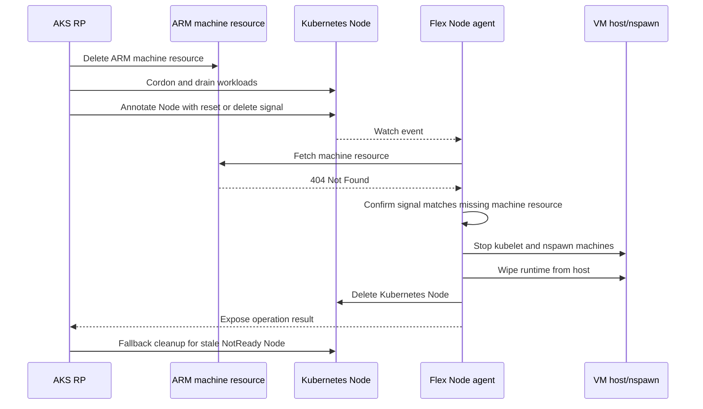
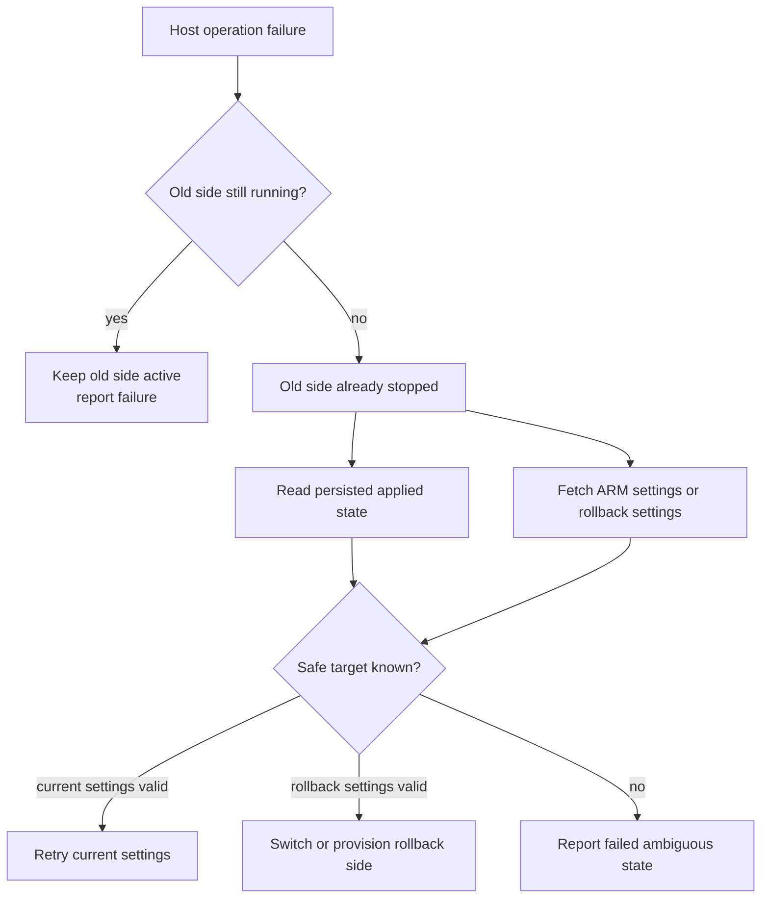

# AKS RP And Flex Node Agent Interaction

This document describes the intended interaction model between AKS RP and the AKS Flex Node agent for node lifecycle operations such as upgrade, reset, and deletion. Reimage and rollback are treated as upgrade modes because they are driven by the ARM machine settings version.

## Overview

AKS RP owns the AKS control-plane decision making for a Flex Node. The AKS Flex Node agent owns local host and nspawn reconciliation on the VM.

The key contract between them is an AKS RP-exposed ARM machine resource. The ARM machine resource acts as the authoritative goal state for one AKS Flex Node instance. It serves the same conceptual purpose as the Machine custom resource used by unbounded-agent, but is exposed through ARM and owned by AKS RP.

AKS RP creates the ARM machine resource before host bootstrap and returns the accepted bootstrap settings to the user. The user runs those bootstrap settings on the host, and after the node joins the cluster the agent continuously reconciles local host/nspawn state from the ARM machine settings version and the Kubernetes `Node` signal for this instance.

Lifecycle operations use these signals:

- Upgrade: AKS RP updates the ARM machine settings, cordons and drains the node, then deletes the Kubernetes `Node` object. The agent observes the node deletion or re-read 404, fetches the ARM machine, and applies the target settings.
- Reimage: treated as an upgrade mode where the target ARM settings require fresh local provisioning.
- Rollback: treated as an upgrade mode where AKS RP resets the ARM machine settings to a previous value.
- Reset/delete: AKS RP deletes the ARM machine, cordons and drains the node, then annotates the node. The agent confirms the ARM machine returns 404, wipes host runtime, and deletes the Kubernetes `Node` object.

AKS RP determines upgrade completion from ARM machine status and `observedSettingsVersion`. For reset/delete, Kubernetes `Node` deletion is the primary completion signal, with AKS RP fallback cleanup for stale, NotReady nodes.

At runtime, the Flex Node agent maintains two main authenticated connections:

- ARM machine resource fetch: reads the latest desired machine goal state from AKS RP.
- Kubernetes Node watch: observes the Kubernetes `Node` object that corresponds to this Flex Node instance.

AKS RP mutates the ARM machine resource and the Kubernetes `Node` object to trigger node-level operations. The Flex Node agent responds by reconciling local host and nspawn state.



## Ownership

AKS RP owns:

- Producing the ARM machine goal state.
- Deciding when a node operation should happen.
- Cordon and drain for workload disruption control.
- Kubernetes `Node` deletion or annotation used to signal operations.
- Fallback cleanup for stale, NotReady Kubernetes `Node` objects.
- Observing operation completion through node readiness and ARM machine status.

The Flex Node agent owns:

- Fetching and validating the ARM machine goal state.
- Watching the corresponding Kubernetes `Node` object.
- Translating goal state and node events into local host/nspawn actions.
- Provisioning, starting, stopping, and cleaning up nspawn machine sides.
- Deleting the Kubernetes `Node` object during reset/delete after host cleanup.
- Reporting local operation status and failures.
- Preserving enough local state to recover or roll back safely.

The agent should not own Kubernetes workload disruption. Cordon and drain belong to AKS RP because AKS RP has the broader cluster context needed to decide when disruption is safe.

## ARM Machine Creation And Bootstrap

AKS RP creates the ARM machine resource as part of the user-facing create flow and returns the accepted bootstrap settings to the user. This makes the ARM machine resource the saved goal state before any host mutation starts.

The creation order is:

1. The user requests Flex Node creation from AKS RP.
2. AKS RP creates the ARM machine resource and returns the accepted bootstrap settings to the user.
3. The user runs the bootstrap settings on the target host.
4. The agent bootstraps the host and prepares the local nspawn-backed Kubernetes node from those settings.
5. The node joins the AKS cluster and the Kubernetes `Node` object exists.
6. The agent fetches the ARM machine resource, validates that it belongs to this Flex Node instance, and persists the accepted ARM machine settings locally.
7. The agent starts its runtime control loops for ARM machine fetch/status patch and Kubernetes `Node` watch.

Creating the ARM machine before host bootstrap ensures a failed or interrupted bootstrap still has a durable goal state for retry and reconciliation.

ARM machine creation must be idempotent. If AKS RP retries creation and the ARM machine resource already exists, AKS RP should return the existing accepted bootstrap settings when they match the requested Flex Node instance. The agent should treat the existing ARM machine resource as the source of truth, persist the accepted settings, and continue.

## Control Loops

The Flex Node agent reconciles two external signals.

The ARM machine resource provides desired settings and a version for those settings. The current minimal settings are desired Kubernetes version and settings version. The agent compares the settings version from ARM with its locally applied settings version to detect drift. Future schema extensions can add more settings, but the agent should treat the ARM machine resource as the source of truth for host/nspawn reconciliation.

The ARM machine resource does not own the nspawn side. Selecting `kube1` or `kube2` is an internal host implementation detail used by the agent to apply settings atomically.

The Kubernetes `Node` object provides operation signals and cluster-visible node state. AKS RP can delete or annotate the node to request operations such as upgrade or reset after it has completed any required cordon and drain work. The agent watch is scoped to its own node object, so node deletion is observed as the watched object disappearing, including a 404 when the agent re-reads the node.

The agent combines both inputs before making host changes. A Kubernetes node event can indicate that an operation is allowed to proceed, while the ARM machine resource supplies the desired target state for that operation.



## Normal Operation Flow

1. After node bootstrap, the ARM machine resource exists for a Flex Node instance.
2. The Flex Node agent authenticates to ARM and fetches the machine resource.
3. The agent persists the latest accepted goal state locally.
4. The agent watches the Kubernetes `Node` object for this Flex Node instance.
5. On startup and watch reconnect, the agent re-reads the Kubernetes `Node` object so a missed upgrade deletion is observed as a 404.
6. The agent compares ARM desired state, Kubernetes node signals, and local host/nspawn state.
7. If local state already matches the goal state, the agent reports healthy status and takes no host-mutating action.
8. If reconciliation is needed and the Kubernetes signal allows it, the agent performs the required host/nspawn operation.
9. The agent updates local status and exposes operation result for AKS RP observation.

## Upgrade Flow



1. AKS RP decides that a Flex Node should upgrade.
2. AKS RP updates the ARM machine resource with the target machine settings, including the desired Kubernetes version and settings version.
3. AKS RP cordons and drains the Kubernetes node.
4. AKS RP deletes the Kubernetes `Node` object to signal that the node-level operation may proceed.
5. The Flex Node agent observes the node deletion event and fetches the latest ARM machine goal state.
6. The agent compares the ARM settings version with its locally applied settings version to confirm drift.
7. The agent provisions the inactive nspawn side using the ARM machine goal state.
8. The agent applies AKS-specific rootfs customization, such as node-problem-detector, the `aks-flex-node` binary, and CNI configuration.
9. The agent stops the old nspawn side and starts the newly provisioned side.
10. The agent waits for kubelet and required local services to become healthy.
11. The agent marks the new side as the active applied state and reports success.
12. AKS RP observes the node becoming Ready and completes any RP-side operation bookkeeping.

Reimage is a subset of upgrade. AKS RP expresses the target through the ARM machine resource settings version. The agent derives whether it can reuse existing local artifacts or must provision from a fresh image by comparing the new ARM machine settings with the locally applied settings. The nspawn side used to stage the change remains an internal agent choice.

Rollback is also a subset of upgrade. AKS RP owns the rollback trigger. To roll back, AKS RP resets the ARM machine settings to a previous settings value, and the agent applies that settings version through the same blue/green nspawn flow used for forward upgrades.



1. AKS RP determines that rollback is required or allowed.
2. AKS RP updates the ARM machine resource by resetting it to a previous settings value.
3. AKS RP performs any required Kubernetes disruption orchestration.
4. AKS RP deletes the Kubernetes `Node` object to signal that the operation may proceed.
5. The Flex Node agent observes the node deletion event, fetches the latest ARM machine resource, and compares the selected settings version with local applied state.
6. If the previous side is still available and matches the selected settings version, the agent can switch back to it.
7. If the previous side is not available or does not match the selected settings, the agent provisions the inactive side from the selected settings.
8. The agent starts the reconciled side, verifies kubelet health, and records the applied state.
9. AKS RP observes the recovered node state and completes rollback bookkeeping.

The ARM machine resource is what makes rollback deterministic. The agent should not infer rollback settings only from runtime `machinectl` state.

## Reset And Delete Flow



1. AKS RP deletes the ARM machine resource. This is usually triggered by an AKS user operation.
2. AKS RP cordons and drains the corresponding Kubernetes node.
3. AKS RP annotates the Kubernetes `Node` with a reset or delete signal.
4. The Flex Node agent detects the node signal and fetches the ARM machine resource.
5. The ARM fetch returns 404 Not Found.
6. The agent confirms that the node signal and missing ARM machine resource agree.
7. The agent performs the host reset flow and wipes node runtime from the host.
8. The agent deletes the Kubernetes `Node` object.
9. The agent exposes terminal local status for AKS RP observation.
10. AKS RP runs a fallback cleaner for stale, NotReady node objects if the agent cannot delete the node.

The reset/delete host flow removes the local runtime that made the VM participate as this AKS node. Reset should clear all previous installed node state and artifacts from the host.

AKS RP owns fallback cleanup for stale, NotReady Kubernetes nodes. This is an AKS RP implementation detail, but it should be delayed enough to avoid racing a healthy but slow Flex Node agent. The fallback cleaner should only act when control-plane state indicates the agent did not complete the expected node deletion or reconciliation. AKS RP can then retry the control-plane signal, rewire the node or machine state, or remove stale NotReady node objects according to RP policy.

## State And Idempotency

The agent should persist the last accepted ARM machine goal state and the last successfully applied machine state. This persisted state is required for safe recovery after agent restart, VM reboot, or partial host operation failure.

Host-mutating operations must be idempotent. Reprocessing the same ARM machine settings version or Kubernetes node event should not perform a second destructive operation once the local state already matches the desired state.

The ARM machine resource should include a settings version so the agent can distinguish new desired settings from a repeated observation of the same desired state.

Previous known-good settings are stored locally on the host, not in the ARM machine resource. The exact persistence path is an agent implementation detail, but it should be a well-known host location with checksum verification so the agent can detect corruption before using the data for recovery.

The agent should continue using a single host-operation guard so upgrade, upgrade rollback, reset/delete cleanup, health repair, and other nspawn-mutating operations cannot run concurrently.

## Failure Handling

If ARM machine fetch fails, the agent should not start a new host-mutating operation. It can continue reporting current local status and retry fetching goal state.

If the Kubernetes watch fails, the agent should reconnect before executing operations that require AKS RP's node-level signal. The ARM machine resource alone provides desired state, but the node deletion or annotation determines whether AKS RP has completed Kubernetes-side orchestration. For upgrade, the watch is scoped to the node object, so the agent should also handle the re-read returning 404 as the deletion signal.

The agent must not depend only on receiving a live watch deletion event. On daemon startup and after watch reconnect, it should explicitly read the scoped Kubernetes `Node`; a 404 from that read is equivalent to observing the upgrade deletion trigger.

If the ARM machine resource is missing but the reset/delete node annotation is not present, the agent should wait and avoid wiping host runtime. AKS RP is responsible for retrying or rewiring the control-plane state so the node annotation and ARM machine state converge.

If provisioning the inactive side fails, the agent should keep the current active side running and report failure.

If failure happens after the old side is stopped, the agent should use the persisted applied state and ARM machine rollback settings to decide whether to retry the new settings or roll back to the previous settings.

If local state is ambiguous, such as both nspawn sides running or both stopped, the agent should prefer persisted applied state and ARM goal state over runtime discovery alone.



## Operation Signals

AKS RP uses Kubernetes `Node` deletion events and annotations as authoritative operation triggers.

For upgrade operations, AKS RP deletes the Kubernetes `Node` after updating the ARM machine resource and completing required cordon/drain work. The node deletion is the operation trigger. The Flex Node agent then fetches the ARM machine resource and uses it as the upgrade goal state.

For reset/delete operations, AKS RP annotates the node with a reset or delete signal after deleting the ARM machine resource. The Flex Node agent confirms the ARM machine resource returns 404 Not Found before wiping host runtime and deleting the Kubernetes `Node` object.

## Status Reporting

The Flex Node agent reports operation status by patching the ARM machine resource status. Status updates should cover in-progress, succeeded, failed, and rollback-applied upgrade states.

AKS RP determines upgrade operation completion from ARM machine status and `observedSettingsVersion`. The operation is complete when machine status reports success for the settings version AKS RP requested.

If the ARM machine resource has been deleted during reset/delete, the agent cannot patch machine status. In that case, successful Kubernetes `Node` deletion is the primary completion signal, with AKS RP fallback cleanup for stale, NotReady nodes.

## Authentication

The Flex Node agent requires credentials for two APIs.

For ARM, the agent uses pre-configured credentials retrieved from AKS RP during the user-facing create flow. The bootstrap credential delivery and rotation mechanism follows the bootstrap authentication design described in the broader project docs and is out of scope for this interaction document. The credential must allow reading the machine goal state and patching machine status for the specific Flex Node instance. The agent should not start host-mutating operations if it cannot authenticate to ARM or cannot fetch the machine resource, except for reset/delete where a 404 Not Found is part of the expected confirmation path.

For the Kubernetes API server, the agent should not rely on the kubelet kubeconfig for lifecycle operations. A standard kubelet identity is authorized for kubelet-scoped node behavior and should not be assumed to have permission to delete `Node` objects.

The agent needs a separate Kubernetes credential or explicitly granted RBAC for its lifecycle API calls. That credential must allow watching the corresponding node, reading operation annotations, and deleting that node during reset/delete. Workload disruption remains owned by AKS RP; the agent does not require permission to cordon or drain.

## Appendix: Minimal ARM Machine Model

The initial ARM machine model can stay minimal. It only needs desired Kubernetes version, settings version, and status.

```json
{
  "properties": {
    "settings": {
      "kubernetesVersion": "1.34.0",
      "settingsVersion": "42"
    },
    "status": {
      "phase": "Succeeded",
      "observedSettingsVersion": "42",
      "message": ""
    }
  }
}
```

The `settingsVersion` is the drift key. The agent compares it with the locally applied settings version before reconciling host state. Kubernetes `Node` deletion is the upgrade trigger; the ARM machine resource supplies the target settings.

Previous known-good settings are persisted locally on the host so rollback does not require ARM to carry historical settings.

## Appendix: AKS RP Implementation Details

- Define the exact allowed ARM machine `status.phase` values and required status fields, such as reason, message, and last transition time.
