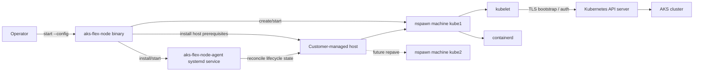

# AKS Flex Node Design

AKS Flex Node extends Azure Kubernetes Service (AKS) to customer-managed virtual machines and bare metal hosts. It is built on top of [Azure Unbounded](https://github.com/Azure/unbounded), using host-side nspawn machines to run isolated Kubernetes worker environments that can join an existing AKS cluster.

## Goals

- Join customer-managed hosts to AKS as worker nodes.
- Keep host mutation explicit, root-owned, and idempotent.
- Isolate Kubernetes node runtime inside local nspawn machines.
- Support multiple authentication modes for different deployment environments.
- Enable future AKS-managed lifecycle operations such as upgrade, repair, reset, reimage, and rollback.

## Architecture



## Host Model

The host runs the `aks-flex-node` binary as root because the agent installs packages, writes system configuration, manages systemd units, configures nspawn machines, and starts Kubernetes runtime services. Host-side commands mutate system state and should be treated as privileged operations.

Current host-side responsibilities include:

- Install and configure OS prerequisites.
- Prepare nspawn workspace under `/var/lib/machines`.
- Download and install Kubernetes, CRI, CNI, runc, containerd, and node-problem-detector artifacts.
- Render containerd, kubelet, CNI, and systemd configuration.
- Start the active nspawn-backed worker.
- Install and start `aks-flex-node-agent.service`.

The Kubernetes worker runs inside an nspawn machine. The initial machine is `kube1`; lifecycle repave flows use `kube1` and `kube2` as blue-green sides.

## Unbounded Integration

AKS Flex Node builds on the host-side agent model from Azure Unbounded. The [Unbounded agent guide](https://unbounded-cloud.io/guides/agent/) describes the underlying pattern for running Kubernetes node environments in systemd-nspawn machines and reconciling host-local machine state.

AKS Flex Node reuses that foundation for:

- Resolving machine goal state into an nspawn worker environment.
- Preparing rootfs content and node runtime assets.
- Managing blue-green nspawn sides for future repave operations.
- Applying host-local reconciliation patterns around persisted state and idempotent mutation.

AKS Flex Node owns the AKS-specific layer on top:

- AKS cluster authentication and join configuration.
- AKS-specific kubelet, CNI, node-problem-detector, and runtime customization.
- Flex Node config and CLI commands.
- Future AKS RP lifecycle integration through ARM machine state and Kubernetes `Node` signals.

## Command Model

The primary command is:

```bash
aks-flex-node start --config /etc/aks-flex-node/config.json
```

`start` performs host bootstrap and installs the long-running systemd service. `bootstrap` remains an alias for compatibility, but new docs should use `start`.

Other important commands:

| Command | Purpose |
|---------|---------|
| `daemon` / `agent` | Run the long-lived daemon. Intended to be launched by systemd. |
| `reset` / `unbootstrap` | Remove local Flex Node runtime from the host. |
| `version` | Print build version, commit, and build time. |
| `token kubelogin` | Exec credential helper used by kubelet auth flows. |

## Configuration Model

The agent reads a JSON config file. The config has these top-level sections:

- `azure` - subscription, target AKS cluster, cloud, and authentication mode.
- `agent` - logging, node name, daemon reconcile interval, and test-mode settings.
- `kubernetes` - Kubernetes version to install.
- `node` - kubelet, labels, taints, max pods, and node IP settings.
- `containerd`, `runc`, `cni`, `npd` - optional component version overrides.

Exactly one authentication mode must be configured:

- Kubernetes bootstrap token.
- Azure managed identity.
- Azure Arc.
- Service principal.

See [Configuration](usages/configuration.md) for the option reference and sample configs.

## Join Flows

### Bootstrap Token

Bootstrap token mode uses Kubernetes TLS bootstrapping. A short-lived Kubernetes bootstrap token and RBAC bindings are created in the target AKS cluster. The host config includes the token, API server URL, and cluster CA data. After the kubelet joins, it uses its issued client certificate for ongoing Kubernetes API access.

This is the shortest validated path and is documented in the [README](../README.md#getting-started).

### Managed Identity

Managed identity mode is intended for Azure VMs with system-assigned or user-assigned managed identity. The host uses Azure identity to retrieve or use the cluster connection details needed by kubelet.

### Azure Arc

Arc mode registers the host as an Arc-enabled server and uses Arc-managed identity for Azure integration. This path adds Azure Arc dependencies and requires Arc onboarding permissions.

### Service Principal

Service principal mode uses static Azure application credentials. It is simple to automate but requires careful secret storage and rotation.

## Runtime And Daemon

After `start`, the host runs `aks-flex-node-agent.service`.

The daemon is responsible for fetching desired machine goal state and reconciling it with local applied state and Kubernetes `Node` signals. The production AKS RP API integration is still in progress; current development and E2E flows use a local file-backed machine client for that desired state.

The agent does not own workload disruption decisions. Cordon and drain are AKS/RP responsibilities because they require cluster-wide scheduling context.

## Lifecycle And Repave

AKS Flex Node uses a blue-green nspawn model for lifecycle operations.

- `kube1` is the initial active side.
- `kube2` is used as the alternate side for repave.
- Active side selection comes from persisted daemon state, not live `machinectl` discovery alone.
- The agent provisions the inactive side, applies AKS-specific customization, stops the old side, starts the new side, verifies kubelet health, and then persists the new applied state.

The current repave path is driven by machine goal state and Kubernetes `Node` deletion. Future production flows are intended to be driven by AKS RP through an ARM machine resource and Kubernetes `Node` operation signals.

See [AKS RP And Flex Node Agent Interaction](design/agent-and-aks.md) for the detailed lifecycle contract.

## State And Idempotency

The agent persists local daemon state so it can recover after restart, reboot, or partial failure. Persisted state includes the applied Kubernetes/settings version and active nspawn machine side.

The current state model separates desired state, applied state, and runtime discovery:

| State | Owner | Purpose |
|-------|-------|---------|
| Desired machine goal | AKS RP API or local file-backed client | Target Kubernetes version and settings version for the Flex Node. |
| Applied daemon state | Local host | Last successfully applied goal and active nspawn side. |
| Runtime machine state | systemd/machinectl | Current process and nspawn machine status for inspection and service control. |

Applied daemon state is the source of truth for blue-green side selection. Runtime `machinectl` state is useful for diagnostics, but the agent should not guess upgrade or rollback targets from runtime discovery alone.

Applied daemon state is persisted on the host as JSON:

| Path | Mode | Purpose |
|------|------|---------|
| `/etc/aks-flex-node/daemon-state.json` | `0600` | Last safely applied settings and active nspawn side. |
| `/etc/aks-flex-node/daemon-state.json.sha256` | `0600` | Checksum used to detect state corruption before loading. |

The exact state schema is an implementation detail and may evolve. On load, the agent verifies the checksum before trusting the state file. If the file is missing, corrupt, or cannot identify a safe active side, the agent should avoid guessing a safe repave target from runtime state alone.

Reset and uninstall flows remove local Flex Node runtime state, including nspawn machine artifacts, service configuration, and agent-managed runtime directories. Cluster-side `Node` cleanup is a separate Kubernetes operation unless it is driven by an AKS RP lifecycle signal.

Design principles:

- Re-running host setup should converge rather than duplicate work.
- Reprocessing the same desired machine settings should not perform destructive work if local state already matches.
- Runtime `machinectl` state is useful for inspection but not the sole source of truth for repave decisions.
- Host-mutating lifecycle operations should be serialized by a single operation guard.

## Authentication Modes

AKS Flex Node supports one authentication mode per config. The selected mode determines how the host obtains the credentials or bootstrap material needed to join the AKS cluster.

| Mode | Config Field | Primary Use Case | Credential Boundary |
|------|--------------|------------------|---------------------|
| Bootstrap token | `azure.bootstrapToken` | Short-lived Kubernetes TLS bootstrap path. | Host receives a temporary Kubernetes bootstrap token, then kubelet uses issued client certificates. |
| Managed identity | `azure.managedIdentity` | Azure VM with assigned managed identity. | Host uses Azure Instance Metadata Service for identity-backed Azure access. |
| Azure Arc | `azure.arc.enabled: true` | Host registered as an Arc-enabled server. | Host uses Arc-managed identity after Arc registration. |
| Service principal | `azure.servicePrincipal` | Automation with static Azure application credentials. | Host stores client credentials and requires secret rotation. |

Only one of these modes can be configured at a time. Bootstrap token mode requires the config to include the Kubernetes API server URL and CA data because the host does not use Azure credentials to fetch cluster connection details during join.

Auth mode selection affects only how the node obtains join and API credentials. Host lifecycle mutation remains local and privileged, and AKS/RP remains responsible for workload disruption decisions such as cordon and drain.

## Detailed Design Topics

- [AKS RP And Flex Node Agent Interaction](design/agent-and-aks.md) - AKS RP contract, lifecycle signals, nspawn repave flow, status reporting, and failure handling.

## References

- [Azure Unbounded](https://github.com/Azure/unbounded)
- [Azure Arc-enabled servers](https://learn.microsoft.com/azure/azure-arc/servers/overview)
- [Kubernetes TLS bootstrapping](https://kubernetes.io/docs/reference/access-authn-authz/kubelet-tls-bootstrapping/)
- [Kubernetes Node API](https://kubernetes.io/docs/reference/kubernetes-api/cluster-resources/node-v1/)
- [containerd](https://containerd.io/)
- [runc](https://github.com/opencontainers/runc)
- [CNI Specification](https://github.com/containernetworking/cni)
