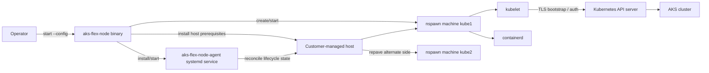

# AKS Flex Node design

AKS Flex Node extends Azure Kubernetes Service (AKS) to customer-managed virtual machines and bare metal hosts. It builds on [Project Unbounded](https://github.com/Azure/unbounded) and uses host-side systemd-nspawn machines to run isolated Kubernetes worker environments.

> [!NOTE]
> **Status:** This document describes the current implementation. The detailed lifecycle design identifies proposed behavior and remaining limitations separately.

## Goals

- Join customer-managed hosts to AKS as worker nodes.
- Keep host mutation explicit, root-owned, and idempotent.
- Isolate Kubernetes node runtime inside local nspawn machines.
- Support multiple authentication modes for different deployment environments.
- Reconcile current upgrade, restart, reset, and repave operations while keeping cluster-wide disruption decisions outside the host agent.

## Architecture


```mermaid
flowchart LR
    Operator[Operator]
    AKS[AKS cluster]
    API[Kubernetes API server]
    Host[Customer-managed host]
    Agent[aks-flex-node binary]
    Service[aks-flex-node-agent systemd service]
    Kube1[nspawn machine kube1]
    Kube2[nspawn machine kube2]
    Kubelet[kubelet]
    Containerd[containerd]

    Operator -->|start --config| Agent
    Agent -->|install host prerequisites| Host
    Agent -->|create/start| Kube1
    Agent -->|install/start| Service
    Service -->|reconcile lifecycle state| Host
    Host --> Kube1
    Host -->|repave alternate side| Kube2
    Kube1 --> Kubelet
    Kube1 --> Containerd
    Kubelet -->|TLS bootstrap / auth| API
    API --> AKS
```

## Host model

The host runs the `aks-flex-node` binary as root because the agent installs packages, writes system configuration, manages systemd units, configures nspawn machines, and starts Kubernetes runtime services. Host-side commands mutate system state and should be treated as privileged operations.

Current host-side responsibilities include:

- Install and configure OS prerequisites.
- Prepare nspawn workspace under `/var/lib/machines`.
- Download and install Kubernetes, CRI, CNI, runc, containerd, and node-problem-detector artifacts.
- Render containerd, kubelet, CNI, and systemd configuration.
- Start the active nspawn-backed worker.
- Install and start `aks-flex-node-agent.service`.

The Kubernetes worker runs inside an nspawn machine. The initial machine is `kube1`; lifecycle repave alternates between `kube1` and `kube2`.

## Unbounded integration

AKS Flex Node builds on the host-side agent model from Azure Unbounded. The [Unbounded agent guide](https://unbounded-cloud.io/guides/agent/) describes the underlying pattern for running Kubernetes node environments in systemd-nspawn machines and reconciling host-local machine state.

AKS Flex Node reuses that foundation for:

- Resolving machine goal state into an nspawn worker environment.
- Preparing rootfs content and node runtime assets.
- Managing `kube1` and `kube2` as alternating nspawn sides during repave.
- Applying host-local reconciliation patterns around persisted state and idempotent mutation.

AKS Flex Node owns the AKS-specific layer on top:

- AKS cluster authentication and join configuration.
- AKS-specific kubelet, node-problem-detector, and runtime customization, plus CNI version wiring for the cluster CNI.
- Flex Node config and CLI commands.
- AKS resource provider integration through Azure Machine goal state and Kubernetes `Node` signals.

## Command model

The primary command is:

```bash
aks-flex-node start --config /etc/aks-flex-node/config.json
```

`start` performs host bootstrap and installs the long-running systemd service. `bootstrap` remains an alias for compatibility, but new docs should use `start`.

Other commands include the non-mutating `preflight` check, protected bootstrap-data retrieval, reset, version reporting, and service integration commands. Some lifecycle commands are hidden from top-level help because systemd or a managed workflow invokes them rather than an operator.

See the [Command-line Reference](usages/cli.md) for commands, flags, compatibility aliases, and the operator versus internal command boundary.

## Configuration model

The agent reads a JSON config file with these top-level sections:

- `azure` - subscription, target AKS cluster and pool, cloud endpoint, and authentication settings.
- `agent` - logging, node name, Machine backend, reconciliation interval, registration policy, and MachineOperation mode.
- `components` - Kubernetes, containerd, runc, sandbox image, and Gantry settings.
- `bootstrap` - rootfs image, offline artifacts, host devices, mounts, and required services.
- `hostRouting` - optional static IPv4 routes and route-overlap checks.
- `networking` - DNS service IP, CNI version, and AKS LocalDNS profile.
- `node` - kubelet settings, labels, taints, maximum pods, and node IP.
- `npd` - Node Problem Detector version.

At most one durable Azure authentication mode must be configured: managed identity, Azure Arc, or service principal. A Kubernetes bootstrap token can be combined with that identity for kubelet TLS bootstrap; Arc requires bootstrap data fetched from AKS RP.

See [Configuration](usages/configuration.md) for the option reference and sample configs.

## Join flows

### Bootstrap Token

Kubernetes bootstrap data contains a short-lived token, API server address, and cluster CA. Kubelet and the daemon use it to request separate client certificates. After issuance, they use those certificates for ongoing Kubernetes API access.

A bootstrap-token-only configuration is available for repository evaluation, but it doesn't provide durable Azure authentication and Machine registration is best effort by default.

### Managed Identity

Managed identity is intended for Azure VMs with a system-assigned or user-assigned identity. The identity authenticates Machine registration, desired-state reads, and runtime bootstrap-data refresh without storing an Azure secret on the host.

### Azure Arc

Arc mode uses the system-assigned identity of an already connected Arc-enabled server. The operator owns Arc installation, onboarding, role assignment, and removal. Flex Node verifies the local connection and uses HIMDS for Azure authentication and bootstrap-data refresh.

### Service Principal

Service principal mode supports hosts that can't use managed identity. Prefer a certificate in a protected root-owned file over a long-lived client secret. The operator owns secure delivery, rotation, and removal.

## Runtime and daemon

After `start`, the host runs `aks-flex-node-agent.service`.

The daemon fetches desired machine goal state, compares it with locally applied state, and observes Kubernetes `Node` signals. Direct ARM is the default machine backend and supports Machine create, update, and read operations. Direct ARM status updates are currently skipped. The in-cluster service-proxy backend is available for development and E2E environments.

The agent does not own workload disruption decisions. Cordon and drain are AKS/RP responsibilities because they require cluster-wide scheduling context.

## Lifecycle and repave

AKS Flex Node uses two alternating nspawn sides for lifecycle operations. This layout supports controlled replacement, but the current repave sequence isn't zero-downtime because it stops the active side before provisioning the alternate side.

- `kube1` is the initial active side.
- `kube2` is used as the alternate side for repave.
- Active side selection comes from persisted daemon state, not live `machinectl` discovery alone.
- The agent resolves the new goal, stops the active side, cleans network state, provisions and configures the alternate side, starts it, verifies kubelet health, persists the new applied state, and cleans up the old side. The current sequence doesn't keep the old worker running while the replacement is provisioned.

The implemented repave path requires both a changed Machine settings version and deletion of the Kubernetes `Node`. AKS owns workload disruption and updates the Machine goal before deleting the Node. The agent then provisions the alternate nspawn side and applies the new goal. Automatic rollback after the old side has stopped isn't implemented.

See [AKS RP And Flex Node Agent Interaction](design/agent-and-aks.md) for the detailed lifecycle contract.

## State and idempotency

The agent persists local daemon state so it can recover after restart, reboot, or partial failure. Persisted state includes the applied Kubernetes/settings version and active nspawn machine side.

The current state model separates desired state, applied state, and runtime discovery:

| State | Owner | Purpose |
|-------|-------|---------|
| Desired machine goal | AKS ARM Machine API, or the in-cluster development endpoint | Target Kubernetes version and settings version for the Flex Node. |
| Applied daemon state | Local host | Last successfully applied goal and active nspawn side. |
| Runtime machine state | systemd/machinectl | Current process and nspawn machine status for inspection and service control. |

Applied daemon state is the source of truth for active and alternate side selection. Runtime `machinectl` state is useful for diagnostics, but the agent should not guess upgrade or rollback targets from runtime discovery alone.

Applied daemon state is persisted on the host as JSON:

| Path | Mode | Purpose |
|------|------|---------|
| `/etc/aks-flex-node/daemon-state.json` | `0600` | Last safely applied settings and active nspawn side. |
| `/etc/aks-flex-node/daemon-state.json.sha256` | `0600` | Checksum used to detect state corruption before loading. |

The exact state schema is an implementation detail and may evolve. On load, the agent verifies the checksum before trusting the state file. If the file is missing, corrupt, or cannot identify a safe active side, the agent should avoid guessing a safe repave target from runtime state alone.

Reset and uninstall flows remove local Flex Node runtime state, including nspawn machine artifacts, service configuration, and agent-managed runtime directories. Cluster-side `Node` cleanup is a separate Kubernetes operation unless it is driven by an AKS RP lifecycle signal.

Design principles:

- Re-running host setup should converge rather than duplicate work.
- Reprocessing the same desired machine settings should not perform destructive work if local state already matches.
- Runtime `machinectl` state is useful for inspection but not the sole source of truth for repave decisions.
- Host-mutating lifecycle operations should be serialized by a single operation guard.

## Authentication modes

AKS Flex Node uses separate Azure and Kubernetes credentials.

| Credential | Config field | Purpose |
|------|--------------|---------------------|
| Azure VM managed identity | `azure.managedIdentity` | Authenticate the host to Azure through the Instance Metadata Service. |
| Azure Arc managed identity | `azure.arc.enabled: true` | Authenticate an Arc-enabled server to Azure through local HIMDS. |
| Service principal | `azure.servicePrincipal` | Authenticate a host that can't use managed identity. Prefer a protected certificate file. |
| Kubernetes bootstrap token | `azure.bootstrapToken` | Establish initial kubelet and daemon trust with the Kubernetes API server. |

Configure at most one durable Azure identity. The pool bootstrap-data response can add a short-lived Kubernetes bootstrap token, API server address, and CA data alongside that identity. After TLS bootstrap, kubelet and the daemon use issued certificates for Kubernetes API access.

A bootstrap-token-only config is available for repository evaluation flows, where Machine registration is best effort by default. The primary Azure Machine workflow requires a durable Azure identity. Authentication doesn't change lifecycle ownership: host mutation remains local and privileged, while AKS or the operator owns workload disruption such as cordon and drain.

## Detailed design topics

- [AKS RP And Flex Node Agent Interaction](design/agent-and-aks.md) - Implemented machine reconciliation, lifecycle signals, nspawn repave, and remaining API limitations.
- [In-Cluster Machine Flow](design/in-cluster-machine.md) - Development and E2E machine endpoint behavior.
- [Generated Bootstrap Script](design/storage-backed-bootstrap.md) - Bootstrap-data rendering, credential handling, and first-boot behavior.

## References

- [Azure Unbounded](https://github.com/Azure/unbounded)
- [Azure Arc-enabled servers](https://learn.microsoft.com/azure/azure-arc/servers/overview)
- [Kubernetes TLS bootstrapping](https://kubernetes.io/docs/reference/access-authn-authz/kubelet-tls-bootstrapping/)
- [Kubernetes Node API](https://kubernetes.io/docs/reference/kubernetes-api/cluster-resources/node-v1/)
- [containerd](https://containerd.io/)
- [runc](https://github.com/opencontainers/runc)
- [CNI Specification](https://github.com/containernetworking/cni)
