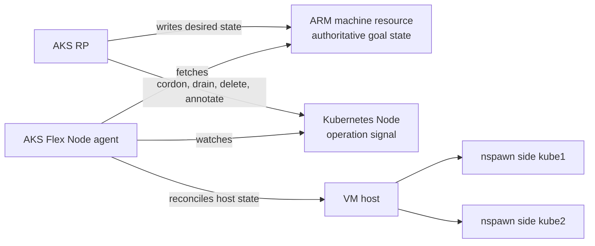
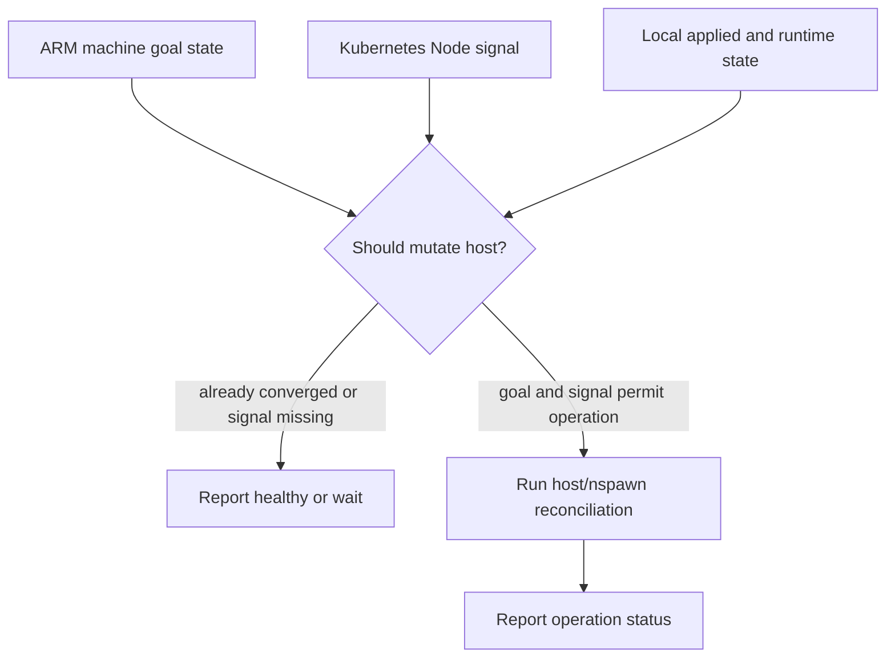
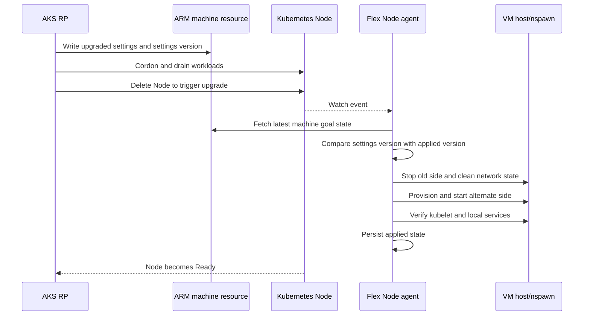
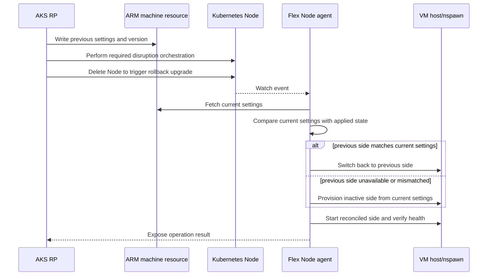
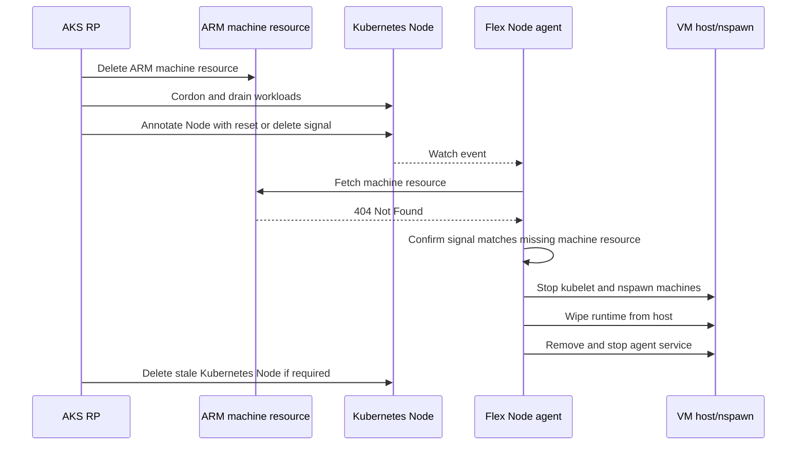
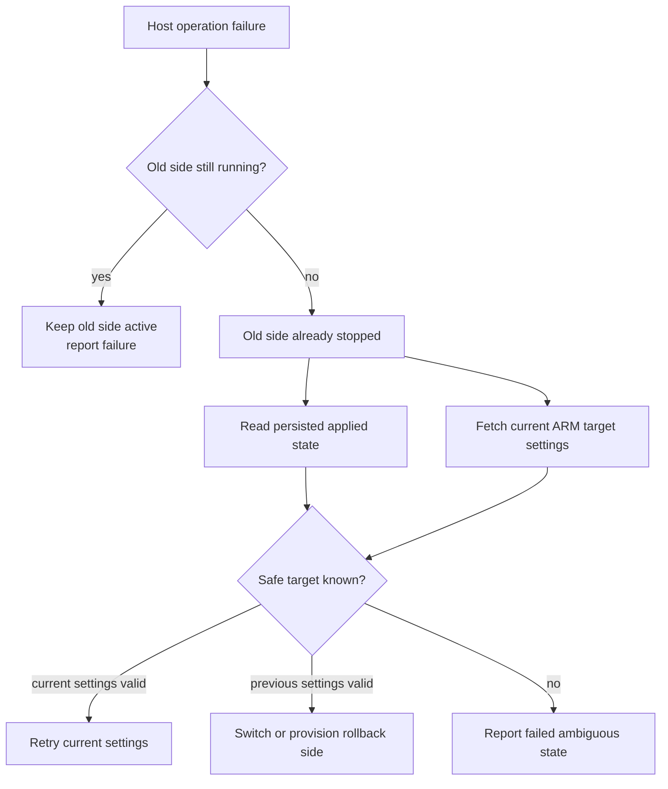

# AKS RP and Flex Node agent interaction

This document describes the current and intended interaction between the AKS resource provider (RP) and the AKS Flex Node agent for node lifecycle operations. Reimage and rollback use the same desired-state model as upgrade.

> [!IMPORTANT]
> **Status:** Partially implemented. Direct ARM Machine create and read, local desired-state reconciliation, nspawn repave, and selected Unbounded `MachineOperation` handlers are implemented. Direct ARM Machine status updates and automatic nspawn rollback aren't implemented. Sections that describe AKS RP orchestration are contract guidance unless identified as current agent behavior.

| Capability | Current state |
| --- | --- |
| Create or update an Azure Machine during bootstrap | Implemented through the direct ARM client. |
| Read desired Machine state | Implemented through direct ARM or the in-cluster development endpoint. |
| Patch Machine status through direct ARM | Not implemented; the current client logs and skips the update. |
| Repave after settings drift and Kubernetes Node deletion | Implemented. |
| Automatically restore the previous nspawn side after a failed repave | Not implemented. |
| Handle Unbounded `NodeReboot`, `AgentUpgrade`, and `AgentReset` operations | Implemented when the MachineOperation API is installed and handling isn't disabled. |
| Handle ARM-backed MachineOperations | Not implemented. |
| Delete the Kubernetes Node during reset | Not implemented by the agent; AKS RP owns Node cleanup after local reset. |

## Overview

AKS RP owns the AKS control-plane decision making for a Flex Node. The AKS Flex Node agent owns local host and nspawn reconciliation on the VM.

The key contract between them is an AKS RP-exposed ARM machine resource. The ARM machine resource acts as the authoritative goal state for one AKS Flex Node instance. It serves the same conceptual purpose as the Machine custom resource used by unbounded-agent, but is exposed through ARM and owned by AKS RP.

In the durable-identity flow, bootstrap obtains pool data and configures the host with an Azure identity. During `aks-flex-node start`, the agent ensures that the Azure Machine exists and that its Kubernetes version matches the local bootstrap goal. After the node joins, the daemon reads desired Machine state and combines it with the Kubernetes `Node` signal for this instance.

A bootstrap-token-only configuration remains available for standalone evaluation. Without a durable Azure identity, Machine registration is best effort and the agent can't continuously reconcile ARM Machine state.

Lifecycle operations use these signals:

- **Repave:** A changed Machine settings version supplies the new goal. After AKS or an operator deletes the Kubernetes `Node`, the agent applies that goal to the alternate nspawn side.
- **Node restart:** An Unbounded `NodeReboot` MachineOperation restarts the active nspawn worker.
- **Agent upgrade:** An Unbounded `AgentUpgrade` MachineOperation downloads and activates a candidate agent with host-binary rollback on activation failure.
- **Agent reset:** An Unbounded `AgentReset` MachineOperation removes local node runtime and then stops the daemon.
- **Delete signal:** A `kubernetes.azure.com/flex-node-deleting=true:NoSchedule` taint combined with a missing Azure Machine triggers local reset and daemon shutdown.

The intended AKS RP flow performs cordon and drain before it sends a destructive node signal. Direct ARM status patching isn't currently available, so AKS must not depend on agent-written Machine status for completion in the current implementation.

At runtime, the Flex Node agent maintains two main authenticated connections:

- ARM machine resource fetch: reads the latest desired machine goal state from AKS RP.
- Kubernetes Node watch: observes the Kubernetes `Node` object that corresponds to this Flex Node instance.

AKS RP mutates the ARM machine resource and the Kubernetes `Node` object to trigger node-level operations. The Flex Node agent responds by reconciling local host and nspawn state.



## Ownership

AKS RP owns:

- Producing the ARM machine goal state.
- Deciding when a node operation should happen.
- Cordon and drain for workload disruption control.
- Kubernetes `Node` deletion to approve repave, and the Flex-node deletion taint plus a missing ARM Machine to signal local reset.
- Fallback cleanup for stale, NotReady Kubernetes `Node` objects.
- Observing operation completion through Node readiness and available control-plane signals. A writable agent-to-ARM status contract remains future work.

The Flex Node agent owns:

- Fetching and validating the ARM machine goal state.
- Watching the corresponding Kubernetes `Node` object.
- Translating goal state and node events into local host/nspawn actions.
- Provisioning, starting, stopping, and cleaning up nspawn machine sides.
- Resetting local runtime and stopping the daemon after a confirmed delete signal.
- Reporting operation status where the selected backend supports status updates.
- Preserving applied-version and active-side state for safe restart and repave decisions.

The agent should not own Kubernetes workload disruption. Cordon and drain belong to AKS RP because AKS RP has the broader cluster context needed to decide when disruption is safe.

## ARM Machine creation and bootstrap

The current agent ensures the Azure Machine during `aks-flex-node start`, before host and nspawn mutation begins. Local bootstrap configuration is authoritative for this initial operation.

The implemented order is:

1. The operator creates the Flex node pool and obtains current bootstrap data.
2. The operator runs the bootstrap workflow on a host with an authorized Azure identity.
3. The agent builds a Machine goal from the local config.
4. The agent reads the Machine by cluster, pool, and normalized node name.
5. If the Machine is absent, the agent creates it. If its Kubernetes version differs, the agent updates it from the local bootstrap goal.
6. The agent adopts the returned Machine ETag as the settings-version baseline.
7. The agent prepares and starts the nspawn-backed Kubernetes worker.
8. After worker startup succeeds, the agent persists the initial daemon state.
9. The daemon starts its Machine polling and Kubernetes `Node` watch loops.

Machine creation and update are idempotent for an unchanged Kubernetes version. When `agent.requireMachineRegistration` is `true`, an unavailable or unauthorized Machine API fails bootstrap before host mutation. Bootstrap-token-only evaluation configs default this setting to `false`, so Machine registration failures are logged and bootstrap can continue.

## Control loops

The Flex Node agent reconciles two external signals.

The ARM machine resource provides desired settings and a version for those settings. The current minimal settings are desired Kubernetes version and settings version. The agent compares the settings version from ARM with its locally applied settings version to detect drift. Future schema extensions can add more settings, but the agent should treat the ARM machine resource as the source of truth for host/nspawn reconciliation.

The ARM machine resource does not own the nspawn side. Selecting `kube1` or `kube2` is an internal host implementation detail used by the agent to apply settings atomically.

The Kubernetes `Node` object provides operation signals and cluster-visible node state. AKS RP can delete or annotate the node to request operations such as upgrade or reset after it has completed any required cordon and drain work. The agent watch is scoped to its own node object, so node deletion is observed as the watched object disappearing, including a 404 when the agent re-reads the node.

The agent combines both inputs before making host changes. A Kubernetes node event can indicate that an operation is allowed to proceed, while the ARM machine resource supplies the desired target state for that operation.



## Normal operation flow

1. After node bootstrap, the ARM machine resource exists for a Flex Node instance.
2. The Flex Node agent authenticates to ARM and fetches the machine resource.
3. The agent persists the latest accepted goal state locally.
4. The agent watches the Kubernetes `Node` object for this Flex Node instance.
5. On startup and watch reconnect, the agent re-reads the Kubernetes `Node` object so a missed upgrade deletion is observed as a 404.
6. The agent compares ARM desired state, Kubernetes node signals, and local host/nspawn state.
7. If local state already matches the goal state, the agent takes no host-mutating action and attempts a success status update through the selected backend.
8. If reconciliation is needed and the Kubernetes signal allows it, the agent performs the required host/nspawn operation.
9. The agent persists successful local state and attempts a status update through the selected backend.

## Current repave implementation

AKS Flex Node no longer runs a standalone local drift detector. Desired node settings come from an AKS machine resource. The agent compares the desired machine goal with locally persisted daemon state and repaves the nspawn-backed worker when Kubernetes `Node` deletion indicates AKS has approved replacement.

The current machine goal comes from the ARM machine model:

- `properties.kubernetes` contains the desired Kubernetes version and node settings.
- `properties.eTag` is exposed internally as the settings version.

The ETag is the drift key. If it differs from the locally applied ETag, the agent waits for the Kubernetes `Node` object to disappear before mutating host state. Status-only updates must not change the ETag.

The daemon uses two inputs:

- Desired state from the AKS machine client.
- Applied state persisted locally by the daemon.

For E2E and dev-test clusters, the in-cluster AKS Flex Controller serves pre-created machine JSON from the `kube-system/aks-flex-machines` ConfigMap through the Kubernetes service proxy. E2E configs set `agent.machineClient.mode: "in-cluster"` and `agent.machineClient.endpointUrl` to the controller service-proxy path so the same daemon path reads machine state from the controller instead of a host-local test file.

The daemon reconciles machine state on startup and on `agent.machineReconcileInterval`.

Direct ARM is the default machine backend and supports Machine create, update, and read operations. The in-cluster controller remains a development and E2E backend that serves pre-created Machine state through the Kubernetes service proxy. Direct ARM status updates are currently a no-op because the Machine status surface is read-only to this client.

Repave requires both conditions:

- The machine goal differs from the locally applied daemon state.
- The Kubernetes `Node` object for the current nspawn side is absent.

This keeps scheduling and disruption decisions outside the agent. AKS RP, an operator, or the in-cluster controller's machine data source updates the machine goal and deletes the Kubernetes `Node`; the daemon reacts by applying the new goal.

`daemon.NSpawnNodeOperator.ApplyGoalState` performs the nspawn side replacement:

1. Load the active side from persisted daemon state (`ActiveMachine`).
2. Select the alternate side with `goalstates.AlternateMachine`.
3. Refresh bootstrap data when the durable Azure identity supports it, and resolve the Machine goal for the alternate side.
4. Stop the active nspawn side and clean up host network state.
5. Download or stage required artifacts and provision the alternate rootfs.
6. Apply AKS-specific configuration and install the agent binary in the alternate rootfs.
7. Start the alternate side and wait for kubelet to become active.
8. Start Node Problem Detector.
9. Persist the new applied state and active side.
10. Clean up the old side's nspawn artifacts.

After successful repave, the daemon persists the applied goal locally and attempts to patch Machine status. The in-cluster ConfigMap backend accepts and ignores the status mutation; the direct ARM backend currently skips it.

AKS Flex Node uses two local nspawn machine names:

- `kube1`
- `kube2`

The initial bootstrap starts `kube1` and seeds daemon state with `ActiveMachine: kube1`. Repave loads `ActiveMachine` from persisted daemon state, treats that value as the old side, then provisions and starts the alternate side. Runtime `machinectl` state is not the source of truth for side selection.

The default E2E `all` flow includes controller-machine-driven repave coverage for MSI, bootstrap-token, and kubeadm modes. The suite also exposes an explicit `upgrade-drift` command for running only the repave scenario after infra is deployed.

The flow updates the machine goal in `kube-system/aks-flex-machines`, deletes the Kubernetes `Node`, waits for the daemon to repave to `kube2`, validates the host kubelet and Kubernetes Node-reported kubelet major/minor match the AKS desired version, and runs a smoke pod.

Run it after infra is deployed:

```bash
./hack/e2e/run.sh infra
./hack/e2e/run.sh upgrade-drift
```

Optional override:

```bash
E2E_DRIFT_UPGRADE_TIMEOUT=1200 ./hack/e2e/run.sh upgrade-drift
```

Current limitations:

- Direct ARM Machine status updates aren't implemented.
- ARM-backed MachineOperation handling isn't implemented; the current operation reconciler uses the Unbounded Kubernetes custom resource when that API is installed.
- Rollback isn't automatic if a repave fails after the old side stops but before the new side becomes healthy. This limitation is separate from agent binary activation rollback, which is implemented.
- Active-side selection depends on persisted daemon state. If that state file is missing, corrupt, or stale, repave can't safely choose the old side and requires operator intervention instead of guessing from runtime `machinectl` state.

## Upgrade flow



1. AKS RP decides that a Flex Node should upgrade.
2. AKS RP updates the ARM machine resource with the target machine settings, including the desired Kubernetes version and settings version.
3. AKS RP cordons and drains the Kubernetes node.
4. AKS RP deletes the Kubernetes `Node` object to signal that the node-level operation may proceed.
5. The Flex Node agent observes the node deletion event and fetches the latest ARM machine goal state.
6. The agent compares the ARM settings version with its locally applied settings version to confirm drift.
7. The agent resolves the target, stops the active nspawn side, and cleans host network state.
8. The agent provisions the alternate side and applies AKS-specific customization, such as Node Problem Detector and the `aks-flex-node` binary. Pod networking is provided by the cluster CNI, such as Unbounded-Net in E2E.
9. The agent starts the alternate side and waits for kubelet and required local services to become healthy.
10. The agent persists the new side as active and cleans up the old side.
11. A backend that supports status updates receives the result; direct ARM status patching is currently skipped.
12. AKS RP can observe the Node becoming `Ready` and complete its operation bookkeeping.

Reimage is represented by a changed Machine goal and uses the same trigger as upgrade. The current repave implementation provisions the alternate nspawn side from the resolved goal; it doesn't expose a separate reimage operation.

The following rollback flow is a target design, not current automatic behavior. To roll back, the control plane would apply a previous settings version and trigger the same alternating-side reconciliation used for a forward upgrade. The current daemon records the previous settings and Kubernetes versions, but successful repave removes the old nspawn side and a failed repave doesn't automatically restore it.



1. The user applies a previous settings version to roll back the Flex Node.
2. AKS RP updates the ARM machine resource with those previous settings as the current settings value.
3. AKS RP performs any required Kubernetes disruption orchestration.
4. AKS RP deletes the Kubernetes `Node` object to signal that the operation may proceed.
5. The Flex Node agent observes the node deletion event, fetches the latest ARM machine resource, and compares the current settings version with local applied state.
6. If the previous side is still available and matches the current settings version, the agent can switch back to it.
7. If the previous side is not available or does not match the current settings, the agent provisions the inactive side from the current settings.
8. The agent starts the reconciled side, verifies kubelet health, and records the applied state.
9. AKS RP observes the recovered node state and completes rollback bookkeeping.

A future rollback implementation should use explicit desired settings and persisted applied state. It must not infer rollback settings only from runtime `machinectl` state.

## Reset and delete flow



1. AKS RP deletes the ARM machine resource. This is usually triggered by an AKS user operation.
2. AKS RP cordons and drains the corresponding Kubernetes node.
3. AKS RP annotates the Kubernetes `Node` with a reset or delete signal.
4. The Flex Node agent detects the node signal and fetches the ARM machine resource.
5. The ARM fetch returns 404 Not Found.
6. The agent confirms that the node signal and missing ARM machine resource agree.
7. The agent performs the host reset flow and wipes node runtime from the host.
8. The agent removes and stops its systemd service.
9. AKS RP removes the stale Kubernetes `Node` object when required.

The reset/delete host flow removes both nspawn sides, network artifacts, local daemon state, and agent-managed runtime directories. The current agent doesn't delete the Kubernetes `Node` in this flow. Cluster-side Node and Azure resource cleanup remain control-plane or operator responsibilities.

## State and idempotency

The agent should persist the last accepted ARM machine goal state and the last successfully applied machine state. This persisted state is required for safe recovery after agent restart, VM reboot, or partial host operation failure.

Host-mutating operations must be idempotent. Reprocessing the same ARM machine settings version or Kubernetes node event should not perform a second destructive operation once the local state already matches the desired state.

The ARM machine resource should include a settings version so the agent can distinguish new desired settings from a repeated observation of the same desired state.

The host stores the applied and previous settings versions, applied and previous Kubernetes versions, and active nspawn side in `/etc/aks-flex-node/daemon-state.json`. A separate SHA-256 file protects the state from undetected corruption. The state doesn't preserve a complete previous Machine goal or guarantee automatic rollback.

The agent should continue using a single host-operation guard so upgrade, upgrade rollback, reset/delete cleanup, health repair, and other nspawn-mutating operations cannot run concurrently.

## Failure handling

If ARM machine fetch fails, the agent should not start a new host-mutating operation. It can continue reporting current local status and retry fetching goal state.

If the Kubernetes watch fails, the agent should reconnect before executing operations that require AKS RP's node-level signal. The ARM machine resource alone provides desired state, but the node deletion or `kubernetes.azure.com/flex-node-deleting=true:NoSchedule` taint determines whether AKS RP has completed Kubernetes-side orchestration. For upgrade, the watch is scoped to the node object, so the agent should also handle the re-read returning 404 as the deletion signal.

The agent must not depend only on receiving a live watch deletion event. On daemon startup and after watch reconnect, it should explicitly read the scoped Kubernetes `Node`; a 404 from that read is equivalent to observing the upgrade deletion trigger.

If the ARM machine resource is missing but the RP deletion taint is not present, the agent should wait and avoid wiping host runtime. AKS RP is responsible for retrying or rewiring the control-plane state so the node taint and ARM machine state converge.

If provisioning the inactive side fails, the agent should keep the current active side running and report failure.

If failure happens after the old side is stopped, the agent should use the persisted applied state and current ARM machine settings to decide whether to retry the current settings or return to the previously applied settings.

If local state is ambiguous, such as both nspawn sides running or both stopped, the agent should prefer persisted applied state and ARM goal state over runtime discovery alone.



## Operation signals

AKS RP uses Kubernetes `Node` deletion events and annotations as authoritative operation triggers.

For upgrade operations, AKS RP deletes the Kubernetes `Node` after updating the ARM machine resource and completing required cordon/drain work. The node deletion is the operation trigger. The Flex Node agent then fetches the ARM machine resource and uses it as the upgrade goal state.

For reset/delete operations, AKS RP applies the `kubernetes.azure.com/flex-node-deleting=true:NoSchedule` taint after deleting the ARM machine resource. The Flex Node agent confirms that the Machine returns 404 before wiping local runtime and stopping its daemon. AKS RP or the operator removes the Kubernetes `Node` object.

## Status reporting

Status behavior depends on the backend and operation type:

- The in-cluster development endpoint accepts reconciliation status updates without changing the Machine ETag.
- The direct ARM client's `PatchStatus` method currently logs that the update is skipped because the Machine status surface is read-only to the client.
- The Unbounded MachineOperation reconciler updates `MachineOperation.status` for `NodeReboot`, `AgentUpgrade`, and `AgentReset` requests.
- Kubernetes Node readiness and service state remain observable signals for operators and AKS.

A future writable ARM status contract can use fields such as `provisioningState`, `observedSettingsVersion`, and `message`, but consumers must not depend on those agent-written ARM fields until the API and client implementation support them. After reset, AKS RP or the operator owns Kubernetes Node and Azure resource cleanup.

## Authentication

The Flex Node agent requires credentials for two APIs.

For ARM, the final config selects Azure Arc managed identity, Azure VM managed identity, or service principal authentication. Pool bootstrap data supplies cluster join settings; it isn't the durable Azure credential. The Azure identity must allow the agent to create or update and read its Machine resource. The agent doesn't start a required Machine registration or a host-mutating reconciliation when it can't authenticate or fetch the Machine, except that a confirmed 404 is one half of the reset/delete signal.

For Kubernetes, the kubelet and long-running daemon use separate credentials. When bootstrap-token authentication is configured, the daemon requests a client certificate for the node identity and the `aks-flex-node-daemons` group. AKS-managed Flex node pools provide the approver and RBAC for that credential. Standalone controller deployments must explicitly enable and configure their CSR approver. The current agent doesn't require permission to delete the Kubernetes Node.

Workload disruption remains owned by AKS RP or the operator. The agent doesn't cordon or drain workloads.

## Appendix: Minimal ARM Machine model

The machine read response follows the ARM SDK model. The Kubernetes profile carries desired settings, and the machine properties ETag is the opaque settings version.

```json
{
  "properties": {
    "eTag": "settings-42",
    "kubernetes": {
      "orchestratorVersion": "1.34.0"
    },
    "provisioningState": "Succeeded"
  }
}
```

The following status-patch shape is a target ARM contract and isn't written by the current direct ARM client:

```json
{
  "properties": {
    "status": {
      "provisioningState": "Succeeded",
      "observedSettingsVersion": "settings-42",
      "message": ""
    }
  }
}
```

The ETag is the drift key. The agent compares it with the locally applied ETag before reconciling host state. Kubernetes `Node` deletion is the repave trigger, and the Machine resource supplies the target settings.

Previous settings metadata is persisted locally for diagnosis and future recovery behavior. The current repave implementation doesn't automatically roll back the nspawn worker.

## Appendix: AKS RP implementation details

- Define the exact allowed ARM machine `status.provisioningState` values and required status fields, such as reason, message, and last transition time.
