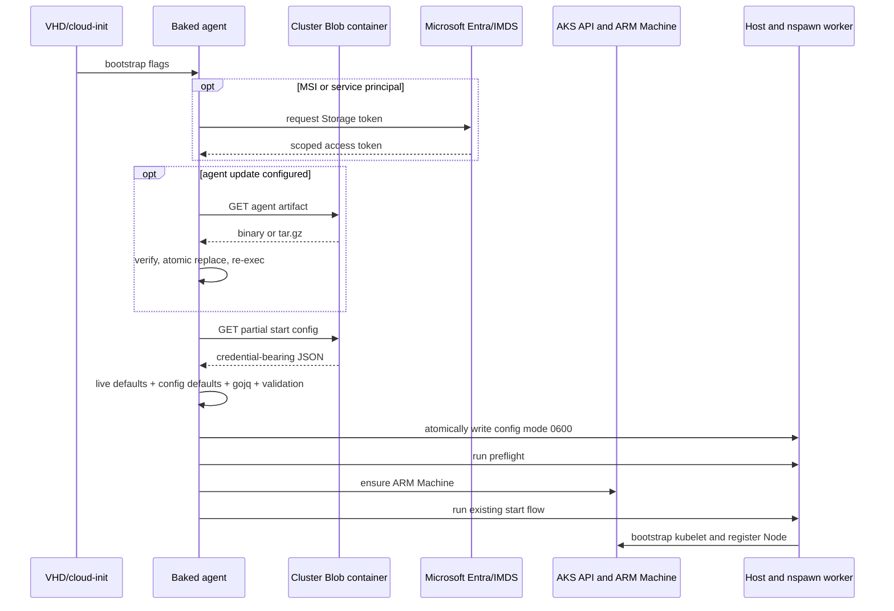

# Storage-backed node bootstrap

## Status

Draft implementation design for `aks-flex-node bootstrap`.

## Context

A reusable VHD cannot contain node-specific AKS join data. It can, however,
contain a known-good `aks-flex-node` binary. At first boot, the host needs a
small set of cluster-issued settings, optional agent update metadata, and live
host identity before it can run preflight and join an AKS FlexNodes pool.

The bootstrap flow therefore treats the VHD binary as the trust anchor and
retrieves a partial start configuration from an explicitly configured source.
It does not install Azure CLI and does not require Python or jq on the host.

## Goals

- Support one-command first-boot onboarding from a reusable VHD.
- Retrieve a partial start config and optional agent update from Azure Blob
  Storage, HTTPS, `file://`, or a local path.
- Authenticate Blob reads with an embedded SAS, a service principal, or a
  system/user-assigned managed identity.
- Materialize a complete, validated, node-specific config without requiring the
  source to know the host name or host IP.
- Allow controlled runtime customization with gojq.
- Run the same preflight and start commands operators use manually.
- Keep existing `start --config` behavior and `scripts/install.sh` unchanged.

## Non-goals

- Creating the AKS cluster, FlexNodes pool, bootstrap RBAC, or bootstrap token.
- Installing host package prerequisites.
- Installing Azure CLI.
- Implementing full artifact rollback or release-channel selection.
- Persisting Storage retrieval credentials in the agent runtime config.
- Providing environment-variable equivalents for bootstrap flags.

## CLI contract

A VHD with a usable baked agent needs only the partial start config:

```console
aks-flex-node bootstrap \
  --start-config-url "https://<account>.blob.core.windows.net/<cluster>/pools/<pool>/start-config.json" \
  --storage-auth msi
```

An optional update is applied before config rendering:

```console
aks-flex-node bootstrap \
  --start-config-url "$START_CONFIG_URL" \
  --agent-binary-url "$AGENT_BINARY_URL" \
  --agent-binary-sha256 "$AGENT_BINARY_SHA256" \
  --storage-auth msi
```

All bootstrap inputs are flags. Service-principal secrets are read from a
protected file rather than a process-visible flag:

```console
aks-flex-node bootstrap \
  --start-config-url "$START_CONFIG_URL" \
  --storage-auth service-principal \
  --storage-tenant-id "$TENANT_ID" \
  --storage-client-id "$CLIENT_ID" \
  --storage-client-secret-file /run/credentials/storage-client-secret
```

## Storage organization

A storage account can host assets for multiple clusters. Use one private
container per cluster so data-plane RBAC can be scoped to that cluster:

```text
<cluster-container>/
  pools/<pool>/start-config.json
  pools/<pool>/nodes/<node>/start-config.json
  agents/<version>/linux/amd64/aks-flex-node.tar.gz
  agents/<version>/linux/arm64/aks-flex-node.tar.gz
```

Use a pool-level config when all join data is reusable for the bootstrap token's
bounded lifetime. Use a node-level config when the control plane issues
node-specific credentials or settings. Agent artifacts may be shared by every
pool in the cluster container.

Blob paths are virtual directories; Azure RBAC applies at the account,
container, or a broader ARM scope unless an additional role-assignment condition
is used.

## Partial start config

The start config uses the existing agent config JSON shape but may omit values
that the host or config package can derive. It typically contains:

- target cluster resource ID and location;
- tenant, subscription, and target agent pool;
- bootstrap token and API server CA/FQDN;
- Kubernetes and component versions;
- DNS and CNI settings;
- runtime Azure authentication selection;
- machine-client settings and cluster-issued node defaults.

It should normally omit:

- `agent.nodeName`, which defaults to the lowercase host name;
- `node.kubelet.nodeIP`, which is optional and can be discovered by the node
  runtime;
- local filesystem paths unless the image intentionally overrides them.

A representative partial config is:

```json
{
  "azure": {
    "subscriptionId": "<subscription-id>",
    "tenantId": "<tenant-id>",
    "targetAgentPoolName": "aksflexnodes",
    "managedIdentity": {},
    "bootstrapToken": {
      "token": "<bootstrap-token>"
    },
    "arc": {
      "enabled": false
    },
    "targetCluster": {
      "resourceId": "/subscriptions/.../managedClusters/<cluster>",
      "location": "eastus"
    }
  },
  "agent": {
    "machineClient": {
      "mode": "arm"
    },
    "requireMachineRegistration": true
  },
  "components": {
    "kubernetes": "1.35.6"
  },
  "node": {
    "kubelet": {
      "clusterFQDN": "<api-server>:443",
      "caCertData": "<base64-ca>"
    }
  }
}
```

The config is a credential-bearing object and must not be printed or committed.

## Config rendering pipeline

The bootstrap command processes config in the following order:

1. Download the partial JSON into memory with a 16 MiB limit.
2. Require a top-level JSON object.
3. Set live values required before normal config validation:
   - default `agent.nodeName` to the lowercase host name;
   - default `azure.arc.machineName` to the node name when Arc is enabled.
4. Run the existing config defaulting and validation logic through a protected,
   mode `0600` staging file in a mode `0700` temporary directory.
5. Convert the defaulted config back to a JSON object.
6. Apply each `--jq` transformation in order.
7. Run typed config defaulting and validation again.
8. Atomically write the final config, normally
   `/etc/aks-flex-node/config.json`, with mode `0600`.

The renderer keeps materialization-specific cleanup local. In particular, it
removes derived target-cluster helper fields instead of changing the existing
public config structure.

### gojq customization

The command embeds `github.com/itchyny/gojq`; the host does not need a `jq`
executable.

```console
aks-flex-node bootstrap \
  --start-config-url "$START_CONFIG_URL" \
  --storage-auth msi \
  --jq-arg scenario=edge-vhd \
  --jq-argjson maxPods=200 \
  --jq '.node.labels["aks-flex-node.azure.com/bootstrap-scenario"] = $scenario' \
  --jq '.node.maxPods = $maxPods'
```

Supported bindings are:

- `--jq-arg NAME=VALUE` for a string;
- `--jq-argjson NAME=JSON` for typed JSON.

The following read-only live bindings are always available:

- `$hostName`
- `$nodeName`
- `$os`
- `$arch`

Each query has a ten-second execution limit and must return exactly one JSON
object. Empty, multi-result, error, and scalar results fail bootstrap. Argument
names must be unique and cannot replace built-in bindings.

## Storage authentication

Storage authentication authorizes only retrieval of bootstrap inputs. Agent
runtime authentication remains defined by the rendered start config.

### SAS

`--storage-auth sas` expects the SAS to be embedded in each signed URL. A
separate SAS token file is not currently supported. The downloader detects the
`sig` query parameter and does not add a bearer token.

### Service principal

`--storage-auth service-principal` constructs an Azure SDK client-secret
credential from tenant/client IDs and a protected secret file. The secret file
must not be accessible by group or other users. The authority host and Storage
token scope are explicit optional flags for sovereign-cloud support.

### Managed identity

`--storage-auth msi` uses the Azure SDK managed identity credential. Omitting
`--storage-client-id` selects the system-assigned identity. Supplying it selects
a user-assigned identity. The identity should receive only `Storage Blob Data
Reader`, scoped to the cluster container when possible.

## Agent update

A VHD contains a baseline binary capable of understanding the bootstrap CLI.
When `--agent-binary-url` is supplied, the baseline performs these steps before
config retrieval:

1. Replace `{{OS}}` and `{{ARCH}}` in the artifact source.
2. Download at most 1 GiB.
3. Verify `--agent-binary-sha256` against the downloaded artifact when supplied.
4. Treat the source as a raw binary or extract `aks-flex-node-<os>-<arch>` or
   `aks-flex-node` from a gzip-compressed tar archive.
5. Compare the extracted binary with the active destination.
6. Atomically write the destination with mode `0755` when it differs.
7. Re-exec the active destination with an internal one-process update guard.

The new process parses the same flags and continues with config retrieval,
preflight, and start. A same-content artifact still transitions into the guarded
process, preventing an update loop while ensuring a baked fallback launches the
active destination.

The SHA-256 covers the downloaded artifact, not only the extracted executable.
Signing and rollback slots are possible future additions.

## End-to-end sequence



## Cloud-init usage

Production VHDs should already contain the baseline binary. A cloud-init flow
can invoke it directly after installing image-specific host prerequisites:

```yaml
#cloud-config
packages:
  - nftables
  - systemd-container
  - util-linux
runcmd:
  - - /usr/local/bin/aks-flex-node
    - bootstrap
    - --start-config-url
    - https://<account>.blob.core.windows.net/<cluster>/pools/<pool>/start-config.json
    - --storage-auth
    - msi
```

A test that starts from a stock marketplace image can first download the
baseline with a pre-authorized user-assigned identity, then invoke the same
command. This models the first-boot orchestration but is not a replacement for
baking the baseline into the production VHD.

## Security properties

- Authenticated Storage downloads require HTTPS.
- Bearer headers are removed on cross-host redirects.
- Authenticated redirects to non-HTTPS URLs are rejected.
- Signed URLs are omitted from downloader errors.
- The command never prints config contents, access tokens, or client secrets.
- Service-principal secrets are file-based and are removed from child-process
  environments.
- Download and extraction sizes are bounded.
- Tar entries are read in memory rather than extracted by path.
- Config and update installation use atomic replacement.
- Final config is owner-only mode `0600`.
- Preflight runs before host bootstrap mutations.

Callers should use short-lived bootstrap tokens, short-lived SAS URLs, narrow
Storage data-plane roles, and an expected artifact digest. Retrieval credentials
must not be copied into the runtime config unless they are independently the
chosen runtime authentication mechanism.

## Compatibility and recovery

The explicit root `bootstrap` command is registered before the existing
`start` command, which retains `bootstrap` as a legacy alias. Exact bootstrap
invocations therefore use the new workflow. `bootstrap --config <path>` with no
remote inputs delegates to the existing `start --config <path>` behavior.

The remote bootstrap workflow is currently intended as a first-boot operation.
A retry before host mutation safely repeats download, rendering, and update. A
retry after a complete deployment may fail the existing-deployment preflight;
a future reconciliation mode can distinguish an already-healthy deployment
from a partial bootstrap and restart only the long-running service when needed.

The baked binary remains the recovery path when no update URL is provided. The
current update mechanism does not preserve an additional on-disk rollback slot.

## Validation

The implementation has been validated with fresh Ubuntu 24.04 Flex VMs in the
following scenarios:

| Scenario | Config retrieval | Agent source | Node IP in config | Result |
|---|---|---|---|---|
| System MSI update | System-assigned MSI | Baseline updated from private Blob archive | Explicit for initial coverage | Ready |
| System MSI baked agent | System-assigned MSI | Already-baked candidate | Omitted | Ready; host IP detected |
| SAS update | Embedded container SAS | Baseline updated from signed Blob archive | Omitted | Ready; jq label applied |
| Cloud-init | User-assigned MSI | Baseline fetched by cloud-init, then updated | Omitted | Cloud-init completed; Ready |

All scenarios created an ARM Machine in `Succeeded`, generated a root-owned mode
`0600` config, passed preflight, joined the expected Unbounded site, and received
a distinct pod CIDR. A cross-site ClusterIP request was also validated.

The lab did not have the daemon CSR controller deployed, so one daemon CSR per
node required manual approval. This is an environment prerequisite independent
of Storage retrieval and config rendering.

Unit tests cover service-principal credential construction and secret-file
permissions. A live service-principal Storage scenario remains useful future
coverage when a disposable application credential is available.
