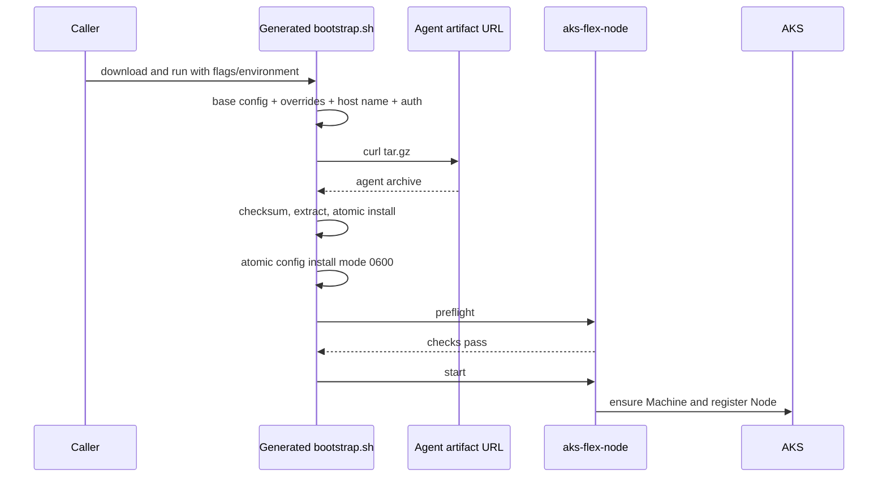

# Generated bootstrap script

## Status

Draft design for a minimal, cluster-specific AKS Flex Node bootstrap script.

## Context

A reusable host does not need Azure CLI or a configuration-generation tool. The
control-plane-side publisher already has the cluster bootstrap data and can
render it into a shell script. The caller only needs to download that script,
select runtime Azure authentication when necessary, and run it as root.

The script downloads `aks-flex-node`, writes the final config, runs preflight,
and starts the node. Configuration manipulation uses the host's existing `jq`
binary rather than adding a bootstrap subcommand to `aks-flex-node`.

## Goals

- Keep first-boot orchestration in one portable shell script.
- Embed the cluster/pool-specific base config in the distributed script.
- Support CLI and environment overrides with deterministic precedence.
- Select managed identity or service-principal runtime authentication.
- Download an agent archive from an exact URL or a versioned default URL.
- Generate a protected config and run preflight before start.
- Work from cloud-init, image provisioning, or an interactive root shell.
- Leave the existing agent commands and `scripts/install.sh` unchanged.

## Non-goals

- Discovering cluster metadata from the host.
- Creating bootstrap tokens or cluster RBAC.
- Authenticating to the URL used to download the script itself.
- Installing host packages, Azure CLI, curl, tar, or jq.
- Providing a new Go bootstrap command.
- Providing an agent artifact signing or rollback system.

## Host requirements

The publisher and operator must call out these prerequisites:

- Bash
- curl
- tar
- jq
- standard Linux core utilities
- `sha256sum` when an artifact checksum is supplied
- the packages required by normal `aks-flex-node preflight`, such as
  `systemd-container`, `nftables`, and `util-linux`

The script verifies its direct command dependencies and fails with an actionable
message. It never installs missing software.

## Publishing model

`scripts/bootstrap.sh` contains exactly one config marker:

```text
__AKS_FLEX_NODE_BASE_CONFIG_JSON__
```

The publisher replaces that marker with a valid cluster/pool-specific partial
config and stores the generated script at a caller-accessible URL. The
replacement must preserve the shell heredoc delimiters.

A simple publisher operation is conceptually:

```python
script = open("scripts/bootstrap.sh").read()
config = open("start-config.json").read().rstrip()
assert script.count("__AKS_FLEX_NODE_BASE_CONFIG_JSON__") == 1
open("generated-bootstrap.sh", "w").write(
    script.replace("__AKS_FLEX_NODE_BASE_CONFIG_JSON__", config)
)
```

The generated script contains a bootstrap token and CA material. It is a secret
for the lifetime of those credentials. Its download URL and backing object must
therefore use appropriate confidentiality, expiry, and authorization controls.
The script must not be committed after generation.

`AKS_FLEX_NODE_BASE_CONFIG_FILE` exists as a development/test escape hatch. The
normal distributed flow uses the embedded config.

## Expected first-boot flow

The flow has four actors with deliberately separate responsibilities:

- The **script publisher** obtains cluster bootstrap data and renders the
  cluster-specific script.
- The **image owner** prepares a reusable host image with operating-system
  prerequisites, but no cluster credentials or node identity.
- The **provisioner** creates the machine, configures network and Azure identity,
  and gives the machine a way to download the generated script.
- The **first-boot environment** downloads and invokes the script once, then
  records success outside the script.

Keeping these responsibilities separate prevents the generic VHD from becoming
cluster-specific and makes it clear that `--auth` configures the installed
agent, not the initial script download.

### 1. Prepare the reusable image

Before the image is captured, install the documented host dependencies:

- Bash, curl, tar, jq, and standard core utilities;
- systemd and nspawn prerequisites;
- nftables and other packages required by agent preflight;
- optional organization-specific CA certificates and proxy configuration.

Do not place any of the following in the reusable image:

- the generated bootstrap script;
- a bootstrap token or SP credential;
- `/etc/aks-flex-node/config.json` from another node;
- `/var/lib/aks-flex-node` state;
- a first-boot completion marker from image construction.

The image can include a wrapper or systemd oneshot unit that performs the
caller-owned script download, but it should obtain all cluster-specific inputs
from provisioning data at instance creation time.

### 2. Publish a bounded-lifetime script

For each pool or node enrollment operation, the publisher:

1. Obtains fresh bootstrap data, preferably from the pool's
   `listBootstrapData` operation.
2. Adds the target cluster location, runtime machine-client policy, and any
   other config fields not returned by that operation.
3. Leaves host-derived fields such as node name and node IP unset.
4. Replaces the single marker in `scripts/bootstrap.sh` with that JSON.
5. Selects an agent version or exact archive URL and records the archive
   SHA-256.
6. Uploads the generated script to a protected location.
7. Returns the script URL plus non-embedded invocation metadata to the
   provisioner.

The generated script should not outlive its bootstrap token. A pool-level script
can be reused only when the token and policy intentionally permit that. A
node-level script should be preferred when enrollment is tied to a specific
machine resource.

The publisher must never log the generated script body. Diagnostics can report
the cluster, pool, script object path, token expiry, and artifact digest without
reporting the token or config.

### 3. Provision identity, network, and download access

Before first boot runs, the provisioner prepares the host's external
prerequisites:

- network reachability to the AKS API server, artifact URL, and required image
  registries;
- a unique host name suitable for a Kubernetes Node name;
- the selected managed identity or service principal with the permissions
  required by the agent's runtime machine-client mode;
- authorization to download the generated script when its URL is private;
- a readable agent artifact URL, such as a short-lived read-only SAS URL.

For MSI runtime auth, grant the identity the required AKS role before invoking
bootstrap and allow time for role-assignment propagation. For a user-assigned
identity, provide the same client ID both to the runtime config override and to
any caller-owned script-download logic that uses that identity.

Script-download authorization and agent runtime authorization are independent.
For example, cloud-init can use a user-assigned identity to download a private
script, while the generated script receives a signed agent archive URL and
writes that identity into `azure.managedIdentity` for ARM Machine operations.

### 4. Download the generated script

The caller downloads the generated script before invoking it. The bootstrap
script does not authenticate its own download because it is not running yet.
Depending on the environment, the caller can use a signed URL, cloud-init's
provisioning channel, IMDS plus an OAuth request, or an existing configuration
management system.

For a URL that curl can already read:

```console
install -d -m 0700 /run/aks-flex-node-bootstrap
curl -fsSLo /run/aks-flex-node-bootstrap/bootstrap.sh "$BOOTSTRAP_SCRIPT_URL"
chmod 0700 /run/aks-flex-node-bootstrap/bootstrap.sh
```

When the script is stored in a private Blob container, caller-owned code should
obtain a Storage token and download it without printing the token or URL. The
caller should validate the HTTP result before execution. If the publisher also
returns a script digest or signature, verify it at this boundary.

Do not use `curl ... | bash` for a generated credential-bearing script. Saving
it first allows permissions, download success, and optional integrity metadata
to be checked before root execution.

### 5. Invoke once with runtime overrides

Run the script as root after all roles and network paths are ready. Environment
overrides are convenient for cloud-init and orchestration systems:

```console
sudo env \
  AKS_FLEX_NODE_AUTH=msi \
  AKS_FLEX_NODE_AGENT_URL="$AGENT_URL" \
  AKS_FLEX_NODE_AGENT_SHA256="$AGENT_SHA256" \
  AKS_FLEX_NODE_CONFIG_OVERRIDES='{"node":{"labels":{"bootstrap":"first-boot"}}}' \
  bash /run/aks-flex-node-bootstrap/bootstrap.sh
```

A user-assigned identity can be selected explicitly:

```console
sudo bash /run/aks-flex-node-bootstrap/bootstrap.sh \
  --auth msi \
  --msi-client-id "$MANAGED_IDENTITY_CLIENT_ID" \
  --agent-url "$AGENT_URL" \
  --agent-sha256 "$AGENT_SHA256"
```

For SP auth, deliver the credential as a root-only file and pass its path. Do
not place the secret in cloud-init command arguments, a systemd `ExecStart`, or
a generic JSON override.

The caller does not need to set node IP. The script leaves it absent unless the
base config or a generic override intentionally supplies it.

During invocation, the script:

1. validates prerequisites and the embedded JSON;
2. applies generic environment and CLI overrides;
3. resolves node name and runtime auth;
4. downloads, verifies, and atomically installs the agent;
5. atomically writes the mode `0600` config;
6. runs non-mutating preflight;
7. invokes the existing start lifecycle only after preflight succeeds.

### 6. Record completion and remove the downloaded script

A successful invocation ends only after `aks-flex-node start` installs and
starts the long-running service. The first-boot wrapper should then:

1. remove the downloaded generated script;
2. remove transient SP secret files when their lifecycle permits;
3. create a root-owned completion marker outside the reusable image;
4. stop retrying the full bootstrap workflow.

For example:

```bash
if bash /run/aks-flex-node-bootstrap/bootstrap.sh; then
    rm -f /run/aks-flex-node-bootstrap/bootstrap.sh
    install -d -m 0755 /var/lib/aks-flex-node
    touch /var/lib/aks-flex-node/first-boot-complete
fi
```

The completion marker is caller-owned because the caller decides whether and
how to retry failed provisioning. A systemd oneshot wrapper can use
`ConditionPathExists=!/var/lib/aks-flex-node/first-boot-complete` to prevent a
successful node from being bootstrapped again after reboot.

### 7. Verify convergence

The provisioning system should not treat script exit alone as complete cluster
convergence. Verify at least:

- `/etc/aks-flex-node/config.json` is `0600 root:root`;
- `aks-flex-node-agent.service` is active;
- the ARM Machine exists and has reached `Succeeded`;
- the Kubernetes Node has the expected host-derived name and is Ready;
- the Node's InternalIP matches the expected host address even when node IP was
  omitted from config;
- the Node joined the intended network site and received a pod CIDR;
- a test workload can start on the node when the environment requires an
  end-to-end networking check.

If the cluster does not run the daemon CSR controller, certificate approval is
an explicit environment prerequisite. A pending daemon CSR can otherwise cause
service retries even after kubelet registration succeeds.

### Failure and retry expectations

A nonzero script exit means the first-boot wrapper must not write its completion
marker. Preserve root-only logs and config for diagnosis. The safe retry point
depends on where failure occurred:

- Download, checksum, JSON rendering, and preflight failures occur before
  `start` and can be retried after correcting the input.
- A failure during `start` may leave partial host or ARM Machine state; use the
  existing agent diagnostics and lifecycle guidance before retrying.
- After a successful start, do not rerun the full script. The
  existing-deployment preflight is expected to reject a second first-boot
  attempt.
- If the embedded bootstrap token expires before retry, publish a new generated
  script rather than editing the old one on the host.

## Suggested storage layout

A private container per cluster keeps generated scripts and artifacts organized
and permits cluster-level data-plane role scoping:

```text
<cluster-container>/
  pools/<pool>/bootstrap.sh
  pools/<pool>/nodes/<node>/bootstrap.sh
  agents/<version>/linux/amd64/aks-flex-node.tar.gz
  agents/<version>/linux/arm64/aks-flex-node.tar.gz
```

A pool-level script is appropriate when the bootstrap payload can be reused by
multiple nodes for its bounded lifetime. A node-level script is appropriate
when the payload is issued for one machine.

The script's agent URL must already be readable by curl. It may be public,
network-restricted but anonymously readable from the host, a `file://` URL, or
an HTTPS URL with an embedded SAS. Runtime MSI/SP selection changes the rendered
agent config; it does not add OAuth to curl downloads.

## Base config contract

The embedded JSON follows the existing agent config shape and supplies values
that the host cannot derive:

- subscription and tenant;
- target cluster resource ID and location;
- target FlexNodes pool;
- bootstrap token;
- API server FQDN and CA;
- Kubernetes/component versions;
- DNS/CNI settings;
- machine-client policy and cluster-issued node defaults.

The base config should omit `agent.nodeName`. The script defaults it to the
lowercase host name. It should also omit `node.kubelet.nodeIP`; the node runtime
can discover the host's primary address.

Example shape, with credentials redacted:

```json
{
  "azure": {
    "subscriptionId": "<subscription-id>",
    "tenantId": "<tenant-id>",
    "targetAgentPoolName": "aksflexnodes",
    "bootstrapToken": {
      "token": "<bootstrap-token>"
    },
    "arc": {
      "enabled": false
    },
    "targetCluster": {
      "resourceId": "/subscriptions/.../managedClusters/<cluster>",
      "location": "eastus"
    }
  },
  "agent": {
    "machineClient": {
      "mode": "arm"
    },
    "requireMachineRegistration": true
  },
  "components": {
    "kubernetes": "1.35.6"
  },
  "node": {
    "kubelet": {
      "clusterFQDN": "<api-server>:443",
      "caCertData": "<base64-ca>"
    }
  }
}
```

## Input precedence

Runtime values use this precedence:

```text
CLI flags > environment variables > embedded base config/script defaults
```

The script supports:

```text
AKS_FLEX_NODE_AUTH
AKS_FLEX_NODE_MSI_CLIENT_ID
AKS_FLEX_NODE_SP_TENANT_ID
AKS_FLEX_NODE_SP_CLIENT_ID
AKS_FLEX_NODE_SP_CLIENT_SECRET
AKS_FLEX_NODE_SP_CLIENT_SECRET_FILE
AKS_FLEX_NODE_AGENT_URL
AKS_FLEX_NODE_AGENT_VERSION
AKS_FLEX_NODE_AGENT_SHA256
AKS_FLEX_NODE_CONFIG_OVERRIDES
AKS_FLEX_NODE_INSTALL_DIR
AKS_FLEX_NODE_CONFIG_PATH
```

The equivalent non-secret values have CLI flags. A service-principal client
secret has no CLI value because command arguments are process-visible. Use a
protected secret file or, when unavoidable, the dedicated environment variable.
The secret file takes precedence over the direct secret environment value.

When using sudo, the caller must explicitly preserve the needed variables:

```console
sudo --preserve-env=AKS_FLEX_NODE_AUTH,AKS_FLEX_NODE_AGENT_URL \
  bash bootstrap.sh
```

## Config generation

The script processes JSON in this order:

1. Write the embedded base config into a mode `0700` temporary workspace.
2. Validate that it is a JSON object.
3. Deep-merge `AKS_FLEX_NODE_CONFIG_OVERRIDES`, when present.
4. Deep-merge each CLI `--config-overrides` object in invocation order.
5. Set `agent.nodeName` from the lowercase host name only when absent.
6. Apply the dedicated auth selection.
7. Validate the final JSON with jq.
8. Keep the rendered result in the protected workspace while the agent archive
   is downloaded and installed.
9. Atomically install the config at `/etc/aks-flex-node/config.json` with mode
   `0600`.
10. Clear bootstrap environment variables, including signed artifact URLs and any
   direct SP secret, before launching the agent commands.

Dedicated auth selection runs last so generic overrides cannot accidentally
leave multiple incompatible Azure runtime authentication methods configured.
Generic override arguments must not contain secrets because they are visible in
the process list.

### Managed identity

```console
AKS_FLEX_NODE_AUTH=msi \
AKS_FLEX_NODE_AGENT_URL="$AGENT_URL" \
sudo --preserve-env=AKS_FLEX_NODE_AUTH,AKS_FLEX_NODE_AGENT_URL \
  bash bootstrap.sh
```

For a user-assigned identity:

```console
bash bootstrap.sh \
  --auth msi \
  --msi-client-id "$MANAGED_IDENTITY_CLIENT_ID" \
  --agent-url "$AGENT_URL"
```

The renderer removes `azure.servicePrincipal`, disables Arc authentication, and
writes either an empty `azure.managedIdentity` object or one with `clientId`.
Bootstrap-token authentication can remain alongside MSI because it serves the
Kubernetes bootstrap path.

### Service principal

```console
bash bootstrap.sh \
  --auth service-principal \
  --sp-client-id "$CLIENT_ID" \
  --sp-client-secret-file /run/credentials/aks-flex-node-sp \
  --agent-url "$AGENT_URL"
```

The secret file must not be group/world accessible. The tenant defaults to
`azure.tenantId` in the base config and can be overridden separately. jq reads
the secret from the file, preserving JSON correctness for quotes, slashes, and
other special characters. The renderer removes managed identity and disables
Arc authentication.

## Agent download and installation

The caller supplies either:

- `--agent-url` / `AKS_FLEX_NODE_AGENT_URL`; or
- `--agent-version` / `AKS_FLEX_NODE_AGENT_VERSION`.

A version resolves to the normal GitHub release archive:

```text
https://github.com/Azure/AKSFlexNode/releases/download/<version>/aks-flex-node-linux-<arch>.tar.gz
```

An exact URL may use these placeholders:

- `{{OS}}`
- `{{ARCH}}`
- `{{VERSION}}`
- `{{ARCHIVE_NAME}}`

The script:

1. Detects AMD64 or ARM64.
2. Downloads the tar.gz with curl retries without printing the URL.
3. Optionally validates the archive SHA-256.
4. Rejects absolute and parent-traversal tar paths.
5. Extracts `aks-flex-node-linux-<arch>` or `aks-flex-node`.
6. Atomically replaces `/usr/local/bin/aks-flex-node` with mode `0755`.

The checksum covers the downloaded archive. Supplying a digest is strongly
recommended, especially for signed URLs or mirrors.

## Execution flow

After installing the binary and config, the script executes:

```console
aks-flex-node preflight --config /etc/aks-flex-node/config.json --output text
aks-flex-node start --config /etc/aks-flex-node/config.json
```

Preflight failure stops the script before start. The existing binary owns host
mutation, ARM Machine registration, nspawn provisioning, and systemd service
installation.



## Cloud-init

A stock-image test or image-build pipeline can install prerequisites and invoke
the downloaded generated script:

```yaml
#cloud-config
packages:
  - curl
  - jq
  - nftables
  - systemd-container
  - tar
  - util-linux
runcmd:
  - - env
    - AKS_FLEX_NODE_AUTH=msi
    - AKS_FLEX_NODE_AGENT_URL=https://example/aks-flex-node-linux-amd64.tar.gz
    - AKS_FLEX_NODE_CONFIG_OVERRIDES={"node":{"labels":{"bootstrap":"cloud-init"}}}
    - bash
    - /var/lib/aks-flex-node/bootstrap.sh
```

The mechanism that downloads the generated script is caller-owned. For a
private Blob, cloud-init can use a pre-authorized managed identity; for a signed
URL, the custom-data security implications of embedding that URL must be
considered.

## Security properties

- The generated script and final config are credential-bearing secrets.
- Temporary files use a mode `0700` directory and process umask `077`.
- Final config is root-owned mode `0600`.
- Service-principal secrets are not accepted as CLI arguments.
- Secret files are rejected when accessible by group/other users.
- Bootstrap environment values and signed agent URLs are cleared before
  preflight and start child processes are launched.
- jq performs JSON encoding rather than shell string interpolation.
- Download URLs are not logged by the script.
- Archive traversal paths are rejected.
- Binary and config installation use same-filesystem atomic replacement.
- An optional SHA-256 detects artifact corruption or substitution.
- Preflight must pass before start.

An embedded SAS is still visible to privileged process inspection while curl is
running. Prefer short expiry and read-only scope. Protect cloud-init custom data
when it contains signed artifact URLs.

## Recovery and idempotency

This is a first-boot script. Download and config rendering are safe to repeat
before host mutation. Once `start` has completed, rerunning the whole script may
fail the existing-deployment preflight. A caller should record first-boot
completion and avoid automatic reruns after success.

If agent download or checksum validation fails, the installed binary is not
replaced. If preflight fails, the rendered config remains available for root-only
diagnostics. The script does not keep an additional rollback binary.

## Validation

The final generated-script flow was validated on a fresh Ubuntu 24.04 VM using
cloud-init:

- cloud-init installed curl, tar, jq, and host prerequisites;
- a user-assigned identity downloaded the private generated script;
- runtime settings were supplied through environment overrides;
- the script downloaded a signed agent archive and verified SHA-256;
- the embedded config omitted node name and node IP;
- the generated node name matched the host name;
- the node runtime discovered the expected private IP;
- config was root-owned mode `0600`;
- all preflight checks passed;
- ARM Machine provisioning reached `Succeeded`;
- the Kubernetes node became Ready in the expected Unbounded site;
- the configured jq label appeared on the Node.

The lab lacked the daemon CSR controller, so the daemon CSR required manual
approval. That prerequisite is independent of script download, config rendering,
and agent installation.
