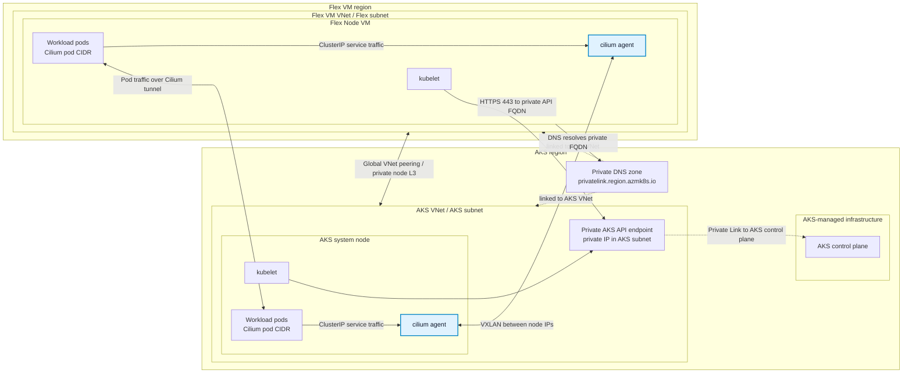

# Private AKS Cluster With Unmanaged Cilium And Cross-Region Flex Node

This guide shows how to create a private AKS cluster with no built-in CNI, install unmanaged upstream Cilium, connect a VM in another Azure region through VNet peering, and join that VM as an AKS Flex Node.

The validated setup uses AKS private cluster mode with `--network-plugin none` and Cilium as the CNI. Cilium is installed manually with cluster-pool IPAM and VXLAN tunnel mode, so pod traffic between AKS and Flex nodes is encapsulated over the existing VNet peering path. Use an AKS Flex Node version that includes eBPF CNI support.

For Cilium concepts and operations, see the [Cilium documentation](https://docs.cilium.io/).

## Prerequisites

- An Azure subscription where you can create resource groups, VNets, VMs, a private AKS cluster, private DNS links, and the bootstrap RBAC needed by AKS Flex Node.
- Azure CLI logged in to the target subscription.
- `kubectl`, Helm, `curl`, `python3`, and SSH/SCP tooling on the workstation or admin VM that will run the lab commands.
- A command runner that can resolve and reach the private AKS API endpoint. If your workstation cannot, use the admin VM described below.
- Non-overlapping CIDR ranges for the AKS VNet, Flex VM VNet, Cilium pod CIDR, AKS service CIDR, and any connected networks.
- A Flex VM image with Ubuntu 24.04 and sudo access.

## What Is Cilium?

Cilium is an eBPF-based networking, security, and observability layer for Kubernetes. In this setup, Cilium provides CNI functionality for both the AKS system node and the Flex node.

In this lab, Cilium does three important things:

- Runs the `cilium` agent as a DaemonSet on AKS and Flex nodes.
- Allocates pod IPs from a cluster-wide Cilium pod CIDR using cluster-pool IPAM.
- Programs pod networking and service load balancing using eBPF, with VXLAN encapsulation for cross-node pod traffic.

This lab intentionally uses unmanaged upstream Cilium on a no-CNI AKS cluster. Do not use AKS-managed Cilium for this flow. AKS-managed Cilium is Azure CNI powered by Cilium and assumes AKS-managed node networking, which does not apply to an external Flex VM.

## Topology



- AKS cluster region: `<aks-region>`
- Flex VM region: `<vm-region>`
- AKS VNet: `<aks-vnet-cidr>`
- Flex VM VNet: `<flex-vnet-cidr>`
- Cilium pod CIDR: `<cilium-pod-cidr>`
- AKS service CIDR: `<service-cidr>`
- AKS DNS service IP: `<dns-service-ip>`

Example regions:

- AKS: `eastus2`
- Flex VM: `southcentralus`

Example CIDRs:

- AKS VNet: `10.81.0.0/16`
- AKS subnet: `10.81.1.0/24`
- Flex VM VNet: `10.82.0.0/16`
- Flex VM subnet: `10.82.1.0/24`
- Cilium pod CIDR: `10.83.0.0/16`
- AKS service CIDR: `10.84.0.0/16`
- AKS DNS service IP: `10.84.0.10`

Avoid CIDR overlap across the AKS VNet, Flex VNet, Cilium pod CIDR, AKS service CIDR, and any connected networks.

## Private Link And DNS

Private AKS uses a private endpoint for the API server. VNet peering can carry traffic to that private endpoint, but DNS is not automatic across peered VNets.

After creating the AKS cluster, link the AKS private DNS zone to the Flex VM VNet. The private DNS zone is usually in the AKS node resource group and has a name like:

```text
<guid>.privatelink.<aks-region>.azmk8s.io
```

From the Flex VM, the private AKS API FQDN should resolve to a private IP and TCP 443 should connect.

```bash
getent hosts <private-aks-fqdn>
curl -k -i https://<private-aks-fqdn>:443
```

Expected unauthenticated result:

```text
HTTP/2 401
```

## Create Networks

```bash
SUBSCRIPTION_ID="<subscription-id>"
AKS_RG="<aks-resource-group>"
VM_RG="<vm-resource-group>"
AKS_REGION="<aks-region>"
VM_REGION="<vm-region>"
AKS_VNET="<aks-vnet-name>"
FLEX_VNET="<flex-vnet-name>"

az account set --subscription "$SUBSCRIPTION_ID"

az group create -n "$AKS_RG" -l "$AKS_REGION"
az group create -n "$VM_RG" -l "$VM_REGION"

az network vnet create \
  -g "$AKS_RG" \
  -n "$AKS_VNET" \
  -l "$AKS_REGION" \
  --address-prefixes 10.81.0.0/16 \
  --subnet-name aks-subnet \
  --subnet-prefixes 10.81.1.0/24

az network vnet create \
  -g "$VM_RG" \
  -n "$FLEX_VNET" \
  -l "$VM_REGION" \
  --address-prefixes 10.82.0.0/16 \
  --subnet-name flex-subnet \
  --subnet-prefixes 10.82.1.0/24
```

Create global VNet peering:

```bash
AKS_VNET_ID=$(az network vnet show -g "$AKS_RG" -n "$AKS_VNET" --query id -o tsv)
FLEX_VNET_ID=$(az network vnet show -g "$VM_RG" -n "$FLEX_VNET" --query id -o tsv)

az network vnet peering create \
  -g "$AKS_RG" \
  --vnet-name "$AKS_VNET" \
  -n aks-to-flex \
  --remote-vnet "$FLEX_VNET_ID" \
  --allow-vnet-access

az network vnet peering create \
  -g "$VM_RG" \
  --vnet-name "$FLEX_VNET" \
  -n flex-to-aks \
  --remote-vnet "$AKS_VNET_ID" \
  --allow-vnet-access
```

## Create A Private No-CNI AKS Cluster

```bash
CLUSTER_NAME="<aks-cluster-name>"
AKS_SUBNET_ID=$(az network vnet subnet show \
  -g "$AKS_RG" \
  --vnet-name "$AKS_VNET" \
  -n aks-subnet \
  --query id \
  -o tsv)

az aks create \
  -g "$AKS_RG" \
  -n "$CLUSTER_NAME" \
  -l "$AKS_REGION" \
  --vnet-subnet-id "$AKS_SUBNET_ID" \
  --enable-private-cluster \
  --network-plugin none \
  --pod-cidr 10.83.0.0/16 \
  --service-cidr 10.84.0.0/16 \
  --dns-service-ip 10.84.0.10 \
  --node-count 1 \
  --node-vm-size Standard_D4s_v5 \
  --generate-ssh-keys
```

The AKS node starts `NotReady` until Cilium writes the CNI configuration and initializes the datapath.

## Link Private DNS To The Flex VNet

```bash
NODE_RG=$(az aks show -g "$AKS_RG" -n "$CLUSTER_NAME" --query nodeResourceGroup -o tsv)
PRIVATE_DNS_ZONE=$(az network private-dns zone list -g "$NODE_RG" --query '[0].name' -o tsv)
FLEX_VNET_ID=$(az network vnet show -g "$VM_RG" -n "$FLEX_VNET" --query id -o tsv)

az network private-dns link vnet create \
  -g "$NODE_RG" \
  -z "$PRIVATE_DNS_ZONE" \
  -n flex-vnet-link \
  -v "$FLEX_VNET_ID" \
  -e false
```

## Create An Admin VM For The Private Cluster

If your workstation cannot resolve or reach the private AKS API endpoint, create an admin VM in the Flex VNet. You can also use the Flex VM itself for this role before joining it as a node.

```bash
ADMIN_VM_NAME="<admin-vm-name>"

az vm create \
  -g "$VM_RG" \
  -n "$ADMIN_VM_NAME" \
  -l "$VM_REGION" \
  --image Ubuntu2404 \
  --size Standard_D4s_v5 \
  --vnet-name "$FLEX_VNET" \
  --subnet flex-subnet \
  --admin-username azureuser \
  --generate-ssh-keys \
  --public-ip-sku Standard
```

Copy or create an admin kubeconfig on that VM, install `kubectl` and Helm, and verify private cluster access:

```bash
kubectl get nodes -o wide
```

## Install Unmanaged Cilium

Install Cilium with cluster-pool IPAM and VXLAN tunnel mode. Run these commands from a machine that can reach the private AKS API endpoint.

```bash
helm repo add cilium https://helm.cilium.io/
helm repo update

helm upgrade --install cilium cilium/cilium \
  --namespace kube-system \
  --set ipam.mode=cluster-pool \
  --set ipam.operator.clusterPoolIPv4PodCIDRList='{10.83.0.0/16}' \
  --set ipam.operator.clusterPoolIPv4MaskSize=24 \
  --set routingMode=tunnel \
  --set tunnelProtocol=vxlan \
  --set kubeProxyReplacement=true
```

Wait for Cilium and the AKS node:

```bash
kubectl -n kube-system rollout status ds/cilium --timeout=5m
kubectl -n kube-system rollout status ds/cilium-envoy --timeout=5m
kubectl get nodes -o wide
```

On a one-node cluster, one Cilium operator replica may remain pending until the Flex node joins. Check it without blocking the lab:

```bash
kubectl -n kube-system get deploy cilium-operator
kubectl -n kube-system get pods -l io.cilium/app=operator -o wide
```

## Create The Flex VM

```bash
VM_NAME="<flex-vm-name>"

az vm create \
  -g "$VM_RG" \
  -n "$VM_NAME" \
  -l "$VM_REGION" \
  --image Ubuntu2404 \
  --size Standard_D4s_v5 \
  --vnet-name "$FLEX_VNET" \
  --subnet flex-subnet \
  --admin-username azureuser \
  --generate-ssh-keys \
  --public-ip-sku Standard
```

Get the VM IPs:

```bash
az vm show -g "$VM_RG" -n "$VM_NAME" --show-details \
  --query '{privateIps:privateIps,publicIps:publicIps}' \
  -o table
```

From the VM, verify private API reachability:

```bash
getent hosts <private-aks-fqdn>
curl -k -i https://<private-aks-fqdn>:443
```

Expected unauthenticated response:

```text
HTTP/2 401
```

## Generate Bootstrap Config

Use the config helper from this repository. By default, the installer resolves the latest GitHub release. Set `AKS_FLEX_NODE_VERSION` only when you want to use a specific release tag.

```bash
# Optional: uncomment to use a specific release tag.
# AKS_FLEX_NODE_VERSION="<release-tag>"

curl -fsSLo ./aks-flex-config \
  "https://raw.githubusercontent.com/Azure/AKSFlexNode/${AKS_FLEX_NODE_VERSION:-main}/scripts/aks-flex-config"
chmod +x ./aks-flex-config

./aks-flex-config setup-node-rbac \
  --resource-group "$AKS_RG" \
  --cluster-name "$CLUSTER_NAME" \
  --subscription "$SUBSCRIPTION_ID"

./aks-flex-config generate-node-config \
  --resource-group "$AKS_RG" \
  --cluster-name "$CLUSTER_NAME" \
  --subscription "$SUBSCRIPTION_ID" \
  --bootstrap-token \
  --output ./aks-flex-node-config.json
```

Before copying the config to the Flex VM, verify that the config references a bootstrap token secret that exists in the cluster:

```bash
TOKEN_ID=$(python3 -c 'import json; print(json.load(open("./aks-flex-node-config.json"))["azure"]["bootstrapToken"]["token"].split(".")[0])')
kubectl get secret -n kube-system "bootstrap-token-${TOKEN_ID}"
```

For private clusters, if your workstation cannot reach the private API endpoint, run the RBAC/token creation from the admin VM and render the config from `az aks show` plus `az aks get-credentials --admin --file <path>`. The `kubernetes.version` value must be the full patch version, such as `1.34.7`, not the major/minor alias such as `1.34`; `aks-flex-node` uses this value to download Kubernetes binaries.

```bash
KUBERNETES_VERSION=$(az aks show \
  -g "$AKS_RG" \
  -n "$CLUSTER_NAME" \
  --query currentKubernetesVersion \
  -o tsv)
```

The config must contain:

```json
{
  "kubernetes": {
    "version": "<full-kubernetes-version>"
  },
  "node": {
    "kubelet": {
      "serverURL": "https://<private-aks-fqdn>:443",
      "caCertData": "<base64-ca-data>",
      "dnsServiceIP": "10.84.0.10",
      "nodeIP": "<flex-vm-private-ip>"
    }
  },
  "agent": {
    "nodeName": "<flex-vm-node-name>"
  }
}
```

## Install AKS Flex Node On The VM

Copy the generated config:

```bash
VM_PUBLIC_IP="<flex-vm-public-ip>"

scp ./aks-flex-node-config.json azureuser@"$VM_PUBLIC_IP":/tmp/aks-flex-node-config.json
```

Install `aks-flex-node` and place the config:

```bash
ssh azureuser@"$VM_PUBLIC_IP"

sudo su

# Optional: uncomment to use a specific release tag.
# AKS_FLEX_NODE_VERSION="<release-tag>"

curl -fsSL "https://raw.githubusercontent.com/Azure/AKSFlexNode/${AKS_FLEX_NODE_VERSION:-main}/scripts/install.sh" \
  | AKS_FLEX_NODE_VERSION="${AKS_FLEX_NODE_VERSION:-}" bash

umask 077
mkdir -p /etc/aks-flex-node
cp /tmp/aks-flex-node-config.json /etc/aks-flex-node/config.json
chmod 600 /etc/aks-flex-node/config.json

aks-flex-node version
aks-flex-node start --config /etc/aks-flex-node/config.json
```

## DaemonSets On The Flex Node

The Cilium DaemonSet and Cilium Envoy DaemonSet should schedule on the Flex node automatically after the node joins.

## Verify

Check nodes:

```bash
kubectl get nodes -o wide
```

Expected result:

```text
NAME                                STATUS   VERSION   INTERNAL-IP
aks-nodepool1-...                   Ready    v1.34.x   <aks-node-ip>
<flex-vm-node-name>                 Ready    v1.34.x   <flex-vm-private-ip>
```

Check Cilium pods:

```bash
kubectl -n kube-system get pods -o wide | grep cilium
```

Expected Cilium pods on both nodes:

```text
kube-system   cilium-...          1/1   Running   ...   <aks-node-name>
kube-system   cilium-...          1/1   Running   ...   <flex-vm-node-name>
kube-system   cilium-envoy-...    1/1   Running   ...   <aks-node-name>
kube-system   cilium-envoy-...    1/1   Running   ...   <flex-vm-node-name>
```

Create smoke pods on the AKS node and Flex node:

```bash
kubectl apply -f - <<'EOF'
apiVersion: v1
kind: Pod
metadata:
  name: cilium-smoke-aks
  labels:
    app: cilium-smoke-aks
spec:
  nodeSelector:
    kubernetes.io/hostname: <aks-node-name>
  tolerations:
  - operator: Exists
  containers:
  - name: web
    image: python:3.12-alpine
    command: ["python3", "-m", "http.server", "8080"]
---
apiVersion: v1
kind: Pod
metadata:
  name: cilium-smoke-flex
  labels:
    app: cilium-smoke-flex
spec:
  nodeSelector:
    kubernetes.io/hostname: <flex-vm-node-name>
  tolerations:
  - operator: Exists
  containers:
  - name: web
    image: python:3.12-alpine
    command: ["python3", "-m", "http.server", "8080"]
---
apiVersion: v1
kind: Service
metadata:
  name: cilium-smoke-flex
spec:
  selector:
    app: cilium-smoke-flex
  ports:
  - port: 8080
    targetPort: 8080
EOF
```

Wait for both pods:

```bash
kubectl wait --for=condition=Ready pod/cilium-smoke-aks --timeout=180s
kubectl wait --for=condition=Ready pod/cilium-smoke-flex --timeout=180s
kubectl get pods -o wide -l app
```

Run connectivity checks:

```bash
AKS_IP=$(kubectl get pod cilium-smoke-aks -o jsonpath='{.status.podIP}')
FLEX_IP=$(kubectl get pod cilium-smoke-flex -o jsonpath='{.status.podIP}')
SVC_IP=$(kubectl get svc cilium-smoke-flex -o jsonpath='{.spec.clusterIP}')

kubectl exec cilium-smoke-flex -- true

kubectl exec cilium-smoke-aks -- wget -qO- -T 5 "http://${FLEX_IP}:8080" | head -1
kubectl exec cilium-smoke-flex -- wget -qO- -T 5 "http://${AKS_IP}:8080" | head -1
kubectl exec cilium-smoke-aks -- wget -qO- -T 5 "http://${SVC_IP}:8080" | head -1
kubectl logs cilium-smoke-flex --tail=5
kubectl exec cilium-smoke-flex -- nslookup kubernetes.default.svc.cluster.local
```

Expected HTTP output starts with:

```text
<!DOCTYPE HTML>
```

Expected DNS output includes:

```text
Name: kubernetes.default.svc.cluster.local
Address: <kubernetes-service-ip>
```

Clean up smoke resources:

```bash
kubectl delete pod cilium-smoke-aks cilium-smoke-flex --wait=false
kubectl delete svc cilium-smoke-flex
```

## Troubleshooting

Check the Flex agent and kubelet logs:

```bash
systemctl status aks-flex-node-agent
journalctl -M kube1 -u kubelet -f
```

Check private API reachability from the VM:

```bash
curl -k -i https://<private-aks-fqdn>:443
```

Expected unauthenticated response:

```text
HTTP/2 401
```

Check Cilium status:

```bash
kubectl -n kube-system get pods -o wide | grep cilium
kubectl -n kube-system logs -l k8s-app=cilium --tail=100
kubectl get nodes -o wide
```

If pods schedule on the Flex node but cannot reach pods on AKS nodes, check Cilium health and VXLAN traffic between node IPs. Ensure NSGs allow node-to-node traffic over the VNet peering path.
