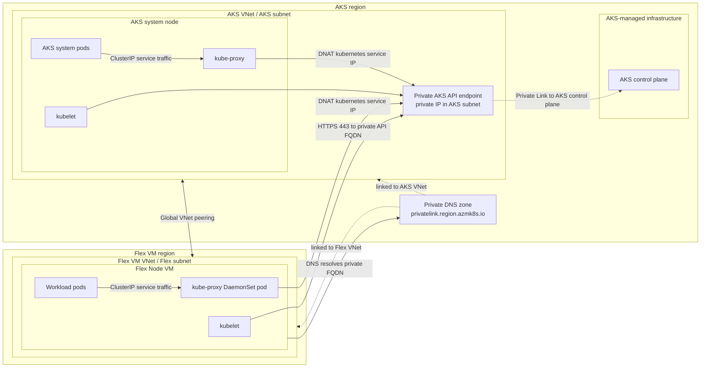

# Private AKS Cluster With Cross-Region Flex Node

This guide shows how to create a private AKS cluster, connect a VM in another Azure region through VNet peering, and join that VM as an AKS Flex Node.

The validated setup uses AKS private cluster mode with `kubenet`. The key requirement is that the Flex Node can resolve and reach the private AKS API endpoint, and that AKS node DaemonSets such as `kube-proxy` can schedule onto the Flex Node.

## Topology



- AKS cluster region: `<aks-region>`
- Flex VM region: `<vm-region>`
- AKS VNet: `<aks-vnet-cidr>`
- Flex VM VNet: `<flex-vnet-cidr>`
- AKS pod CIDR: `10.244.0.0/16`
- AKS service CIDR: `10.30.0.0/16`
- AKS DNS service IP: `10.30.0.10`

Example regions:

- AKS: `eastus2`
- Flex VM: `southcentralus`

Example CIDRs:

- AKS VNet: `10.11.0.0/16`
- AKS subnet: `10.11.1.0/24`
- Flex VM VNet: `10.20.0.0/16`
- Flex VM subnet: `10.20.1.0/24`

Avoid CIDR overlap across the AKS VNet, Flex VNet, AKS pod CIDR, AKS service CIDR, and any connected networks.

## Private Link And DNS

Private AKS uses a private endpoint for the API server. VNet peering can carry traffic to that private endpoint, but DNS is not automatic across peered VNets.

After creating the AKS cluster, link the AKS private DNS zone to the Flex VM VNet. The private DNS zone is usually in the AKS node resource group and has a name like:

```text
<guid>.privatelink.<aks-region>.azmk8s.io
```

From the Flex VM, the private AKS API FQDN should resolve to a private IP and TCP 443 should connect.

```bash
getent hosts <private-aks-fqdn>
curl -k -i https://<private-aks-fqdn>:443
```

Expected unauthenticated result:

```text
HTTP/2 401
```

## Create Networks

```bash
SUBSCRIPTION_ID="<subscription-id>"
AKS_RG="<aks-resource-group>"
VM_RG="<vm-resource-group>"
AKS_REGION="<aks-region>"
VM_REGION="<vm-region>"
AKS_VNET="<aks-vnet-name>"
FLEX_VNET="<flex-vnet-name>"

az account set --subscription "$SUBSCRIPTION_ID"

az group create -n "$AKS_RG" -l "$AKS_REGION"
az group create -n "$VM_RG" -l "$VM_REGION"

az network vnet create \
  -g "$AKS_RG" \
  -n "$AKS_VNET" \
  -l "$AKS_REGION" \
  --address-prefixes 10.11.0.0/16 \
  --subnet-name aks-subnet \
  --subnet-prefixes 10.11.1.0/24

az network vnet create \
  -g "$VM_RG" \
  -n "$FLEX_VNET" \
  -l "$VM_REGION" \
  --address-prefixes 10.20.0.0/16 \
  --subnet-name flex-subnet \
  --subnet-prefixes 10.20.1.0/24
```

Create global VNet peering:

```bash
AKS_VNET_ID=$(az network vnet show -g "$AKS_RG" -n "$AKS_VNET" --query id -o tsv)
FLEX_VNET_ID=$(az network vnet show -g "$VM_RG" -n "$FLEX_VNET" --query id -o tsv)

az network vnet peering create \
  -g "$AKS_RG" \
  --vnet-name "$AKS_VNET" \
  -n aks-to-flex \
  --remote-vnet "$FLEX_VNET_ID" \
  --allow-vnet-access

az network vnet peering create \
  -g "$VM_RG" \
  --vnet-name "$FLEX_VNET" \
  -n flex-to-aks \
  --remote-vnet "$AKS_VNET_ID" \
  --allow-vnet-access
```

## Create A Private Kubenet AKS Cluster

```bash
CLUSTER_NAME="<aks-cluster-name>"
AKS_SUBNET_ID=$(az network vnet subnet show \
  -g "$AKS_RG" \
  --vnet-name "$AKS_VNET" \
  -n aks-subnet \
  --query id \
  -o tsv)

az aks create \
  -g "$AKS_RG" \
  -n "$CLUSTER_NAME" \
  -l "$AKS_REGION" \
  --vnet-subnet-id "$AKS_SUBNET_ID" \
  --enable-private-cluster \
  --network-plugin kubenet \
  --pod-cidr 10.244.0.0/16 \
  --service-cidr 10.30.0.0/16 \
  --dns-service-ip 10.30.0.10 \
  --node-count 1 \
  --node-vm-size Standard_D4s_v5 \
  --generate-ssh-keys
```

## Link Private DNS To The Flex VNet

```bash
NODE_RG=$(az aks show -g "$AKS_RG" -n "$CLUSTER_NAME" --query nodeResourceGroup -o tsv)
PRIVATE_DNS_ZONE=$(az network private-dns zone list -g "$NODE_RG" --query '[0].name' -o tsv)
FLEX_VNET_ID=$(az network vnet show -g "$VM_RG" -n "$FLEX_VNET" --query id -o tsv)

az network private-dns link vnet create \
  -g "$NODE_RG" \
  -z "$PRIVATE_DNS_ZONE" \
  -n flex-vnet-link \
  -v "$FLEX_VNET_ID" \
  -e false
```

## Create The Flex VM

```bash
VM_NAME="<flex-vm-name>"

az vm create \
  -g "$VM_RG" \
  -n "$VM_NAME" \
  -l "$VM_REGION" \
  --image Ubuntu2404 \
  --size Standard_D4s_v5 \
  --vnet-name "$FLEX_VNET" \
  --subnet flex-subnet \
  --admin-username azureuser \
  --generate-ssh-keys \
  --public-ip-sku Standard
```

Get the VM IPs:

```bash
az vm show -g "$VM_RG" -n "$VM_NAME" --show-details \
  --query '{privateIps:privateIps,publicIps:publicIps}' \
  -o table
```

## Generate Bootstrap Config

Use the config helper from this repository. By default, the installer resolves the latest GitHub release. Set `AKS_FLEX_NODE_VERSION` only when you want to use a specific release tag.

```bash
# Optional: uncomment to use a specific release tag.
# AKS_FLEX_NODE_VERSION="<release-tag>"

curl -fsSLo ./aks-flex-config \
  "https://raw.githubusercontent.com/Azure/AKSFlexNode/${AKS_FLEX_NODE_VERSION:-main}/scripts/aks-flex-config"
chmod +x ./aks-flex-config

./aks-flex-config setup-node-rbac \
  --resource-group "$AKS_RG" \
  --cluster-name "$CLUSTER_NAME" \
  --subscription "$SUBSCRIPTION_ID"

./aks-flex-config generate-node-config \
  --resource-group "$AKS_RG" \
  --cluster-name "$CLUSTER_NAME" \
  --subscription "$SUBSCRIPTION_ID" \
  --bootstrap-token \
  --output ./aks-flex-node-config.json
```

For private clusters, if your workstation cannot reach the private API endpoint, run the RBAC/token creation with `az aks command invoke` and render the config from `az aks show` plus `az aks get-credentials --admin --file <path>`. The config must contain:

```json
{
  "kubernetes": {
    "version": "<full-kubernetes-version>"
  },
  "node": {
    "kubelet": {
      "serverURL": "https://<private-aks-fqdn>:443",
      "caCertData": "<base64-ca-data>",
      "dnsServiceIP": "10.30.0.10",
      "nodeIP": "<flex-vm-private-ip>"
    }
  },
  "agent": {
    "nodeName": "<flex-vm-node-name>"
  }
}
```

## Install AKS Flex Node On The VM

Copy the generated config:

```bash
VM_PUBLIC_IP="<flex-vm-public-ip>"

scp ./aks-flex-node-config.json azureuser@"$VM_PUBLIC_IP":/tmp/aks-flex-node-config.json
```

Install `aks-flex-node` and place the config:

```bash
ssh azureuser@"$VM_PUBLIC_IP"

sudo su

# Optional: uncomment to use a specific release tag.
# AKS_FLEX_NODE_VERSION="<release-tag>"

curl -fsSL "https://raw.githubusercontent.com/Azure/AKSFlexNode/${AKS_FLEX_NODE_VERSION:-main}/scripts/install.sh" \
  | AKS_FLEX_NODE_VERSION="${AKS_FLEX_NODE_VERSION:-}" bash

umask 077
mkdir -p /etc/aks-flex-node
cp /tmp/aks-flex-node-config.json /etc/aks-flex-node/config.json
chmod 600 /etc/aks-flex-node/config.json

aks-flex-node version
aks-flex-node start --config /etc/aks-flex-node/config.json
```

## Schedule AKS Node DaemonSets On The Flex Node

By default, AKS Flex Node excludes AKS-managed DaemonSets from running on Flex Nodes. For this demo, add the `kubernetes.azure.com/cluster` label so the required `kube-system` pods can be scheduled on the Flex Node.

After the Flex Node registers, add the cluster label:

```bash
kubectl label node <flex-vm-node-name> \
  kubernetes.azure.com/cluster=<aks-cluster-name> \
  --overwrite
```

This allows AKS-managed `kube-proxy` to land on the Flex Node. `kube-proxy` is required for pods on the Flex Node to reach ClusterIP services such as the Kubernetes API service IP.

## Verify

Check nodes:

```bash
kubectl get nodes -o wide
```

Expected result:

```text
NAME                                STATUS   VERSION   INTERNAL-IP
aks-nodepool1-...                   Ready    v1.34.x   <aks-node-ip>
<flex-vm-node-name>                 Ready    v1.34.x   <flex-vm-private-ip>
```

Check pods on the Flex Node:

```bash
kubectl get pods -A --field-selector spec.nodeName=<flex-vm-node-name> -o wide
```

Expected minimum `kube-system` pod after labeling:

```text
kube-system   kube-proxy-...             Running   <flex-vm-node-name>
```

Verify a pod on the Flex Node can reach the Kubernetes ClusterIP service:

```bash
kubectl run flex-service-smoke \
  --image=busybox:1.36 \
  --restart=Never \
  --overrides='{"spec":{"nodeSelector":{"kubernetes.io/hostname":"<flex-vm-node-name>"},"tolerations":[{"operator":"Exists"}]}}' \
  --command -- sh -c 'wget -S -O- --no-check-certificate https://kubernetes.default.svc 2>&1 | grep -E "HTTP/|Unauthorized|Forbidden"; sleep 300'

kubectl wait --for=condition=Ready pod/flex-service-smoke --timeout=180s
kubectl logs flex-service-smoke --tail=20
kubectl delete pod flex-service-smoke --wait=false
```

If `kube-proxy` is not running on the Flex Node, pods scheduled there can fail with:

```text
Unable to connect to the server: dial tcp <service-cidr-first-ip>:443: i/o timeout
```

## Troubleshooting

Check the Flex agent and nspawn worker:

```bash
systemctl status aks-flex-node-agent
machinectl list
systemctl status systemd-nspawn@kube1
journalctl -M kube1 -u kubelet -f
```

Check private API reachability from the VM:

```bash
curl -k -i https://<private-aks-fqdn>:443
```

Expected unauthenticated response:

```text
HTTP/2 401
```

Check kube-proxy on the Flex Node:

```bash
kubectl get pods -n kube-system -o wide --field-selector spec.nodeName=<flex-vm-node-name>
kubectl logs -n kube-system <kube-proxy-pod-name>
```

The kube-proxy logs should show service endpoint programming, including the Kubernetes API service:

```text
portName="default/kubernetes:https" endpoints=["<private-api-ip>:443"]
SyncProxyRules complete
```
