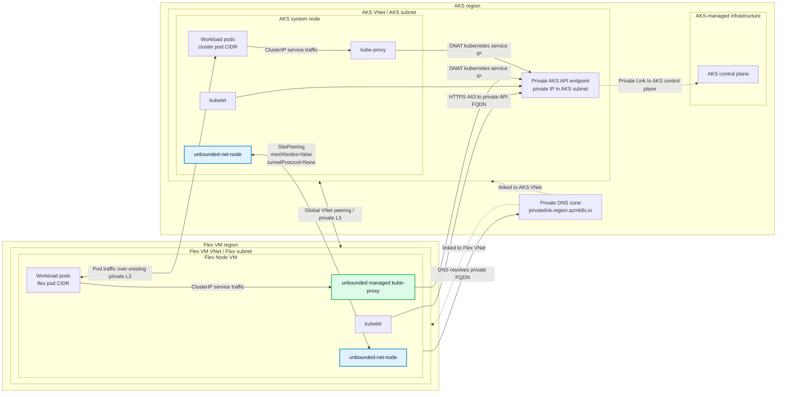

# Private AKS Cluster With Unbounded-Net And Cross-Region Flex Node

This guide shows how to create a private AKS cluster with no built-in CNI, install `unbounded-net`, connect a VM in another Azure region through VNet peering, and join that VM as an AKS Flex Node.

The validated setup uses AKS private cluster mode with `--network-plugin none` and `unbounded-net` as the CNI. Because the AKS VNet and Flex VNet are privately reachable through VNet peering, the Unbounded configuration uses `SitePeering` with `meshNodes: false` and `tunnelProtocol: None`. Do not assign the Flex site to a gateway pool for this private-L3 topology.

For unbounded-net concepts, custom resources, and operations, see the [Unbounded networking documentation](https://unbounded-cloud.io/concepts/networking/) and [unbounded-net operations guide](https://unbounded-cloud.io/reference/networking/operations/).

## Prerequisites

- An Azure subscription where you can create resource groups, VNets, VMs, a private AKS cluster, private DNS links, and the bootstrap RBAC needed by AKS Flex Node.
- Azure CLI logged in to the target subscription.
- `kubectl`, `curl`, `git`, `make`, `python3`, and SSH/SCP tooling on the workstation or admin VM that will run the lab commands.
- A command runner that can resolve and reach the private AKS API endpoint. If your workstation cannot, use the admin VM described below.
- Non-overlapping CIDR ranges for the AKS VNet, Flex VM VNet, AKS pod CIDR, Flex pod CIDR, AKS service CIDR, and any connected networks.
- A Flex VM image with Ubuntu 24.04 and sudo access.

## What Is Unbounded-Net?

`unbounded-net` is the networking layer from [Project Unbounded](https://unbounded-cloud.io/). It provides CNI functionality and multi-site pod networking for Kubernetes clusters whose nodes may live in different networks, regions, or clouds.

In this setup, `unbounded-net` does three important things:

- Runs `unbounded-net-node` as a DaemonSet on AKS and Flex nodes. The node agent writes the host CNI config, watches `Site` and `SiteNodeSlice` resources, configures bridge/tunnel interfaces, and installs the routes needed for pod traffic.
- Allocates per-node pod CIDRs from each site's `Site` resource.
- Programs pod routes between the AKS site and Flex site using the existing VNet peering path.

The private-L3 mode here is intentionally different from Unbounded's public gateway mode. Since the AKS VNet and Flex VNet are already peered, the sites use `SitePeering` with `meshNodes: false` and `tunnelProtocol: None` so node and pod traffic can use the private Azure network instead of a public gateway or WireGuard overlay.

## Topology



- AKS cluster region: `<aks-region>`
- Flex VM region: `<vm-region>`
- AKS VNet: `<aks-vnet-cidr>`
- Flex VM VNet: `<flex-vnet-cidr>`
- AKS pod CIDR: `<cluster-pod-cidr>`
- Flex pod CIDR: `<flex-pod-cidr>`
- AKS service CIDR: `<service-cidr>`
- AKS DNS service IP: `<dns-service-ip>`

Example regions:

- AKS: `eastus2`
- Flex VM: `southcentralus`

Example CIDRs:

- AKS VNet: `10.71.0.0/16`
- AKS subnet: `10.71.1.0/24`
- Flex VM VNet: `10.72.0.0/16`
- Flex VM subnet: `10.72.1.0/24`
- AKS pod CIDR: `10.73.0.0/16`
- AKS service CIDR: `10.74.0.0/16`
- AKS DNS service IP: `10.74.0.10`
- Flex pod CIDR: `10.75.0.0/16`

Avoid CIDR overlap across the AKS VNet, Flex VNet, AKS pod CIDR, Flex pod CIDR, AKS service CIDR, and any connected networks.

## Private Link And DNS

Private AKS uses a private endpoint for the API server. VNet peering can carry traffic to that private endpoint, but DNS is not automatic across peered VNets.

After creating the AKS cluster, link the AKS private DNS zone to the Flex VM VNet. The private DNS zone is usually in the AKS node resource group and has a name like:

```text
<guid>.privatelink.<aks-region>.azmk8s.io
```

From the Flex VM, the private AKS API FQDN should resolve to a private IP and TCP 443 should connect.

```bash
getent hosts <private-aks-fqdn>
curl -k -i https://<private-aks-fqdn>:443
```

Expected unauthenticated result:

```text
HTTP/2 401
```

## Create Networks

```bash
SUBSCRIPTION_ID="<subscription-id>"
AKS_RG="<aks-resource-group>"
VM_RG="<vm-resource-group>"
AKS_REGION="<aks-region>"
VM_REGION="<vm-region>"
AKS_VNET="<aks-vnet-name>"
FLEX_VNET="<flex-vnet-name>"
AGENT_POOL_NAME="${AGENT_POOL_NAME:-aksflexnodes}"

az account set --subscription "$SUBSCRIPTION_ID"

az group create -n "$AKS_RG" -l "$AKS_REGION"
az group create -n "$VM_RG" -l "$VM_REGION"

az network vnet create \
  -g "$AKS_RG" \
  -n "$AKS_VNET" \
  -l "$AKS_REGION" \
  --address-prefixes 10.71.0.0/16 \
  --subnet-name aks-subnet \
  --subnet-prefixes 10.71.1.0/24

az network vnet create \
  -g "$VM_RG" \
  -n "$FLEX_VNET" \
  -l "$VM_REGION" \
  --address-prefixes 10.72.0.0/16 \
  --subnet-name flex-subnet \
  --subnet-prefixes 10.72.1.0/24
```

Create global VNet peering:

```bash
AKS_VNET_ID=$(az network vnet show -g "$AKS_RG" -n "$AKS_VNET" --query id -o tsv)
FLEX_VNET_ID=$(az network vnet show -g "$VM_RG" -n "$FLEX_VNET" --query id -o tsv)

az network vnet peering create \
  -g "$AKS_RG" \
  --vnet-name "$AKS_VNET" \
  -n aks-to-flex \
  --remote-vnet "$FLEX_VNET_ID" \
  --allow-vnet-access

az network vnet peering create \
  -g "$VM_RG" \
  --vnet-name "$FLEX_VNET" \
  -n flex-to-aks \
  --remote-vnet "$AKS_VNET_ID" \
  --allow-vnet-access
```

## Create A Private No-CNI AKS Cluster

```bash
CLUSTER_NAME="<aks-cluster-name>"
AKS_SUBNET_ID=$(az network vnet subnet show \
  -g "$AKS_RG" \
  --vnet-name "$AKS_VNET" \
  -n aks-subnet \
  --query id \
  -o tsv)

az aks create \
  -g "$AKS_RG" \
  -n "$CLUSTER_NAME" \
  -l "$AKS_REGION" \
  --vnet-subnet-id "$AKS_SUBNET_ID" \
  --enable-private-cluster \
  --network-plugin none \
  --pod-cidr 10.73.0.0/16 \
  --service-cidr 10.74.0.0/16 \
  --dns-service-ip 10.74.0.10 \
  --node-count 1 \
  --node-vm-size Standard_D4s_v5 \
  --generate-ssh-keys
```

The AKS node starts `NotReady` until `unbounded-net` writes the CNI configuration and allocates a pod CIDR.

## Link Private DNS To The Flex VNet

```bash
NODE_RG=$(az aks show -g "$AKS_RG" -n "$CLUSTER_NAME" --query nodeResourceGroup -o tsv)
PRIVATE_DNS_ZONE=$(az network private-dns zone list -g "$NODE_RG" --query '[0].name' -o tsv)
FLEX_VNET_ID=$(az network vnet show -g "$VM_RG" -n "$FLEX_VNET" --query id -o tsv)

az network private-dns link vnet create \
  -g "$NODE_RG" \
  -z "$PRIVATE_DNS_ZONE" \
  -n flex-vnet-link \
  -v "$FLEX_VNET_ID" \
  -e false
```

## Create An Admin VM For The Private Cluster

If your workstation cannot resolve or reach the private AKS API endpoint, create an admin VM in the Flex VNet. Use it to run `kubectl` against the private cluster.

```bash
ADMIN_VM_NAME="<admin-vm-name>"

az vm create \
  -g "$VM_RG" \
  -n "$ADMIN_VM_NAME" \
  -l "$VM_REGION" \
  --image Ubuntu2404 \
  --size Standard_D4s_v5 \
  --vnet-name "$FLEX_VNET" \
  --subnet flex-subnet \
  --admin-username azureuser \
  --generate-ssh-keys \
  --public-ip-sku Standard
```

Copy or create an admin kubeconfig on that VM, install `kubectl`, and verify access:

```bash
kubectl get nodes -o wide
```

## Install Unbounded-Net

Render and apply `unbounded-net` manifests. This installs the controller and the `unbounded-net-node` DaemonSet.

```bash
# Check the latest release tag at https://github.com/Azure/unbounded/releases.
UNBOUNDED_VERSION="v0.1.10"

git clone --depth 1 --branch "$UNBOUNDED_VERSION" \
  https://github.com/Azure/unbounded.git /tmp/unbounded

cd /tmp/unbounded
make VERSION="$UNBOUNDED_VERSION" net-manifests

kubectl apply --server-side --force-conflicts -f deploy/net/rendered/00-namespace.yaml
kubectl apply --server-side --force-conflicts -f deploy/net/rendered/01-configmap.yaml
kubectl apply --server-side --force-conflicts -f deploy/net/rendered/crd/
kubectl apply --server-side --force-conflicts -f deploy/net/rendered/controller/
kubectl apply --server-side --force-conflicts -f deploy/net/rendered/node/
```

Wait for the controller and node agent:

```bash
kubectl -n unbounded-net rollout status deploy/unbounded-net-controller --timeout=5m
kubectl -n unbounded-net rollout status ds/unbounded-net-node --timeout=5m
```

## Create Sites And Private L3 Peering

Create the AKS cluster site, the Flex site, and a `SitePeering` that tells `unbounded-net` the two sites are already privately reachable through VNet peering.

```bash
kubectl apply -f - <<'EOF'
apiVersion: net.unbounded-cloud.io/v1alpha1
kind: Site
metadata:
  name: cluster
spec:
  nodeCidrs:
  - 10.71.0.0/16
  podCidrAssignments:
  - assignmentEnabled: true
    cidrBlocks:
    - 10.73.0.0/16
  manageCniPlugin: true
---
apiVersion: net.unbounded-cloud.io/v1alpha1
kind: Site
metadata:
  name: flex-southcentralus
spec:
  nodeCidrs:
  - 10.72.0.0/16
  podCidrAssignments:
  - assignmentEnabled: true
    cidrBlocks:
    - 10.75.0.0/16
  manageCniPlugin: true
---
apiVersion: net.unbounded-cloud.io/v1alpha1
kind: SitePeering
metadata:
  name: cluster-flex-private-l3
spec:
  sites:
  - cluster
  - flex-southcentralus
  meshNodes: false
  tunnelProtocol: None
EOF
```

This topology does not need a public `GatewayPool`, and the Flex site does not need a gateway pool assignment. AKS control-plane-to-Flex-kubelet traffic should use the VNet peering path instead of unbounded-net's `unbounded0` interface.

Verify site assignment:

```bash
kubectl get sites,sitenodeslices,sitepeerings -o wide
kubectl get nodes -L net.unbounded-cloud.io/site -o wide
```

Expected result after the AKS node is reconciled:

```text
site.net.unbounded-cloud.io/cluster               ["10.71.0.0/16"]   ...   1   1
site.net.unbounded-cloud.io/flex-southcentralus   ["10.72.0.0/16"]   ...

sitenodeslice.net.unbounded-cloud.io/cluster-0     cluster            0     1
```

The Flex site gets a `SiteNodeSlice` after the Flex node joins.

## Create The Flex VM

```bash
VM_NAME="<flex-vm-name>"

az vm create \
  -g "$VM_RG" \
  -n "$VM_NAME" \
  -l "$VM_REGION" \
  --image Ubuntu2404 \
  --size Standard_D4s_v5 \
  --vnet-name "$FLEX_VNET" \
  --subnet flex-subnet \
  --admin-username azureuser \
  --generate-ssh-keys \
  --public-ip-sku Standard
```

Get the VM IPs:

```bash
az vm show -g "$VM_RG" -n "$VM_NAME" --show-details \
  --query '{privateIps:privateIps,publicIps:publicIps}' \
  -o table
```

## Generate Bootstrap Config

Use the config helper from this repository. By default, the installer resolves the latest GitHub release. Set `AKS_FLEX_NODE_VERSION` only when you want to use a specific release tag.

```bash
# Optional: uncomment to use a specific release tag.
# AKS_FLEX_NODE_VERSION="<release-tag>"

curl -fsSLo ./aks-flex-config \
  "https://raw.githubusercontent.com/Azure/AKSFlexNode/${AKS_FLEX_NODE_VERSION:-main}/scripts/aks-flex-config"
chmod +x ./aks-flex-config

./aks-flex-config setup-node-rbac \
  --resource-group "$AKS_RG" \
  --cluster-name "$CLUSTER_NAME" \
  --subscription "$SUBSCRIPTION_ID"

./aks-flex-config generate-node-config \
  --resource-group "$AKS_RG" \
  --cluster-name "$CLUSTER_NAME" \
  --subscription "$SUBSCRIPTION_ID" \
  --agent-pool-name "$AGENT_POOL_NAME" \
  --bootstrap-token \
  --output ./aks-flex-node-config.json
```

Before copying the config to the Flex VM, verify that the config references a bootstrap token secret that exists in the cluster:

```bash
TOKEN_ID=$(python3 -c 'import json; print(json.load(open("./aks-flex-node-config.json"))["azure"]["bootstrapToken"]["token"].split(".")[0])')
kubectl get secret -n kube-system "bootstrap-token-${TOKEN_ID}"
```

For private clusters, if your workstation cannot reach the private API endpoint, run the RBAC/token creation from the admin VM and render the config from `az aks show` plus `az aks get-credentials --admin --file <path>`. The `components.kubernetes` value must be the full patch version, such as `1.34.7`, not the major/minor alias such as `1.34`; `aks-flex-node` uses this value to download Kubernetes binaries.

```bash
KUBERNETES_VERSION=$(az aks show \
  -g "$AKS_RG" \
  -n "$CLUSTER_NAME" \
  --query currentKubernetesVersion \
  -o tsv)
```

The config must contain:

```json
{
  "components": {
    "kubernetes": "<full-kubernetes-version>"
  },
  "networking": {
    "dnsServiceIP": "10.74.0.10"
  },
  "node": {
    "kubelet": {
      "clusterFQDN": "<private-aks-fqdn>",
      "caCertData": "<base64-ca-data>",
      "nodeIP": "<flex-vm-private-ip>"
    }
  },
  "agent": {
    "nodeName": "<flex-vm-node-name>"
  }
}
```

## Install AKS Flex Node On The VM

Copy the generated config:

```bash
VM_PUBLIC_IP="<flex-vm-public-ip>"

scp ./aks-flex-node-config.json azureuser@"$VM_PUBLIC_IP":/tmp/aks-flex-node-config.json
```

Install `aks-flex-node` and place the config:

```bash
ssh azureuser@"$VM_PUBLIC_IP"

sudo su

# Optional: uncomment to use a specific release tag.
# AKS_FLEX_NODE_VERSION="<release-tag>"

curl -fsSL "https://raw.githubusercontent.com/Azure/AKSFlexNode/${AKS_FLEX_NODE_VERSION:-main}/scripts/install.sh" \
  | AKS_FLEX_NODE_VERSION="${AKS_FLEX_NODE_VERSION:-}" bash

install -d -m 0755 /etc/aks-flex-node
install -m 0600 /tmp/aks-flex-node-config.json /etc/aks-flex-node/config.json

# Keep bootstrap-created nspawn rootfs paths traversable by non-root service users.
umask 022
aks-flex-node version
aks-flex-node start --config /etc/aks-flex-node/config.json
```

## DaemonSets On The Flex Node

The `unbounded-net-node` DaemonSet is installed by the Unbounded manifests and should schedule on the Flex Node automatically. It is responsible for CNI setup and site routing on the Flex Node.

`unbounded-net` also creates a site-scoped managed kube-proxy DaemonSet for each site, for example:

```text
unbounded-net/unbounded-net-kube-proxy-flex-southcentralus
```

Do not add `kubernetes.azure.com/cluster=<cluster-name>` for this unbounded-net setup. That label is only needed in the kubenet flow to make AKS-managed kube-proxy schedule on Flex Nodes. In this setup, kube-proxy for the Flex site is provided by `unbounded-net`.

## Verify

Check nodes:

```bash
kubectl get nodes -o wide
```

Expected result:

```text
NAME                                STATUS   VERSION   INTERNAL-IP
aks-nodepool1-...                   Ready    v1.34.x   <aks-node-ip>
<flex-vm-node-name>                 Ready    v1.34.x   <flex-vm-private-ip>
```

Check sites and slices:

```bash
kubectl get sites,sitenodeslices,sitepeerings -o wide
```

Expected result:

```text
site.net.unbounded-cloud.io/cluster               ...   NODES   1   SLICES   1
site.net.unbounded-cloud.io/flex-southcentralus   ...   NODES   1   SLICES   1
sitepeering.net.unbounded-cloud.io/cluster-flex-private-l3   SITES   2   MESH NODES   false
```

Check pods on the Flex Node:

```bash
kubectl get pods -A --field-selector spec.nodeName=<flex-vm-node-name> -o wide
```

Expected pods:

```text
unbounded-net   unbounded-net-node-...                              Running   <flex-vm-node-name>
unbounded-net   unbounded-net-kube-proxy-flex-southcentralus-...     Running   <flex-vm-node-name>
```

Verify exec and logs through the AKS kubelet proxy path:

```bash
kubectl run flex-exec-smoke \
  --image=busybox:1.36 \
  --restart=Never \
  --overrides='{"spec":{"nodeSelector":{"kubernetes.io/hostname":"<flex-vm-node-name>"},"tolerations":[{"operator":"Exists"}]}}' \
  --command -- sh -c 'echo hello-from-flex; sleep 300'

kubectl wait --for=condition=Ready pod/flex-exec-smoke --timeout=180s
kubectl exec flex-exec-smoke -- true
kubectl logs flex-exec-smoke --tail=5
kubectl delete pod flex-exec-smoke --wait=false
```

Expected log output:

```text
hello-from-flex
```

## Troubleshooting

Check the Flex agent and nspawn worker:

```bash
systemctl status aks-flex-node-agent
machinectl list
systemctl status systemd-nspawn@kube1
journalctl -M kube1 -u kubelet -f
```

Check private API reachability from the VM:

```bash
curl -k -i https://<private-aks-fqdn>:443
```

Expected unauthenticated response:

```text
HTTP/2 401
```

Check `unbounded-net` resources:

```bash
kubectl -n unbounded-net get pods -o wide
kubectl get sites,sitenodeslices,sitepeerings -o wide
kubectl get node <flex-vm-node-name> -o yaml | grep -E 'podCIDR|net.unbounded-cloud.io/site'
```

If `kubectl exec` or `kubectl logs` to a Flex pod fails with a `502` while the Flex node is `Ready`, check whether AKS nodes have a route for the Flex node CIDR through `unbounded0`:

```bash
ip route get <flex-vm-private-ip>
```

For a VNet-peered/private-L3 setup, the route should use the Azure VNet path, not `unbounded0`. Do not assign the Flex site to a `GatewayPool`; that can advertise the Flex VNet CIDR as a gateway `NodeCidr` and hijack kubelet traffic.
