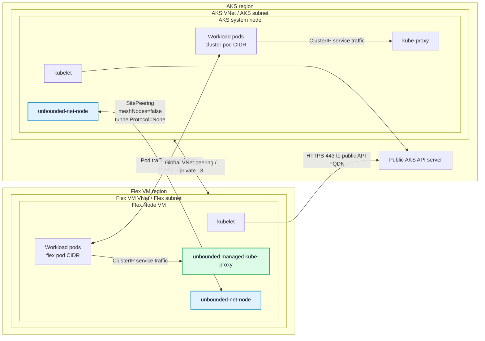

# Public AKS Cluster With Unbounded-Net And Cross-Region VNet-Peered Flex Node

This guide shows how to create a public AKS cluster with no built-in CNI, install `unbounded-net`, connect a VM in another Azure region through VNet peering, and join that VM as an AKS Flex Node.

The validated shape is intentionally different from the WireGuard gateway lab:

- The AKS API server is public.
- The AKS VNet and Flex VM VNet are globally peered.
- `unbounded-net` provides CNI on AKS and Flex nodes.
- Cross-site pod traffic uses the private Azure VNet peering path.
- No `GatewayPool` or WireGuard configuration is required.

Because the AKS VNet and Flex VNet are privately reachable through VNet peering, the Unbounded configuration uses `SitePeering` with `meshNodes: false` and `tunnelProtocol: None`. Do not assign either site to a gateway pool for this private-L3 topology.

For unbounded-net concepts, custom resources, and operations, see the [Unbounded networking documentation](https://unbounded-cloud.io/concepts/networking/) and [unbounded-net operations guide](https://unbounded-cloud.io/reference/networking/operations/).

## Prerequisites

- An Azure subscription where you can create resource groups, VNets, VMs, AKS clusters, VNet peering, and the bootstrap RBAC needed by AKS Flex Node.
- Azure CLI logged in to the target subscription.
- `kubectl`, `curl`, `git`, `make`, `jq`, `python3`, and SSH/SCP tooling on the workstation that will run the lab commands.
- Non-overlapping CIDR ranges for the AKS VNet, Flex VM VNet, AKS pod CIDR, Flex pod CIDR, AKS service CIDR, and any connected networks.
- A Flex VM image with Ubuntu 24.04 and sudo access.

## What Is Unbounded-Net Doing Here?

`unbounded-net` is the networking layer from [Project Unbounded](https://unbounded-cloud.io/). It provides CNI functionality and multi-site pod networking for Kubernetes clusters whose nodes may live in different networks, regions, or clouds.

In this setup, `unbounded-net` does three important things:

- Runs `unbounded-net-node` as a DaemonSet on AKS and Flex nodes. The node agent writes the host CNI config, watches `Site` and `SiteNodeSlice` resources, configures interfaces, and installs the routes needed for pod traffic.
- Allocates per-node pod CIDRs from each site's `Site` resource.
- Programs pod routes between the AKS site and Flex site using the existing VNet peering path.

This private-L3 mode is intentionally different from Unbounded's public gateway mode. Since the AKS VNet and Flex VNet are already peered, the sites use `SitePeering` with `meshNodes: false` and `tunnelProtocol: None` so node and pod traffic can use the Azure private network instead of a public gateway or WireGuard overlay.

## Topology



Example regions and CIDRs used below:

- AKS region: `eastus2`
- Flex VM region: `southcentralus`
- AKS VNet: `10.91.0.0/16`
- AKS subnet: `10.91.1.0/24`
- Flex VM VNet: `10.92.0.0/16`
- Flex VM subnet: `10.92.1.0/24`
- AKS pod CIDR: `10.93.0.0/16`
- AKS service CIDR: `10.94.0.0/16`
- AKS DNS service IP: `10.94.0.10`
- Flex pod CIDR: `10.95.0.0/16`

Avoid CIDR overlap across the AKS VNet, Flex VNet, AKS pod CIDR, Flex pod CIDR, AKS service CIDR, and any connected networks.

## Create Resource Groups And Networks

```bash
SUBSCRIPTION_ID="<subscription-id>"
AKS_RG="<aks-resource-group>"
VM_RG="<vm-resource-group>"
AKS_REGION="eastus2"
VM_REGION="southcentralus"
AKS_VNET="aks-public-peered-unbounded-vnet"
FLEX_VNET="flex-public-peered-unbounded-vnet"
AGENT_POOL_NAME="${AGENT_POOL_NAME:-aksflexnodes}"

az account set --subscription "$SUBSCRIPTION_ID"

az group create -n "$AKS_RG" -l "$AKS_REGION"
az group create -n "$VM_RG" -l "$VM_REGION"

az network vnet create \
  -g "$AKS_RG" \
  -n "$AKS_VNET" \
  -l "$AKS_REGION" \
  --address-prefixes 10.91.0.0/16 \
  --subnet-name aks-subnet \
  --subnet-prefixes 10.91.1.0/24

az network vnet create \
  -g "$VM_RG" \
  -n "$FLEX_VNET" \
  -l "$VM_REGION" \
  --address-prefixes 10.92.0.0/16 \
  --subnet-name flex-subnet \
  --subnet-prefixes 10.92.1.0/24
```

Create global VNet peering between the AKS VNet and the Flex VNet:

```bash
AKS_VNET_ID=$(az network vnet show -g "$AKS_RG" -n "$AKS_VNET" --query id -o tsv)
FLEX_VNET_ID=$(az network vnet show -g "$VM_RG" -n "$FLEX_VNET" --query id -o tsv)

az network vnet peering create \
  -g "$AKS_RG" \
  --vnet-name "$AKS_VNET" \
  -n aks-to-flex \
  --remote-vnet "$FLEX_VNET_ID" \
  --allow-vnet-access \
  --allow-forwarded-traffic

az network vnet peering create \
  -g "$VM_RG" \
  --vnet-name "$FLEX_VNET" \
  -n flex-to-aks \
  --remote-vnet "$AKS_VNET_ID" \
  --allow-vnet-access \
  --allow-forwarded-traffic
```

## Create A Public No-CNI AKS Cluster

```bash
CLUSTER_NAME="<aks-cluster-name>"
AKS_SUBNET_ID=$(az network vnet subnet show \
  -g "$AKS_RG" \
  --vnet-name "$AKS_VNET" \
  -n aks-subnet \
  --query id \
  -o tsv)

az aks create \
  -g "$AKS_RG" \
  -n "$CLUSTER_NAME" \
  -l "$AKS_REGION" \
  --vnet-subnet-id "$AKS_SUBNET_ID" \
  --network-plugin none \
  --pod-cidr 10.93.0.0/16 \
  --service-cidr 10.94.0.0/16 \
  --dns-service-ip 10.94.0.10 \
  --node-count 1 \
  --node-vm-size Standard_D4s_v5 \
  --generate-ssh-keys
```

The AKS node starts `NotReady` until `unbounded-net` writes the CNI configuration and allocates a pod CIDR.

Fetch credentials:

```bash
az aks get-credentials -g "$AKS_RG" -n "$CLUSTER_NAME" --overwrite-existing --admin
kubectl get nodes -o wide
```

## Install Unbounded-Net

Render and apply `unbounded-net` manifests. This installs the controller and the `unbounded-net-node` DaemonSet.

```bash
# Check the latest release tag at https://github.com/Azure/unbounded/releases.
UNBOUNDED_VERSION="v0.1.10"

git clone --depth 1 --branch "$UNBOUNDED_VERSION" \
  https://github.com/Azure/unbounded.git /tmp/unbounded

cd /tmp/unbounded
make VERSION="$UNBOUNDED_VERSION" net-manifests

kubectl apply --server-side --force-conflicts -f deploy/net/rendered/00-namespace.yaml
kubectl apply --server-side --force-conflicts -f deploy/net/rendered/01-configmap.yaml
kubectl apply --server-side --force-conflicts -f deploy/net/rendered/crd/
kubectl apply --server-side --force-conflicts -f deploy/net/rendered/controller/
kubectl apply --server-side --force-conflicts -f deploy/net/rendered/node/
```

Wait for the controller and node agent:

```bash
kubectl -n unbounded-net rollout status deploy/unbounded-net-controller --timeout=5m
kubectl -n unbounded-net rollout status ds/unbounded-net-node --timeout=5m
```

## Create Sites And Private L3 Peering

Create the AKS cluster site, the Flex site, and a `SitePeering` that tells `unbounded-net` the two sites are already privately reachable through VNet peering.

```bash
kubectl apply -f - <<'EOF'
apiVersion: net.unbounded-cloud.io/v1alpha1
kind: Site
metadata:
  name: aks-site
spec:
  nodeCidrs:
  - 10.91.0.0/16
  podCidrAssignments:
  - assignmentEnabled: true
    cidrBlocks:
    - 10.93.0.0/16
  manageCniPlugin: true
---
apiVersion: net.unbounded-cloud.io/v1alpha1
kind: Site
metadata:
  name: flex-site
spec:
  nodeCidrs:
  - 10.92.0.0/16
  podCidrAssignments:
  - assignmentEnabled: true
    cidrBlocks:
    - 10.95.0.0/16
  manageCniPlugin: true
---
apiVersion: net.unbounded-cloud.io/v1alpha1
kind: SitePeering
metadata:
  name: aks-flex-private-l3
spec:
  sites:
  - aks-site
  - flex-site
  meshNodes: false
  tunnelProtocol: None
EOF
```

This topology does not need a public `GatewayPool`, and neither site needs a gateway pool assignment. AKS control-plane-to-Flex-kubelet traffic should use the VNet peering path instead of unbounded-net's `unbounded0` interface.

Because this lab intentionally avoids an overlay gateway, Azure must also know how to route the non-VNet pod CIDRs. The route table and host-route steps below make pod CIDRs reachable over the VNet peering path.

Verify site assignment:

```bash
kubectl get sites,sitenodeslices,sitepeerings -o wide
kubectl get nodes -L net.unbounded-cloud.io/site -o wide
```

Expected result after the AKS node is reconciled:

```text
site.net.unbounded-cloud.io/aks-site    ["10.91.0.0/16"]   ...   1   1
site.net.unbounded-cloud.io/flex-site   ["10.92.0.0/16"]   ...

sitenodeslice.net.unbounded-cloud.io/aks-site-0   aks-site   0   1
```

The Flex site gets a `SiteNodeSlice` after the Flex node joins.

## Create The Flex VM

```bash
VM_NAME="<flex-vm-name>"

az vm create \
  -g "$VM_RG" \
  -n "$VM_NAME" \
  -l "$VM_REGION" \
  --image Ubuntu2404 \
  --size Standard_D4s_v5 \
  --vnet-name "$FLEX_VNET" \
  --subnet flex-subnet \
  --admin-username azureuser \
  --generate-ssh-keys \
  --public-ip-sku Standard
```

Get the VM IPs:

```bash
VM_PRIVATE_IP=$(az vm show -g "$VM_RG" -n "$VM_NAME" --show-details --query privateIps -o tsv)
VM_PUBLIC_IP=$(az vm show -g "$VM_RG" -n "$VM_NAME" --show-details --query publicIps -o tsv)

echo "private=${VM_PRIVATE_IP} public=${VM_PUBLIC_IP}"
```

From the Flex VM, verify public AKS API reachability:

```bash
curl -k -i https://$(az aks show -g "$AKS_RG" -n "$CLUSTER_NAME" --query fqdn -o tsv):443
```

Expected unauthenticated response:

```text
HTTP/2 401
```

## Configure Azure Private-L3 Pod Routing

The AKS and Flex pod CIDRs are not VNet address prefixes. Add Azure UDRs, enable IP forwarding, and allow pod/node CIDR traffic so Azure can carry routed pod packets across the peering path.

This single-node lab routes the full site pod CIDR to the one node in each site. For multi-node sites, create more specific routes for each node's assigned pod CIDR to that node's private IP, or automate route reconciliation.

```bash
AKS_NODE_IP=$(kubectl get nodes \
  -l net.unbounded-cloud.io/site=aks-site \
  -o jsonpath='{.items[0].status.addresses[?(@.type=="InternalIP")].address}')

# Route Flex pod CIDR from the AKS subnet to the Flex node.
az network route-table create \
  -g "$AKS_RG" \
  -n aks-to-flex-pods-rt \
  -l "$AKS_REGION"

az network route-table route create \
  -g "$AKS_RG" \
  --route-table-name aks-to-flex-pods-rt \
  -n flex-pods \
  --address-prefix 10.95.0.0/16 \
  --next-hop-type VirtualAppliance \
  --next-hop-ip-address "$VM_PRIVATE_IP"

az network vnet subnet update \
  -g "$AKS_RG" \
  --vnet-name "$AKS_VNET" \
  -n aks-subnet \
  --route-table aks-to-flex-pods-rt

# Route AKS pod CIDR from the Flex subnet to the AKS node.
az network route-table create \
  -g "$VM_RG" \
  -n flex-to-aks-pods-rt \
  -l "$VM_REGION"

az network route-table route create \
  -g "$VM_RG" \
  --route-table-name flex-to-aks-pods-rt \
  -n aks-pods \
  --address-prefix 10.93.0.0/16 \
  --next-hop-type VirtualAppliance \
  --next-hop-ip-address "$AKS_NODE_IP"

az network vnet subnet update \
  -g "$VM_RG" \
  --vnet-name "$FLEX_VNET" \
  -n flex-subnet \
  --route-table flex-to-aks-pods-rt
```

Enable IP forwarding on the Flex VM NIC and the AKS VMSS NIC configuration:

```bash
FLEX_NIC_ID=$(az vm show \
  -g "$VM_RG" \
  -n "$VM_NAME" \
  --query 'networkProfile.networkInterfaces[0].id' \
  -o tsv)
FLEX_NIC_NAME="${FLEX_NIC_ID##*/}"

az network nic update \
  -g "$VM_RG" \
  -n "$FLEX_NIC_NAME" \
  --ip-forwarding true

NODE_RG=$(az aks show \
  -g "$AKS_RG" \
  -n "$CLUSTER_NAME" \
  --query nodeResourceGroup \
  -o tsv)
VMSS_NAME=$(az vmss list \
  -g "$NODE_RG" \
  --query '[0].name' \
  -o tsv)

az vmss update \
  -g "$NODE_RG" \
  -n "$VMSS_NAME" \
  --set virtualMachineProfile.networkProfile.networkInterfaceConfigurations[0].enableIPForwarding=true

az vmss update-instances \
  -g "$NODE_RG" \
  -n "$VMSS_NAME" \
  --instance-ids '*'
```

If your environment attaches NSGs to the AKS subnet, AKS node resource group, Flex subnet, or Flex NIC, add explicit allow rules for the node and pod CIDRs. Some policy-managed `NRMS-...` subnet NSGs do not treat pod CIDRs as `VirtualNetwork` traffic.

```bash
NODE_RG=$(az aks show -g "$AKS_RG" -n "$CLUSTER_NAME" --query nodeResourceGroup -o tsv)
AKS_AGENT_NSG=$(az network nsg list -g "$NODE_RG" --query '[0].name' -o tsv)
AKS_SUBNET_NSG_ID=$(az network vnet subnet show -g "$AKS_RG" --vnet-name "$AKS_VNET" -n aks-subnet --query networkSecurityGroup.id -o tsv)
FLEX_SUBNET_NSG_ID=$(az network vnet subnet show -g "$VM_RG" --vnet-name "$FLEX_VNET" -n flex-subnet --query networkSecurityGroup.id -o tsv)
FLEX_NIC_NSG_ID=$(az network nic show -g "$VM_RG" -n "$FLEX_NIC_NAME" --query networkSecurityGroup.id -o tsv)

add_peered_pod_nsg_rules() {
  local rg="$1"
  local nsg="$2"
  [ -z "$nsg" ] && return 0

  az network nsg rule create \
    -g "$rg" \
    --nsg-name "$nsg" \
    -n AllowAKSFlexPeeredPodNodeInbound \
    --priority 100 \
    --direction Inbound \
    --access Allow \
    --protocol '*' \
    --source-address-prefixes 10.91.0.0/16 10.92.0.0/16 10.93.0.0/16 10.95.0.0/16 \
    --source-port-ranges '*' \
    --destination-address-prefixes 10.91.0.0/16 10.92.0.0/16 10.93.0.0/16 10.95.0.0/16 \
    --destination-port-ranges '*' || true

  az network nsg rule create \
    -g "$rg" \
    --nsg-name "$nsg" \
    -n AllowAKSFlexPeeredPodNodeOutbound \
    --priority 100 \
    --direction Outbound \
    --access Allow \
    --protocol '*' \
    --source-address-prefixes 10.91.0.0/16 10.92.0.0/16 10.93.0.0/16 10.95.0.0/16 \
    --source-port-ranges '*' \
    --destination-address-prefixes 10.91.0.0/16 10.92.0.0/16 10.93.0.0/16 10.95.0.0/16 \
    --destination-port-ranges '*' || true
}

add_peered_pod_nsg_rules "$NODE_RG" "$AKS_AGENT_NSG"
[ -n "$AKS_SUBNET_NSG_ID" ] && add_peered_pod_nsg_rules "$AKS_RG" "${AKS_SUBNET_NSG_ID##*/}"
[ -n "$FLEX_SUBNET_NSG_ID" ] && add_peered_pod_nsg_rules "$VM_RG" "${FLEX_SUBNET_NSG_ID##*/}"
[ -n "$FLEX_NIC_NSG_ID" ] && add_peered_pod_nsg_rules "$VM_RG" "${FLEX_NIC_NSG_ID##*/}"
```

## Generate Bootstrap Config

Use the config helper from this repository. By default, the installer resolves the latest GitHub release. Set `AKS_FLEX_NODE_VERSION` only when you want to use a specific release tag.

```bash
# Optional: uncomment to use a specific release tag.
# AKS_FLEX_NODE_VERSION="<release-tag>"

curl -fsSLo ./aks-flex-config \
  "https://raw.githubusercontent.com/Azure/AKSFlexNode/${AKS_FLEX_NODE_VERSION:-main}/scripts/aks-flex-config"
chmod +x ./aks-flex-config

./aks-flex-config setup-node-rbac \
  --resource-group "$AKS_RG" \
  --cluster-name "$CLUSTER_NAME" \
  --subscription "$SUBSCRIPTION_ID"

./aks-flex-config generate-node-config \
  --resource-group "$AKS_RG" \
  --cluster-name "$CLUSTER_NAME" \
  --subscription "$SUBSCRIPTION_ID" \
  --agent-pool-name "$AGENT_POOL_NAME" \
  --bootstrap-token \
  --output ./aks-flex-node-config.json
```

Patch the rendered config so kubelet advertises the Flex VM private IP and uses the full Kubernetes patch version from AKS. The config helper reads the cluster DNS service IP from AKS metadata.

```bash
KUBERNETES_VERSION=$(az aks show \
  -g "$AKS_RG" \
  -n "$CLUSTER_NAME" \
  --query currentKubernetesVersion \
  -o tsv)

jq \
  --arg nodeIP "$VM_PRIVATE_IP" \
  --arg kubernetesVersion "$KUBERNETES_VERSION" \
  '.node.kubelet.nodeIP = $nodeIP
   | .components.kubernetes = $kubernetesVersion' \
  ./aks-flex-node-config.json > ./aks-flex-node-config.json.tmp
mv ./aks-flex-node-config.json.tmp ./aks-flex-node-config.json
```

Before copying the config to the Flex VM, verify that the config references a bootstrap token secret that exists in the cluster:

```bash
TOKEN_ID=$(python3 -c 'import json; print(json.load(open("./aks-flex-node-config.json"))["azure"]["bootstrapToken"]["token"].split(".")[0])')
kubectl get secret -n kube-system "bootstrap-token-${TOKEN_ID}"
```

The config must contain:

```json
{
  "components": {
    "kubernetes": "<full-kubernetes-version>"
  },
  "networking": {
    "dnsServiceIP": "10.94.0.10"
  },
  "node": {
    "kubelet": {
      "clusterFQDN": "<public-aks-fqdn>",
      "caCertData": "<base64-ca-data>",
      "nodeIP": "<flex-vm-private-ip>"
    }
  },
  "agent": {
    "nodeName": "<flex-vm-node-name>"
  }
}
```

## Install AKS Flex Node On The VM

Copy the generated config:

```bash
scp ./aks-flex-node-config.json azureuser@"$VM_PUBLIC_IP":/tmp/aks-flex-node-config.json
```

Install `aks-flex-node` and place the config:

```bash
ssh azureuser@"$VM_PUBLIC_IP"

sudo su

# Optional: uncomment to use a specific release tag.
# AKS_FLEX_NODE_VERSION="<release-tag>"

curl -fsSL "https://raw.githubusercontent.com/Azure/AKSFlexNode/${AKS_FLEX_NODE_VERSION:-main}/scripts/install.sh" \
  | AKS_FLEX_NODE_VERSION="${AKS_FLEX_NODE_VERSION:-}" bash

umask 077
mkdir -p /etc/aks-flex-node
cp /tmp/aks-flex-node-config.json /etc/aks-flex-node/config.json
chmod 600 /etc/aks-flex-node/config.json

aks-flex-node version
aks-flex-node start --config /etc/aks-flex-node/config.json
```

Return to your workstation shell after the node starts.

## DaemonSets On The Flex Node

The `unbounded-net-node` DaemonSet is installed by the Unbounded manifests and should schedule on the Flex Node automatically. It is responsible for CNI setup and site routing on the Flex Node.

`unbounded-net` also creates a site-scoped managed kube-proxy DaemonSet for each site, for example:

```text
unbounded-net/unbounded-net-kube-proxy-flex-site
```

Do not add `kubernetes.azure.com/cluster=<cluster-name>` for this unbounded-net setup. That label is only needed in the kubenet flow to make AKS-managed kube-proxy schedule on Flex Nodes. In this setup, kube-proxy for the Flex site is provided by `unbounded-net`.

## Install Host Routes For Pod CIDRs

With `meshNodes: false` and `tunnelProtocol: None`, do not create a `GatewayPool`; a gateway pool can advertise node CIDRs and break AKS API-server-to-Flex-kubelet callbacks. Instead, add host routes that send the remote site's pod CIDR to the local Azure subnet gateway. Azure UDRs then forward the packets to the correct remote node.

These commands use the `unbounded-net-node` host-network pod to enter each node's network namespace. The route changes are sufficient for a lab validation run; for long-running environments, make them persistent with your preferred host route management mechanism.

```bash
AKS_NODE=$(kubectl get nodes -l net.unbounded-cloud.io/site=aks-site -o jsonpath='{.items[0].metadata.name}')
FLEX_NODE="$VM_NAME"
AKS_NODE_IP=$(kubectl get node "$AKS_NODE" -o jsonpath='{.status.addresses[?(@.type=="InternalIP")].address}')
AKS_NODE_POD_CIDR=$(kubectl get node "$AKS_NODE" -o jsonpath='{.spec.podCIDR}')
FLEX_NODE_POD_CIDR=$(kubectl get node "$FLEX_NODE" -o jsonpath='{.spec.podCIDR}')
AKS_SUBNET_GATEWAY="10.91.1.1"
FLEX_SUBNET_GATEWAY="10.92.1.1"

AKS_UNBOUNDED_POD=$(kubectl -n unbounded-net get pod \
  -l app.kubernetes.io/name=unbounded-net-node \
  --field-selector spec.nodeName="$AKS_NODE" \
  -o jsonpath='{.items[0].metadata.name}')
FLEX_UNBOUNDED_POD=$(kubectl -n unbounded-net get pod \
  -l app.kubernetes.io/name=unbounded-net-node \
  --field-selector spec.nodeName="$FLEX_NODE" \
  -o jsonpath='{.items[0].metadata.name}')

# Use the local Azure subnet gateway, not the remote node IP, as the Linux next hop.
kubectl -n unbounded-net exec "$AKS_UNBOUNDED_POD" -- \
  nsenter -t 1 -n ip route replace "$FLEX_NODE_POD_CIDR" via "$AKS_SUBNET_GATEWAY" dev eth0 src "$AKS_NODE_IP"

kubectl -n unbounded-net exec "$FLEX_UNBOUNDED_POD" -- \
  nsenter -t 1 -n ip route replace "$AKS_NODE_POD_CIDR" via "$FLEX_SUBNET_GATEWAY" dev eth0 src "$VM_PRIVATE_IP"
```

Verify that the host routes point at the local Azure subnet gateway:

```bash
kubectl -n unbounded-net exec "$AKS_UNBOUNDED_POD" -- \
  nsenter -t 1 -n ip route show "$FLEX_NODE_POD_CIDR"
kubectl -n unbounded-net exec "$FLEX_UNBOUNDED_POD" -- \
  nsenter -t 1 -n ip route show "$AKS_NODE_POD_CIDR"
```

## Verify

Check nodes:

```bash
kubectl get nodes -o wide
```

Expected result:

```text
NAME                                STATUS   VERSION   INTERNAL-IP
aks-nodepool1-...                   Ready    v1.34.x   <aks-node-ip>
<flex-vm-node-name>                 Ready    v1.34.x   <flex-vm-private-ip>
```

Check sites and slices:

```bash
kubectl get sites,sitenodeslices,sitepeerings -o wide
```

Expected result:

```text
site.net.unbounded-cloud.io/aks-site    ...   NODES   1   SLICES   1
site.net.unbounded-cloud.io/flex-site   ...   NODES   1   SLICES   1
sitepeering.net.unbounded-cloud.io/aks-flex-private-l3   SITES   2   MESH NODES   false
```

Check pods on the Flex Node:

```bash
kubectl get pods -A --field-selector spec.nodeName=<flex-vm-node-name> -o wide
```

Expected pods:

```text
unbounded-net   unbounded-net-node-...                    Running   <flex-vm-node-name>
unbounded-net   unbounded-net-kube-proxy-flex-site-...     Running   <flex-vm-node-name>
```

Verify exec and logs through the AKS kubelet proxy path:

```bash
kubectl run flex-exec-smoke \
  --image=busybox:1.36 \
  --restart=Never \
  --overrides='{"spec":{"nodeSelector":{"kubernetes.io/hostname":"<flex-vm-node-name>"},"tolerations":[{"operator":"Exists"}]}}' \
  --command -- sh -c 'echo hello-from-flex; sleep 300'

kubectl wait --for=condition=Ready pod/flex-exec-smoke --timeout=180s
kubectl exec flex-exec-smoke -- true
kubectl logs flex-exec-smoke --tail=5
kubectl delete pod flex-exec-smoke --wait=false
```

Expected log output:

```text
hello-from-flex
```

Create test pods on AKS and Flex nodes:

```bash
AKS_NODE=$(kubectl get nodes -l net.unbounded-cloud.io/site=aks-site -o jsonpath='{.items[0].metadata.name}')

kubectl run aks-peering-smoke \
  --image=busybox:1.36 \
  --restart=Never \
  --overrides='{"spec":{"nodeSelector":{"kubernetes.io/hostname":"'"$AKS_NODE"'"},"tolerations":[{"operator":"Exists"}]}}' \
  --command -- sh -c 'sleep 3600'

kubectl run flex-peering-smoke \
  --image=busybox:1.36 \
  --restart=Never \
  --overrides='{"spec":{"nodeSelector":{"kubernetes.io/hostname":"<flex-vm-node-name>"},"tolerations":[{"operator":"Exists"}]}}' \
  --command -- sh -c 'sleep 3600'

kubectl wait --for=condition=Ready pod/aks-peering-smoke --timeout=180s
kubectl wait --for=condition=Ready pod/flex-peering-smoke --timeout=180s
```

Verify pod-to-pod traffic in both directions:

```bash
AKS_POD_IP=$(kubectl get pod aks-peering-smoke -o jsonpath='{.status.podIP}')
FLEX_POD_IP=$(kubectl get pod flex-peering-smoke -o jsonpath='{.status.podIP}')

kubectl exec aks-peering-smoke -- ping -c 3 "$FLEX_POD_IP"
kubectl exec flex-peering-smoke -- ping -c 3 "$AKS_POD_IP"
```

Clean up the test pods:

```bash
kubectl delete pod aks-peering-smoke flex-peering-smoke --wait=false
```

## Troubleshooting

Check the Flex agent and nspawn worker:

```bash
systemctl status aks-flex-node-agent
machinectl list
systemctl status systemd-nspawn@kube1
journalctl -M kube1 -u kubelet -f
```

Check public API reachability from the VM:

```bash
curl -k -i https://<public-aks-fqdn>:443
```

Expected unauthenticated response:

```text
HTTP/2 401
```

Check `unbounded-net` resources:

```bash
kubectl -n unbounded-net get pods -o wide
kubectl get sites,sitenodeslices,sitepeerings -o wide
kubectl get node <flex-vm-node-name> -o yaml | grep -E 'podCIDR|net.unbounded-cloud.io/site'
```

If `kubectl exec` or `kubectl logs` to a Flex pod fails with a `502` while the Flex node is `Ready`, check whether AKS nodes have a route for the Flex node CIDR through `unbounded0`:

```bash
ip route get <flex-vm-private-ip>
```

For a VNet-peered/private-L3 setup, the route should use the Azure VNet path, not `unbounded0`. Do not assign either site to a `GatewayPool`; that can advertise node CIDRs as gateway `NodeCidr` values and hijack kubelet traffic.

If pod traffic between AKS and Flex pods fails:

- Verify both VNet peering objects are connected and have `--allow-vnet-access` enabled.
- Verify NSGs allow traffic between AKS node private IPs and Flex node private IPs over the peering path.
- Verify the `Site` `nodeCidrs` match the AKS and Flex VNet ranges.
- Verify the `SitePeering` has `meshNodes: false` and `tunnelProtocol: None`.
- Verify neither site has a `SiteGatewayPoolAssignment`.
- Verify VNet peering has `allowForwardedTraffic=true` in both directions.
- Verify Azure route tables route the remote pod CIDR to the remote node private IP.
- Verify IP forwarding is enabled on the Flex NIC and AKS VMSS NIC configuration.
- Verify NSGs explicitly allow node and pod CIDRs if policy-managed NSGs are attached.
- Verify host routes send remote pod CIDRs to the local Azure subnet gateway, for example `10.91.1.1` on the AKS node and `10.92.1.1` on the Flex node.
