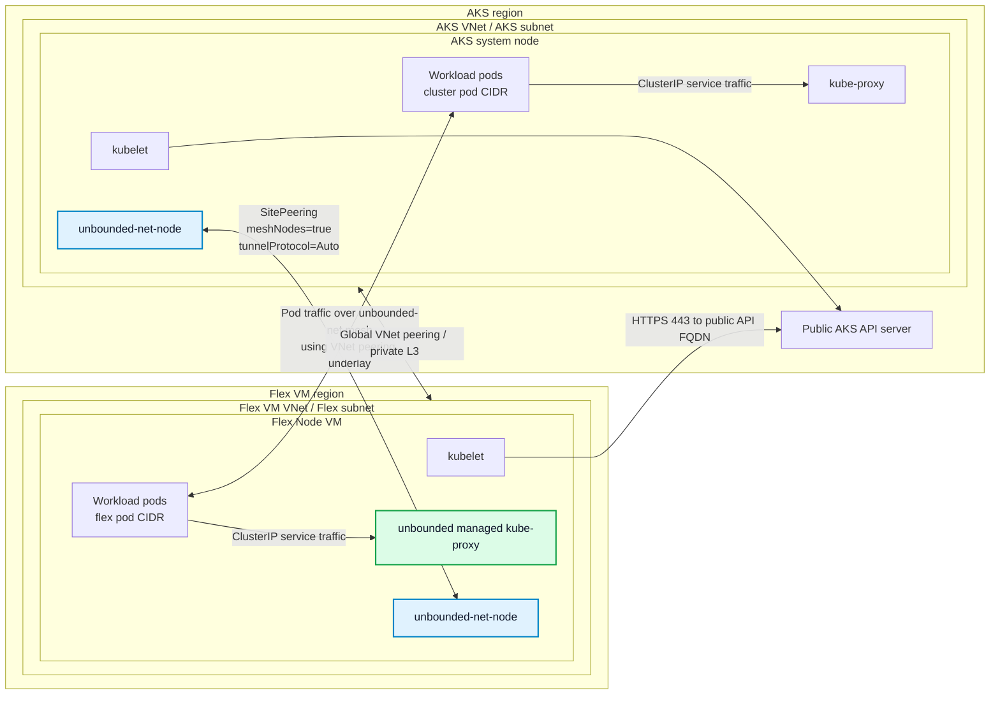

# Public AKS Cluster With Unbounded-Net And Cross-Region VNet-Peered Flex Node

This guide shows how to create a public AKS cluster with no built-in CNI, install `unbounded-net`, connect a VM in another Azure region through VNet peering, and join that VM as an AKS Flex Node.

> [!IMPORTANT]
> This lab covers an additional configuration for evaluation. Review its status, prerequisites, and version scope before use.
>
> **Status:** Validated evaluation scenario
>
> **Last validated:** 2026-09-23
>
> **Validated versions:** AKS Kubernetes `1.35.8`, AKS Flex Node `v0.2.0`, Unbounded `v0.8.0`, and Ubuntu `24.04.4`
>
> **Validated scope:** Cross-region VNet peering, Unbounded Site setup, managed-identity Azure Machine registration, Flex Node readiness, and bidirectional cross-node pod traffic passed.
>
> **Architecture:** amd64

The validated shape is intentionally different from the WireGuard gateway lab:

- The AKS API server is public.
- The AKS VNet and Flex VM VNet are globally peered.
- `unbounded-net` provides CNI on AKS and Flex nodes.
- Cross-site pod traffic uses the private Azure VNet peering path.
- No `GatewayPool` or WireGuard configuration is required.

Because the AKS VNet and Flex VNet are privately reachable through VNet peering, the Unbounded configuration uses `SitePeering` with `meshNodes: true` and `tunnelProtocol: Auto`. This lets `unbounded-net` own pod-to-pod connectivity through its mesh/tunnel datapath while Azure VNet peering provides node-to-node underlay reachability. Do not assign either site to a gateway pool for this topology.

For unbounded-net concepts, custom resources, and operations, see the [Unbounded networking documentation](https://unbounded-cloud.io/concepts/networking/) and [unbounded-net operations guide](https://unbounded-cloud.io/reference/networking/operations/).

## Prerequisites

- An Azure subscription where you can create resource groups, VNets, VMs, AKS clusters, VNet peering, and the bootstrap RBAC needed by AKS Flex Node.
- Azure CLI 2.90.0 or later, signed in to the target subscription.
- `kubectl`, `curl`, `tar`, `jq`, `python3`, and SSH/SCP tools in the Bash environment that runs the lab commands.
- Non-overlapping CIDR ranges for the AKS VNet, Flex VM VNet, AKS pod CIDR, Flex pod CIDR, AKS service CIDR, and any connected networks.
- A Flex VM image with Ubuntu 24.04 and sudo access.

## What Is Unbounded-Net Doing Here?

`unbounded-net` is the networking layer from [Project Unbounded](https://unbounded-cloud.io/). It provides CNI functionality and multi-site pod networking for Kubernetes clusters whose nodes may live in different networks, regions, or clouds.

In this setup, `unbounded-net` does three important things:

- Runs `unbounded-net-node` as a DaemonSet on AKS and Flex nodes. The node agent writes the host CNI config, watches `Site` and `SiteNodeSlice` resources, configures interfaces, and installs the routes needed for pod traffic.
- Allocates per-node pod CIDRs from each site's `Site` resource.
- Programs pod routes between the AKS site and Flex site using the existing VNet peering path as the node-to-node underlay.

This VNet-peered mode is intentionally different from Unbounded's public gateway mode. Since the AKS VNet and Flex VNet are already peered, the sites use `SitePeering` with `meshNodes: true` and `tunnelProtocol: Auto` so `unbounded-net` can provide the CNI mesh for pod traffic without a public `GatewayPool` or WireGuard gateway.

## Topology


```mermaid
flowchart LR
    subgraph aksRegion[AKS region]
        subgraph aksVnet[AKS VNet / AKS subnet]
            subgraph aksNode[AKS system node]
                aksKubelet[kubelet]
                kubeProxyAks[kube-proxy]
                unboundedAks[unbounded-net-node]
                aksPods[Workload pods<br/>cluster pod CIDR]
            end
        end

        publicApi[Public AKS API server]
    end

    subgraph vmRegion[Flex VM region]
        subgraph flexVnet[Flex VM VNet / Flex subnet]
            subgraph flexNode[Flex Node VM]
                flexKubelet[kubelet]
                kubeProxyFlex[unbounded managed kube-proxy]
                unboundedFlex[unbounded-net-node]
                workload[Workload pods<br/>flex pod CIDR]
            end
        end
    end

    aksVnet <-->|Global VNet peering / private L3| flexVnet
    flexKubelet -->|HTTPS 443 to public API FQDN| publicApi
    aksKubelet --> publicApi
    workload -->|ClusterIP service traffic| kubeProxyFlex
    aksPods -->|ClusterIP service traffic| kubeProxyAks
    unboundedAks <-->|SitePeering<br/>meshNodes=true<br/>tunnelProtocol=Auto| unboundedFlex
    workload <-->|Pod traffic over unbounded-net mesh<br/>using VNet peering underlay| aksPods

    classDef unbounded fill:#e0f2fe,stroke:#0284c7,stroke-width:2px,color:#0f172a;
    classDef unboundedProxy fill:#dcfce7,stroke:#16a34a,stroke-width:2px,color:#0f172a;
    class unboundedAks,unboundedFlex unbounded;
    class kubeProxyFlex unboundedProxy;
```

Example regions and CIDRs used below:

- AKS region: `eastus2`
- Flex VM region: `southcentralus`
- AKS VNet: `10.91.0.0/16`
- AKS subnet: `10.91.1.0/24`
- Flex VM VNet: `10.92.0.0/16`
- Flex VM subnet: `10.92.1.0/24`
- AKS pod CIDR: `10.93.0.0/16`
- AKS service CIDR: `10.94.0.0/16`
- AKS DNS service IP: `10.94.0.10`
- Flex pod CIDR: `10.95.0.0/16`

Avoid CIDR overlap across the AKS VNet, Flex VNet, AKS pod CIDR, Flex pod CIDR, AKS service CIDR, and any connected networks.

## Create Resource Groups And Networks

```bash
SUBSCRIPTION_ID="<subscription-id>"
AKS_RG="<aks-resource-group>"
VM_RG="<vm-resource-group>"
AKS_REGION="eastus2"
VM_REGION="southcentralus"
AKS_VNET="aks-public-peered-unbounded-vnet"
FLEX_VNET="flex-public-peered-unbounded-vnet"
AGENT_POOL_NAME="${AGENT_POOL_NAME:-aksflexnodes}"
AKS_PREVIEW_VERSION="22.0.0b8"
AKS_NODE_VM_SIZE="${AKS_NODE_VM_SIZE:-Standard_D4s_v6}"
FLEX_VM_SIZE="${FLEX_VM_SIZE:-Standard_D4s_v5}"

az account set --subscription "$SUBSCRIPTION_ID"

az group create -n "$AKS_RG" -l "$AKS_REGION"
az group create -n "$VM_RG" -l "$VM_REGION"

az network vnet create \
  -g "$AKS_RG" \
  -n "$AKS_VNET" \
  -l "$AKS_REGION" \
  --address-prefixes 10.91.0.0/16 \
  --subnet-name aks-subnet \
  --subnet-prefixes 10.91.1.0/24

az network vnet create \
  -g "$VM_RG" \
  -n "$FLEX_VNET" \
  -l "$VM_REGION" \
  --address-prefixes 10.92.0.0/16 \
  --subnet-name flex-subnet \
  --subnet-prefixes 10.92.1.0/24
```

Create global VNet peering between the AKS VNet and the Flex VNet:

```bash
AKS_VNET_ID=$(az network vnet show -g "$AKS_RG" -n "$AKS_VNET" --query id -o tsv)
FLEX_VNET_ID=$(az network vnet show -g "$VM_RG" -n "$FLEX_VNET" --query id -o tsv)

az network vnet peering create \
  -g "$AKS_RG" \
  --vnet-name "$AKS_VNET" \
  -n aks-to-flex \
  --remote-vnet "$FLEX_VNET_ID" \
  --allow-vnet-access \
  --allow-forwarded-traffic

az network vnet peering create \
  -g "$VM_RG" \
  --vnet-name "$FLEX_VNET" \
  -n flex-to-aks \
  --remote-vnet "$AKS_VNET_ID" \
  --allow-vnet-access \
  --allow-forwarded-traffic
```

## Create A Public No-CNI AKS Cluster

```bash
CLUSTER_NAME="<aks-cluster-name>"
AKS_SUBNET_ID=$(az network vnet subnet show \
  -g "$AKS_RG" \
  --vnet-name "$AKS_VNET" \
  -n aks-subnet \
  --query id \
  -o tsv)

az aks create \
  -g "$AKS_RG" \
  -n "$CLUSTER_NAME" \
  -l "$AKS_REGION" \
  --vnet-subnet-id "$AKS_SUBNET_ID" \
  --network-plugin none \
  --pod-cidr 10.93.0.0/16 \
  --service-cidr 10.94.0.0/16 \
  --dns-service-ip 10.94.0.10 \
  --node-count 1 \
  --node-vm-size "$AKS_NODE_VM_SIZE" \
  --generate-ssh-keys
```

The AKS node starts `NotReady` until `unbounded-net` writes the CNI configuration and allocates a pod CIDR.

Fetch credentials:

```bash
az aks get-credentials -g "$AKS_RG" -n "$CLUSTER_NAME" --overwrite-existing --admin
kubectl get nodes -o wide
```

## Create the Flex node pool

Install the verified preview extension and create the logical pool used for Azure Machine registration. Before continuing, register `AKSFlexNodePreview` and `PutMachinePreview` as described in [Create a no-CNI AKS cluster](../usage/getting-started.md#1-create-a-no-cni-aks-cluster).

```bash
az extension add --name aks-preview --allow-preview true \
  --version "$AKS_PREVIEW_VERSION" --upgrade

while true; do
  if ! STATUS=$(az aks operation show-latest -g "$AKS_RG" -n "$CLUSTER_NAME" \
    --query status -o tsv 2>/dev/null); then
    echo "Failed to query the latest AKS operation" >&2
    exit 1
  fi
  case "$STATUS" in
    InProgress|Running|Updating) sleep 15 ;;
    Succeeded) break ;;
    Failed|Canceled)
      echo "Latest AKS operation ended with status: $STATUS" >&2
      exit 1
      ;;
    *)
      echo "Unexpected AKS operation status: $STATUS" >&2
      exit 1
      ;;
  esac
done

az aks nodepool add \
  --resource-group "$AKS_RG" \
  --cluster-name "$CLUSTER_NAME" \
  --name "$AGENT_POOL_NAME" \
  --vm-set-type FlexNodes \
  --mode User \
  --kubernetes-version "$(az aks show -g "$AKS_RG" -n "$CLUSTER_NAME" --query currentKubernetesVersion -o tsv)" \
  --max-pods 250 \
  --max-unavailable 1 \
  --output none
```

## Install Unbounded-Net

Install the versioned `kubectl-unbounded` plugin and bootstrap the operator:

```bash
UNBOUNDED_VERSION="v0.8.0"
case "$(uname -m)" in
  x86_64) UNBOUNDED_ARCH=amd64 ;;
  aarch64|arm64) UNBOUNDED_ARCH=arm64 ;;
  *) echo "unsupported architecture" >&2; exit 1 ;;
esac

curl -fsSLo /tmp/kubectl-unbounded.tar.gz \
  "https://github.com/Azure/unbounded/releases/download/${UNBOUNDED_VERSION}/kubectl-unbounded-linux-${UNBOUNDED_ARCH}.tar.gz"
tar -xzf /tmp/kubectl-unbounded.tar.gz -C /tmp
sudo install -m 0755 /tmp/kubectl-unbounded /usr/local/bin/kubectl-unbounded

kubectl unbounded install --timeout 5m
```

## Create Sites And Mesh Peering

Use `site init` to create the AKS cluster Site and Flex Site, and then create a `SitePeering` for the existing private Layer 3 path.

```bash
kubectl unbounded site init \
  --name flex-site \
  --cluster-node-cidr 10.91.0.0/16 \
  --cluster-pod-cidr 10.93.0.0/16 \
  --node-cidr 10.92.0.0/16 \
  --pod-cidr 10.95.0.0/16

kubectl apply -f - <<'EOF'
apiVersion: net.unbounded-cloud.io/v1alpha1
kind: SitePeering
metadata:
  name: cluster-flex-private-l3
spec:
  sites:
  - cluster
  - flex-site
  meshNodes: true
  tunnelProtocol: Auto
EOF
```

Wait for the controller and node agent:

```bash
kubectl -n unbounded-system rollout status deploy/unbounded-net-controller --timeout=5m
kubectl -n unbounded-system rollout status ds/unbounded-net-node --timeout=5m
```

This topology does not need a public `GatewayPool`, and neither site needs a gateway pool assignment. AKS control-plane-to-Flex-kubelet traffic should use the VNet peering path, while pod-to-pod traffic is handled by the `unbounded-net` mesh selected by `tunnelProtocol: Auto`.

Verify site assignment:

```bash
kubectl get sites,sitenodeslices,sitepeerings -o wide
kubectl get nodes -L unbounded-cloud.io/site -o wide
```

Expected result after the AKS node is reconciled:

```text
site.unbounded-cloud.io/cluster     ["10.91.0.0/16"]   ...   1   1
site.unbounded-cloud.io/flex-site   ["10.92.0.0/16"]   ...

sitenodeslice.net.unbounded-cloud.io/cluster-0   cluster   0   1
```

The Flex site gets a `SiteNodeSlice` after the Flex node joins.

## Create The Flex VM

```bash
VM_NAME="<flex-vm-name>"

az vm create \
  -g "$VM_RG" \
  -n "$VM_NAME" \
  -l "$VM_REGION" \
  --image Ubuntu2404 \
  --size "$FLEX_VM_SIZE" \
  --vnet-name "$FLEX_VNET" \
  --subnet flex-subnet \
  --admin-username azureuser \
  --generate-ssh-keys \
  --public-ip-sku Standard \
  --assign-identity
```

Get the VM IPs:

```bash
VM_PRIVATE_IP=$(az vm show -g "$VM_RG" -n "$VM_NAME" --show-details --query privateIps -o tsv)
VM_PUBLIC_IP=$(az vm show -g "$VM_RG" -n "$VM_NAME" --show-details --query publicIps -o tsv)

VM_PRINCIPAL_ID=$(az vm show -g "$VM_RG" -n "$VM_NAME" --query identity.principalId -o tsv)
AKS_RESOURCE_ID=$(az aks show -g "$AKS_RG" -n "$CLUSTER_NAME" --query id -o tsv)
FLEX_POOL_RESOURCE_ID="${AKS_RESOURCE_ID}/agentPools/${AGENT_POOL_NAME}"
FLEX_NODE_AGENT_ROLE_ID="8f139b0f-7eaf-460b-a9da-5b1246d9ed0d"

echo "private=${VM_PRIVATE_IP} public=${VM_PUBLIC_IP}"

az role assignment create \
  --assignee-object-id "$VM_PRINCIPAL_ID" \
  --assignee-principal-type ServicePrincipal \
  --role "$FLEX_NODE_AGENT_ROLE_ID" \
  --scope "$FLEX_POOL_RESOURCE_ID" \
  --output none
```

Verify that Azure Kubernetes Service Flex Node Agent Role is assigned at the exact pool scope, then allow the assignment to propagate before bootstrap. If Machine preflight or registration returns HTTP 403, wait and retry instead of disabling required registration.

Resolve the API server name in your Bash environment, and then test it from the flex node host:

```bash
AKS_FQDN=$(az aks show -g "$AKS_RG" -n "$CLUSTER_NAME" --query fqdn -o tsv)
ssh azureuser@"$VM_PUBLIC_IP" "curl -k -i https://${AKS_FQDN}:443"
```

Expected unauthenticated response:

```text
HTTP/2 401
```

<a id="generate-bootstrap-config"></a>
<a id="install-aks-flex-node-on-the-vm"></a>
## Bootstrap The Flex Node

Use the version-matched bootstrap script to retrieve fresh pool-issued data with the VM's managed identity. No client-side bootstrap RBAC or rendered baseline config is required.

On the Flex VM:

```bash
sudo -i

export AKS_RESOURCE_ID="<full-aks-resource-id>"
export AGENT_POOL_NAME="aksflexnodes"
export AKS_FLEX_NODE_VERSION="v0.2.0"

install -d -m 0700 /run/aks-flex-node-bootstrap
curl -fsSLo /run/aks-flex-node-bootstrap/bootstrap.sh \
  "https://raw.githubusercontent.com/Azure/AKSFlexNode/${AKS_FLEX_NODE_VERSION}/scripts/bootstrap.sh"
chmod 0700 /run/aks-flex-node-bootstrap/bootstrap.sh
bash -n /run/aks-flex-node-bootstrap/bootstrap.sh

bash /run/aks-flex-node-bootstrap/bootstrap.sh \
  --auth msi \
  --fetch-bootstrap-data \
  --cluster-resource-id "$AKS_RESOURCE_ID" \
  --agent-pool-name "$AGENT_POOL_NAME" \
  --agent-version "$AKS_FLEX_NODE_VERSION"

rm -f /run/aks-flex-node-bootstrap/bootstrap.sh
```

Use the cluster resource ID and pool name created earlier in this lab. For a user-assigned managed identity, also pass `--msi-client-id "<client-id>"`.

## DaemonSets On The Flex Node

The `unbounded-net-node` DaemonSet is installed by the Unbounded manifests and should schedule on the Flex Node automatically. It is responsible for CNI setup and site routing on the Flex Node.

`unbounded-net` also creates a site-scoped managed kube-proxy DaemonSet for each site, for example:

```text
unbounded-system/unbounded-net-kube-proxy-flex-site
```

Do not add `kubernetes.azure.com/cluster=<cluster-name>` for this unbounded-net setup. That label is only needed in the kubenet flow to make AKS-managed kube-proxy schedule on Flex Nodes. In this setup, kube-proxy for the Flex site is provided by `unbounded-net`.

## Verify

Check nodes:

```bash
kubectl get nodes -o wide
```

Expected result:

```text
NAME                                STATUS   VERSION   INTERNAL-IP
aks-nodepool1-...                   Ready    v1.34.x   <aks-node-ip>
<flex-vm-node-name>                 Ready    v1.34.x   <flex-vm-private-ip>
```

Check sites and slices:

```bash
kubectl get sites,sitenodeslices,sitepeerings -o wide
```

Expected result:

```text
site.unbounded-cloud.io/cluster     ...   NODES   1   SLICES   1
site.unbounded-cloud.io/flex-site   ...   NODES   1   SLICES   1
sitepeering.net.unbounded-cloud.io/aks-flex-private-l3   SITES   2   MESH NODES   true
```

Check pods on the Flex Node:

```bash
kubectl get pods -A --field-selector spec.nodeName=<flex-vm-node-name> -o wide
```

Expected pods:

```text
unbounded-system   unbounded-net-node-...                    Running   <flex-vm-node-name>
unbounded-system   unbounded-net-kube-proxy-flex-site-...     Running   <flex-vm-node-name>
```

Verify exec and logs through the AKS kubelet proxy path:

```bash
kubectl run flex-exec-smoke \
  --image=busybox:1.36 \
  --restart=Never \
  --overrides='{"spec":{"nodeSelector":{"kubernetes.io/hostname":"<flex-vm-node-name>"},"tolerations":[{"operator":"Exists"}]}}' \
  --command -- sh -c 'echo hello-from-flex; sleep 300'

kubectl wait --for=condition=Ready pod/flex-exec-smoke --timeout=180s
kubectl exec flex-exec-smoke -- true
kubectl logs flex-exec-smoke --tail=5
kubectl delete pod flex-exec-smoke --wait=false
```

Expected log output:

```text
hello-from-flex
```

Create test pods on AKS and Flex nodes:

```bash
AKS_NODE=$(kubectl get nodes -l unbounded-cloud.io/site=cluster -o jsonpath='{.items[0].metadata.name}')

kubectl run aks-peering-smoke \
  --image=busybox:1.36 \
  --restart=Never \
  --overrides='{"spec":{"nodeSelector":{"kubernetes.io/hostname":"'"$AKS_NODE"'"},"tolerations":[{"operator":"Exists"}]}}' \
  --command -- sh -c 'sleep 3600'

kubectl run flex-peering-smoke \
  --image=busybox:1.36 \
  --restart=Never \
  --overrides='{"spec":{"nodeSelector":{"kubernetes.io/hostname":"<flex-vm-node-name>"},"tolerations":[{"operator":"Exists"}]}}' \
  --command -- sh -c 'sleep 3600'

kubectl wait --for=condition=Ready pod/aks-peering-smoke --timeout=180s
kubectl wait --for=condition=Ready pod/flex-peering-smoke --timeout=180s
```

Verify pod-to-pod traffic in both directions:

```bash
AKS_POD_IP=$(kubectl get pod aks-peering-smoke -o jsonpath='{.status.podIP}')
FLEX_POD_IP=$(kubectl get pod flex-peering-smoke -o jsonpath='{.status.podIP}')

kubectl exec aks-peering-smoke -- ping -c 3 "$FLEX_POD_IP"
kubectl exec flex-peering-smoke -- ping -c 3 "$AKS_POD_IP"
```

Clean up the test pods:

```bash
kubectl delete pod aks-peering-smoke flex-peering-smoke --wait=false
```

## Troubleshooting

Check the nspawn worker:

```bash
machinectl list
systemctl status systemd-nspawn@kube1
journalctl -M kube1 -u kubelet -f
```

Check public API reachability from the VM:

```bash
curl -k -i https://<public-aks-fqdn>:443
```

Expected unauthenticated response:

```text
HTTP/2 401
```

Check `unbounded-net` resources:

```bash
kubectl -n unbounded-system get pods -o wide
kubectl get sites,sitenodeslices,sitepeerings -o wide
kubectl get node <flex-vm-node-name> -o yaml | grep -E 'podCIDR|unbounded-cloud.io/site'
```

If `kubectl exec` or `kubectl logs` to a Flex pod fails with a `502` while the Flex node is `Ready`, check whether AKS nodes have a route for the Flex node CIDR through `unbounded0`:

```bash
ip route get <flex-vm-private-ip>
```

For this VNet-peered setup, the route to the Flex node IP should use the Azure VNet path, not `unbounded0`. Do not assign either site to a `GatewayPool`; that can advertise node CIDRs as gateway `NodeCidr` values and hijack kubelet traffic.

If pod traffic between AKS and Flex pods fails:

- Verify both VNet peering objects are connected and have `--allow-vnet-access` enabled.
- Verify NSGs allow traffic between AKS node private IPs and Flex node private IPs over the peering path.
- Verify the `Site` `nodeCidrs` match the AKS and Flex VNet ranges.
- Verify the `SitePeering` has `meshNodes: true` and `tunnelProtocol: Auto`.
- Verify neither site has a `SiteGatewayPoolAssignment`.
- Verify VNet peering has `allowForwardedTraffic=true` in both directions.
- Verify NSGs allow node-to-node traffic between the AKS VNet and Flex VNet. With `tunnelProtocol: Auto`, Azure route tables for pod CIDRs are not required.

## Clean up

Delete the test pods if they still exist, and then delete both resource groups:

```bash
kubectl delete pod flex-exec-smoke aks-peering-smoke flex-peering-smoke \
  --ignore-not-found --wait=false

az group delete --name "$AKS_RG" --yes --no-wait
az group delete --name "$VM_RG" --yes --no-wait
```

Confirm both deletions before removing local configuration or validation records:

```bash
az group exists --name "$AKS_RG"
az group exists --name "$VM_RG"
```

Both commands should eventually return `false`.