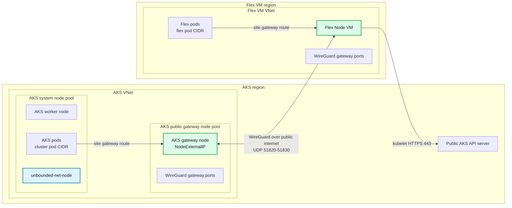

# Public AKS Cluster With Unbounded-Net WireGuard Flex Node

This guide shows how to create a public AKS cluster with no built-in CNI, install `unbounded-net`, join a Flex Node from a separate Azure VNet without VNet peering, and use WireGuard gateway connectivity for pod traffic between AKS nodes and Flex Nodes.

The validated shape is intentionally different from the private-L3 lab:

- The AKS API server is public.
- The AKS VNet and Flex VM VNet are not peered.
- `unbounded-net` provides CNI on AKS and Flex nodes.
- Cross-site pod traffic uses WireGuard through gateway pools over public IPs.

This lab focuses on kubelet-to-API-server join traffic and pod-to-pod connectivity. Kubernetes API server callbacks to the Flex kubelet, such as `kubectl logs`, `kubectl exec`, and `kubectl port-forward`, still require API-server-to-kubelet network reachability and may need separate routing or proxy support.

For unbounded-net architecture details, see the [Unbounded networking architecture](https://unbounded-cloud.io/reference/networking/architecture/), [routing flows](https://unbounded-cloud.io/reference/networking/routing-flows/), and [custom resources](https://unbounded-cloud.io/reference/networking/custom-resources/).

> Review note: this draft uses a lab-only `kubectl patch node --subresource=status` step to publish the Flex VM public IP as a Kubernetes `ExternalIP`. `unbounded-net` external gateway pools discover gateway endpoints from `Node.status.addresses`. For production, prefer a cloud/provider integration or another controller that maintains Flex Node external addresses.

## What Is Unbounded-Net Doing Here?

`unbounded-net` provides the CNI and cross-site pod routing layer. In this setup:

- AKS nodes and Flex Nodes are assigned to different `Site` resources based on their private node CIDRs.
- Each site receives its own pod CIDR pool.
- A public AKS gateway node pool is selected by an AKS `GatewayPool`.
- The Flex Node is selected by a Flex `GatewayPool`.
- `SiteGatewayPoolAssignment` resources tell each site which gateway pool serves it.
- A `GatewayPoolPeering` connects the AKS and Flex gateway pools.
- Because the gateway pools are external and the sites are not network-peered, unbounded-net resolves the cross-site links to WireGuard.

## Topology



Example regions and CIDRs used below:

- AKS region: `eastus2`
- Flex VM region: `southcentralus`
- AKS VNet: `10.81.0.0/16`
- AKS subnet: `10.81.1.0/24`
- Flex VM VNet: `10.82.0.0/16`
- Flex VM subnet: `10.82.1.0/24`
- AKS pod CIDR: `10.83.0.0/16`
- AKS service CIDR: `10.84.0.0/16`
- AKS DNS service IP: `10.84.0.10`
- Flex pod CIDR: `10.85.0.0/16`

Avoid CIDR overlap across the AKS VNet, Flex VNet, AKS pod CIDR, Flex pod CIDR, AKS service CIDR, and any connected networks.

## Create Resource Groups And Networks

```bash
SUBSCRIPTION_ID="<subscription-id>"
AKS_RG="<aks-resource-group>"
VM_RG="<vm-resource-group>"
AKS_REGION="eastus2"
VM_REGION="southcentralus"
AKS_VNET="aks-public-unbounded-vnet"
FLEX_VNET="flex-public-unbounded-vnet"

az account set --subscription "$SUBSCRIPTION_ID"

az group create -n "$AKS_RG" -l "$AKS_REGION"
az group create -n "$VM_RG" -l "$VM_REGION"

az network vnet create \
  -g "$AKS_RG" \
  -n "$AKS_VNET" \
  -l "$AKS_REGION" \
  --address-prefixes 10.81.0.0/16 \
  --subnet-name aks-subnet \
  --subnet-prefixes 10.81.1.0/24

az network vnet create \
  -g "$VM_RG" \
  -n "$FLEX_VNET" \
  -l "$VM_REGION" \
  --address-prefixes 10.82.0.0/16 \
  --subnet-name flex-subnet \
  --subnet-prefixes 10.82.1.0/24
```

Do not create VNet peering between these VNets. Cross-site pod traffic will use WireGuard through unbounded-net gateway pools.

## Create A Public No-CNI AKS Cluster

```bash
CLUSTER_NAME="<aks-cluster-name>"
AKS_SUBNET_ID=$(az network vnet subnet show \
  -g "$AKS_RG" \
  --vnet-name "$AKS_VNET" \
  -n aks-subnet \
  --query id \
  -o tsv)

az aks create \
  -g "$AKS_RG" \
  -n "$CLUSTER_NAME" \
  -l "$AKS_REGION" \
  --vnet-subnet-id "$AKS_SUBNET_ID" \
  --network-plugin none \
  --pod-cidr 10.83.0.0/16 \
  --service-cidr 10.84.0.0/16 \
  --dns-service-ip 10.84.0.10 \
  --node-count 1 \
  --node-vm-size Standard_D4s_v5 \
  --generate-ssh-keys
```

The AKS node starts `NotReady` until `unbounded-net` writes the CNI configuration and allocates a pod CIDR.

Fetch credentials:

```bash
az aks get-credentials -g "$AKS_RG" -n "$CLUSTER_NAME" --overwrite-existing --admin
kubectl get nodes -o wide
```

## Add A Public AKS Gateway Node Pool

Create a small AKS node pool whose instances have public IPs. unbounded-net uses these public IPs as WireGuard endpoints for cross-site traffic.

```bash
az aks nodepool add \
  -g "$AKS_RG" \
  --cluster-name "$CLUSTER_NAME" \
  -n pubgw \
  --mode User \
  --node-count 1 \
  --node-vm-size Standard_D4s_v5 \
  --vnet-subnet-id "$AKS_SUBNET_ID" \
  --enable-node-public-ip \
  --labels net.unbounded-cloud.io/gateway=aks-public
```

Verify that the gateway node has an external IP:

```bash
kubectl get nodes -l net.unbounded-cloud.io/gateway=aks-public -o wide
```

## Allow WireGuard UDP Traffic

unbounded-net gateway traffic uses WireGuard UDP ports. Allow inbound UDP `51820-51830` to the AKS gateway nodes and to the Flex VM.

For the Flex VM VNet, create an NSG rule after the VM NSG exists in a later step. For AKS, locate the node resource group and review the generated NSG before adding the rule:

```bash
NODE_RG=$(az aks show -g "$AKS_RG" -n "$CLUSTER_NAME" --query nodeResourceGroup -o tsv)
az network nsg list -g "$NODE_RG" -o table
```

If the AKS node subnet or NIC NSG does not already allow the WireGuard ports, add an inbound allow rule to the appropriate NSG:

```bash
AKS_NSG_NAME="<aks-node-nsg-name>"

az network nsg rule create \
  -g "$NODE_RG" \
  --nsg-name "$AKS_NSG_NAME" \
  -n AllowUnboundedWireGuard \
  --priority 1200 \
  --direction Inbound \
  --access Allow \
  --protocol Udp \
  --source-address-prefixes Internet \
  --source-port-ranges '*' \
  --destination-port-ranges 51820-51830
```

## Install Unbounded-Net

Render and apply `unbounded-net` manifests. This installs the controller and the `unbounded-net-node` DaemonSet.

```bash
# Check the latest release tag at https://github.com/Azure/unbounded/releases.
UNBOUNDED_VERSION="v0.1.10"

git clone --depth 1 --branch "$UNBOUNDED_VERSION" \
  https://github.com/Azure/unbounded.git /tmp/unbounded

cd /tmp/unbounded
make VERSION="$UNBOUNDED_VERSION" net-manifests

kubectl apply --server-side --force-conflicts -f deploy/net/rendered/00-namespace.yaml
kubectl apply --server-side --force-conflicts -f deploy/net/rendered/01-configmap.yaml
kubectl apply --server-side --force-conflicts -f deploy/net/rendered/crd/
kubectl apply --server-side --force-conflicts -f deploy/net/rendered/controller/
kubectl apply --server-side --force-conflicts -f deploy/net/rendered/node/
```

Wait for the controller and node agent:

```bash
kubectl -n unbounded-net rollout status deploy/unbounded-net-controller --timeout=5m
kubectl -n unbounded-net rollout status ds/unbounded-net-node --timeout=5m
```

## Create Sites And Gateway Pools

Create one site for AKS nodes and one site for Flex Nodes. The AKS site has nodes immediately; the Flex site gets nodes after the Flex VM joins.

```bash
kubectl apply -f - <<'EOF'
apiVersion: net.unbounded-cloud.io/v1alpha1
kind: Site
metadata:
  name: aks-public
spec:
  nodeCidrs:
  - 10.81.0.0/16
  podCidrAssignments:
  - assignmentEnabled: true
    cidrBlocks:
    - 10.83.0.0/16
  manageCniPlugin: true
---
apiVersion: net.unbounded-cloud.io/v1alpha1
kind: Site
metadata:
  name: flex-public
spec:
  nodeCidrs:
  - 10.82.0.0/16
  podCidrAssignments:
  - assignmentEnabled: true
    cidrBlocks:
    - 10.85.0.0/16
  manageCniPlugin: true
---
apiVersion: net.unbounded-cloud.io/v1alpha1
kind: GatewayPool
metadata:
  name: aks-public-gw
spec:
  type: External
  nodeSelector:
    net.unbounded-cloud.io/gateway: aks-public
  tunnelProtocol: WireGuard
---
apiVersion: net.unbounded-cloud.io/v1alpha1
kind: GatewayPool
metadata:
  name: flex-public-gw
spec:
  type: External
  nodeSelector:
    net.unbounded-cloud.io/gateway: flex-public
  tunnelProtocol: WireGuard
---
apiVersion: net.unbounded-cloud.io/v1alpha1
kind: SiteGatewayPoolAssignment
metadata:
  name: aks-public-gw-assignment
spec:
  sites:
  - aks-public
  gatewayPools:
  - aks-public-gw
  tunnelProtocol: WireGuard
---
apiVersion: net.unbounded-cloud.io/v1alpha1
kind: SiteGatewayPoolAssignment
metadata:
  name: flex-public-gw-assignment
spec:
  sites:
  - flex-public
  gatewayPools:
  - flex-public-gw
  tunnelProtocol: WireGuard
---
apiVersion: net.unbounded-cloud.io/v1alpha1
kind: GatewayPoolPeering
metadata:
  name: aks-flex-public-wireguard
spec:
  gatewayPools:
  - aks-public-gw
  - flex-public-gw
  tunnelProtocol: WireGuard
EOF
```

Verify the AKS site and gateway pool:

```bash
kubectl get sites,sitenodeslices,gatewaypools,sitegatewaypoolassignments,gatewaypoolpeerings -o wide
kubectl get nodes -L net.unbounded-cloud.io/site,net.unbounded-cloud.io/gateway -o wide
```

The `aks-public-gw` pool should show at least one node after the AKS gateway node has a WireGuard public key annotation.

## Create The Flex VM

```bash
VM_NAME="<flex-vm-name>"

az vm create \
  -g "$VM_RG" \
  -n "$VM_NAME" \
  -l "$VM_REGION" \
  --image Ubuntu2404 \
  --size Standard_D4s_v5 \
  --vnet-name "$FLEX_VNET" \
  --subnet flex-subnet \
  --admin-username azureuser \
  --generate-ssh-keys \
  --public-ip-sku Standard
```

Get the VM IPs:

```bash
VM_PRIVATE_IP=$(az vm show -g "$VM_RG" -n "$VM_NAME" --show-details --query privateIps -o tsv)
VM_PUBLIC_IP=$(az vm show -g "$VM_RG" -n "$VM_NAME" --show-details --query publicIps -o tsv)

echo "private=${VM_PRIVATE_IP} public=${VM_PUBLIC_IP}"
```

Allow WireGuard inbound to the Flex VM NSG:

```bash
FLEX_NSG_NAME=$(az network nsg list -g "$VM_RG" --query '[0].name' -o tsv)

az network nsg rule create \
  -g "$VM_RG" \
  --nsg-name "$FLEX_NSG_NAME" \
  -n AllowUnboundedWireGuard \
  --priority 1200 \
  --direction Inbound \
  --access Allow \
  --protocol Udp \
  --source-address-prefixes Internet \
  --source-port-ranges '*' \
  --destination-port-ranges 51820-51830
```

## Generate Bootstrap Config

Use the config helper from this repository. By default, the installer resolves the latest GitHub release. Set `AKS_FLEX_NODE_VERSION` only when you want to use a specific release tag.

```bash
# Optional: uncomment to use a specific release tag.
# AKS_FLEX_NODE_VERSION="<release-tag>"

curl -fsSLo ./aks-flex-config \
  "https://raw.githubusercontent.com/Azure/AKSFlexNode/${AKS_FLEX_NODE_VERSION:-main}/scripts/aks-flex-config"
chmod +x ./aks-flex-config

./aks-flex-config setup-node-rbac \
  --resource-group "$AKS_RG" \
  --cluster-name "$CLUSTER_NAME" \
  --subscription "$SUBSCRIPTION_ID"

./aks-flex-config generate-node-config \
  --resource-group "$AKS_RG" \
  --cluster-name "$CLUSTER_NAME" \
  --subscription "$SUBSCRIPTION_ID" \
  --bootstrap-token \
  --output ./aks-flex-node-config.json
```

Patch the rendered config so kubelet advertises the Flex VM private IP and uses the AKS DNS service IP:

```bash
jq \
  --arg nodeIP "$VM_PRIVATE_IP" \
  '.node.kubelet.nodeIP = $nodeIP
   | .node.kubelet.dnsServiceIP = "10.84.0.10"' \
  ./aks-flex-node-config.json > ./aks-flex-node-config.json.tmp
mv ./aks-flex-node-config.json.tmp ./aks-flex-node-config.json
```

Before copying the config to the Flex VM, verify that the config references a bootstrap token secret that exists in the cluster:

```bash
TOKEN_ID=$(python3 -c 'import json; print(json.load(open("./aks-flex-node-config.json"))["azure"]["bootstrapToken"]["token"].split(".")[0])')
kubectl get secret -n kube-system "bootstrap-token-${TOKEN_ID}"
```

## Install AKS Flex Node On The VM

Copy the generated config:

```bash
scp ./aks-flex-node-config.json azureuser@"$VM_PUBLIC_IP":/tmp/aks-flex-node-config.json
```

Install `aks-flex-node` and place the config:

```bash
ssh azureuser@"$VM_PUBLIC_IP"

sudo su

# Optional: uncomment to use a specific release tag.
# AKS_FLEX_NODE_VERSION="<release-tag>"

curl -fsSL "https://raw.githubusercontent.com/Azure/AKSFlexNode/${AKS_FLEX_NODE_VERSION:-main}/scripts/install.sh" \
  | AKS_FLEX_NODE_VERSION="${AKS_FLEX_NODE_VERSION:-}" bash

umask 077
mkdir -p /etc/aks-flex-node
cp /tmp/aks-flex-node-config.json /etc/aks-flex-node/config.json
chmod 600 /etc/aks-flex-node/config.json

aks-flex-node version
aks-flex-node start --config /etc/aks-flex-node/config.json
```

Return to your workstation shell after the node starts.

## Publish The Flex Gateway Endpoint

Label the Flex Node so the `flex-public-gw` `GatewayPool` selects it:

```bash
kubectl label node "$VM_NAME" net.unbounded-cloud.io/gateway=flex-public --overwrite
```

For this lab, patch the Flex Node status with the VM public IP so the external gateway pool can advertise a WireGuard endpoint:

```bash
ADDRESSES=$(kubectl get node "$VM_NAME" -o json | jq --arg ip "$VM_PUBLIC_IP" '
  .status.addresses
  | if any(.type == "ExternalIP" and .address == $ip) then .
    else . + [{"type":"ExternalIP","address":$ip}]
    end
')

kubectl patch node "$VM_NAME" \
  --subresource=status \
  --type=merge \
  -p "{\"status\":{\"addresses\":${ADDRESSES}}}"
```

Verify that the Flex Node has the expected site, gateway label, WireGuard public key annotation, and external IP:

```bash
kubectl get node "$VM_NAME" \
  -L net.unbounded-cloud.io/site,net.unbounded-cloud.io/gateway \
  -o wide

kubectl get node "$VM_NAME" -o jsonpath='{.metadata.annotations.net\.unbounded-cloud\.io/wg-pubkey}{"\n"}'
kubectl get node "$VM_NAME" -o jsonpath='{range .status.addresses[*]}{.type}={.address}{"\n"}{end}'
```

If kubelet later overwrites the `ExternalIP`, re-run the status patch. That is why the manual patch is appropriate only for this lab.

## Verify WireGuard Gateway Connectivity

Check the unbounded-net resources:

```bash
kubectl get sites,sitenodeslices,gatewaypools,sitegatewaypoolassignments,gatewaypoolpeerings -o wide
kubectl get gatewaypool aks-public-gw flex-public-gw -o yaml
```

Expected high-level result:

```text
gatewaypool.net.unbounded-cloud.io/aks-public-gw    ...   NODES   1
gatewaypool.net.unbounded-cloud.io/flex-public-gw   ...   NODES   1
gatewaypoolpeering.net.unbounded-cloud.io/aks-flex-public-wireguard   ...
```

Check the node agents:

```bash
kubectl -n unbounded-net get pods -o wide
kubectl -n unbounded-net logs -l app=unbounded-net-node --tail=100
```

On the Flex VM, inspect WireGuard and routes:

```bash
ssh azureuser@"$VM_PUBLIC_IP"

sudo wg show
sudo ip link show unbounded0
sudo ip route | grep -E '10\.83\.|10\.85\.|unbounded0|wg'
```

## Verify Pods Across Sites

Check nodes and pod CIDRs:

```bash
kubectl get nodes -o wide
kubectl get nodes -o custom-columns=NAME:.metadata.name,SITE:.metadata.labels.net\.unbounded-cloud\.io/site,PODCIDR:.spec.podCIDR,INTERNAL:.status.addresses[?\(@.type=="InternalIP"\)].address,EXTERNAL:.status.addresses[?\(@.type=="ExternalIP"\)].address
```

Create a test pod on the Flex Node:

```bash
kubectl run flex-wireguard-smoke \
  --image=busybox:1.36 \
  --restart=Never \
  --overrides='{"spec":{"nodeSelector":{"kubernetes.io/hostname":"'"$VM_NAME"'"},"tolerations":[{"operator":"Exists"}]}}' \
  --command -- sh -c 'sleep 3600'

kubectl wait --for=condition=Ready pod/flex-wireguard-smoke --timeout=180s
```

Create a test pod on an AKS node:

```bash
AKS_NODE=$(kubectl get nodes -l net.unbounded-cloud.io/site=aks-public -o jsonpath='{.items[0].metadata.name}')

kubectl run aks-wireguard-smoke \
  --image=busybox:1.36 \
  --restart=Never \
  --overrides='{"spec":{"nodeSelector":{"kubernetes.io/hostname":"'"$AKS_NODE"'"},"tolerations":[{"operator":"Exists"}]}}' \
  --command -- sh -c 'sleep 3600'

kubectl wait --for=condition=Ready pod/aks-wireguard-smoke --timeout=180s
```

Verify pod-to-pod traffic in both directions:

```bash
FLEX_POD_IP=$(kubectl get pod flex-wireguard-smoke -o jsonpath='{.status.podIP}')
AKS_POD_IP=$(kubectl get pod aks-wireguard-smoke -o jsonpath='{.status.podIP}')

kubectl exec aks-wireguard-smoke -- ping -c 3 "$FLEX_POD_IP"
kubectl exec flex-wireguard-smoke -- ping -c 3 "$AKS_POD_IP"
```

Clean up the test pods:

```bash
kubectl delete pod aks-wireguard-smoke flex-wireguard-smoke --wait=false
```

## Troubleshooting

Check whether gateway pools have nodes and external IPs:

```bash
kubectl get gatewaypool aks-public-gw flex-public-gw -o jsonpath='{range .items[*]}{.metadata.name}{"\n"}{range .status.nodes[*]}  {.name} external={.externalIPs} wg={.wireGuardPublicKey}{"\n"}{end}{end}'
```

If a gateway pool has no nodes:

- Confirm the target node has the gateway label selected by the pool.
- Confirm the node has `net.unbounded-cloud.io/wg-pubkey` annotation.
- Confirm external gateway nodes have a `NodeExternalIP` address.

Check WireGuard NSG reachability:

```bash
nc -vzu <gateway-public-ip> 51820
```

UDP checks are not always conclusive, but blocked NSG rules are a common cause of missing handshakes.

Check unbounded-net node logs on the gateway nodes:

```bash
kubectl -n unbounded-net get pods -o wide
kubectl -n unbounded-net logs <unbounded-net-node-pod-on-gateway> --tail=200
```

Check the Flex agent and nspawn worker:

```bash
systemctl status aks-flex-node-agent
machinectl list
systemctl status systemd-nspawn@kube1
journalctl -M kube1 -u kubelet -f
```

If the Flex Node is `Ready` but pod traffic fails:

- Verify the Flex Node's `ExternalIP` status patch is still present.
- Verify both gateway pools have status nodes.
- Verify `GatewayPoolPeering` exists and includes both pools.
- Verify UDP `51820-51830` is allowed on both AKS gateway and Flex VM NSGs.
- Verify routes for the remote pod CIDR point at `unbounded0` or WireGuard interfaces.
