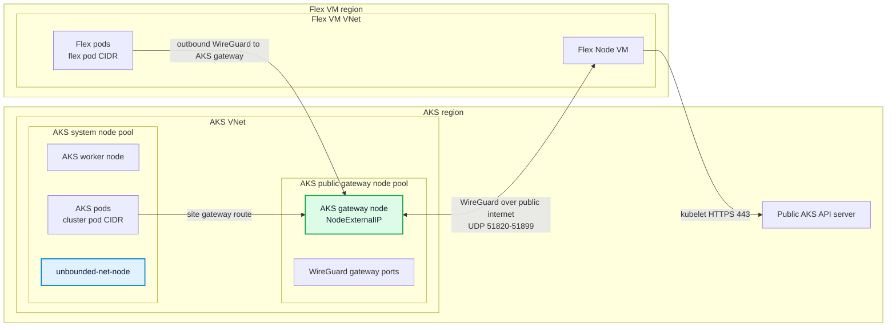

# Public AKS Cluster With Unbounded-Net WireGuard Flex Node

This guide shows how to create a public AKS cluster with no built-in CNI, install `unbounded-net`, join a Flex Node from a separate Azure VNet without VNet peering, and use a public AKS gateway pool for WireGuard connectivity.

The validated shape is intentionally different from the private-L3 lab:

- The AKS API server is public.
- The AKS VNet and Flex VM VNet are not peered.
- `unbounded-net` provides CNI on AKS and Flex nodes.
- Cross-site pod traffic uses WireGuard through a public AKS gateway pool.

This lab focuses on kubelet-to-API-server join traffic and pod-to-pod connectivity. Kubernetes API server callbacks to the Flex kubelet, such as `kubectl logs`, `kubectl exec`, and `kubectl port-forward`, still require API-server-to-kubelet network reachability and may need separate routing or proxy support.

For unbounded-net architecture details, see the [Unbounded networking architecture](https://unbounded-cloud.io/reference/networking/architecture/), [routing flows](https://unbounded-cloud.io/reference/networking/routing-flows/), and [custom resources](https://unbounded-cloud.io/reference/networking/custom-resources/). The cluster shape is a no-CNI AKS cluster plus a dedicated AKS gateway node pool with per-node public IPs and WireGuard host ports open.

## Prerequisites

- Azure CLI logged in to the target subscription.
- `kubectl`, `curl`, `git`, `make`, `jq`, `python3`, and SSH/SCP tooling on the workstation that will run the lab commands.

## What Is Unbounded-Net Doing Here?

`unbounded-net` provides the CNI and cross-site pod routing layer. In this setup:

- AKS nodes and Flex Nodes are assigned to different `Site` resources based on their private node CIDRs.
- Each site receives its own pod CIDR pool.
- A public AKS gateway node pool is selected by a single `GatewayPool`.
- `SiteGatewayPoolAssignment` resources link both the AKS site and Flex site to that gateway pool.
- Flex nodes establish outbound WireGuard tunnels to AKS gateway public IPs.
- Because the gateway pool is external and the sites are not network-peered, unbounded-net resolves those links to WireGuard.

## Topology



Example regions and CIDRs used below:

- AKS region: `eastus2`
- Flex VM region: `southcentralus`
- AKS VNet: `10.81.0.0/16`
- AKS subnet: `10.81.1.0/24`
- Flex VM VNet: `10.82.0.0/16`
- Flex VM subnet: `10.82.1.0/24`
- AKS pod CIDR: `10.83.0.0/16`
- AKS service CIDR: `10.84.0.0/16`
- AKS DNS service IP: `10.84.0.10`
- Flex pod CIDR: `10.85.0.0/16`

Avoid CIDR overlap across the AKS VNet, Flex VNet, AKS pod CIDR, Flex pod CIDR, AKS service CIDR, and any connected networks.

## Create Resource Groups And Networks

```bash
SUBSCRIPTION_ID="<subscription-id>"
AKS_RG="<aks-resource-group>"
VM_RG="<vm-resource-group>"
AKS_REGION="eastus2"
VM_REGION="southcentralus"
AKS_VNET="aks-public-unbounded-vnet"
FLEX_VNET="flex-public-unbounded-vnet"
AGENT_POOL_NAME="${AGENT_POOL_NAME:-aksflexnodes}"

az account set --subscription "$SUBSCRIPTION_ID"

az group create -n "$AKS_RG" -l "$AKS_REGION"
az group create -n "$VM_RG" -l "$VM_REGION"

az network vnet create \
  -g "$AKS_RG" \
  -n "$AKS_VNET" \
  -l "$AKS_REGION" \
  --address-prefixes 10.81.0.0/16 \
  --subnet-name aks-subnet \
  --subnet-prefixes 10.81.1.0/24

az network vnet create \
  -g "$VM_RG" \
  -n "$FLEX_VNET" \
  -l "$VM_REGION" \
  --address-prefixes 10.82.0.0/16 \
  --subnet-name flex-subnet \
  --subnet-prefixes 10.82.1.0/24
```

Do not create VNet peering between these VNets. Cross-site pod traffic will use WireGuard through unbounded-net gateway pools.

Some environments apply platform or policy-managed network security rules to new VNets or subnets. In practice this can appear as an NSG with `NRMS-...` rules on the subnet. Those policy-managed rules can block WireGuard even when the AKS node pool is created with allowed host ports. The steps below add explicit WireGuard allow rules to any NSG attached to the AKS and Flex subnets; re-run them if policy adds, replaces, or updates NRMS rules later.

## Create A Public No-CNI AKS Cluster

```bash
CLUSTER_NAME="<aks-cluster-name>"
AKS_SUBNET_ID=$(az network vnet subnet show \
  -g "$AKS_RG" \
  --vnet-name "$AKS_VNET" \
  -n aks-subnet \
  --query id \
  -o tsv)

az aks create \
  -g "$AKS_RG" \
  -n "$CLUSTER_NAME" \
  -l "$AKS_REGION" \
  --vnet-subnet-id "$AKS_SUBNET_ID" \
  --network-plugin none \
  --pod-cidr 10.83.0.0/16 \
  --service-cidr 10.84.0.0/16 \
  --dns-service-ip 10.84.0.10 \
  --node-count 1 \
  --node-vm-size Standard_D4s_v5 \
  --generate-ssh-keys
```

The AKS node starts `NotReady` until `unbounded-net` writes the CNI configuration and allocates a pod CIDR.

Fetch credentials:

```bash
az aks get-credentials -g "$AKS_RG" -n "$CLUSTER_NAME" --overwrite-existing --admin
kubectl get nodes -o wide
```

## Add A Public AKS Gateway Node Pool

Create a small AKS node pool whose instances have public IPs. unbounded-net uses these public IPs as WireGuard endpoints for cross-site traffic.

```bash
az aks nodepool add \
  -g "$AKS_RG" \
  --cluster-name "$CLUSTER_NAME" \
  -n pubgw \
  --mode User \
  --node-count 1 \
  --node-vm-size Standard_D4s_v5 \
  --vnet-subnet-id "$AKS_SUBNET_ID" \
  --enable-node-public-ip \
  --allowed-host-ports 51820-51899/UDP \
  --labels net.unbounded-cloud.io/gateway=aks-public
```

Verify that the gateway node has an external IP:

```bash
kubectl get nodes -l net.unbounded-cloud.io/gateway=aks-public -o wide
```

The `--allowed-host-ports 51820-51899/UDP` setting creates the node pool with the WireGuard gateway ports exposed.

Allow WireGuard on every AKS-side NSG that can affect the gateway node pool, including the AKS subnet NSG and the AKS-managed node resource group NSG:

```bash
NODE_RG=$(az aks show \
  -g "$AKS_RG" \
  -n "$CLUSTER_NAME" \
  --query nodeResourceGroup \
  -o tsv)

AKS_SUBNET_NSG_ID=$(az network vnet subnet show \
  -g "$AKS_RG" \
  --vnet-name "$AKS_VNET" \
  -n aks-subnet \
  --query networkSecurityGroup.id \
  -o tsv)

AKS_AGENT_NSG=$(az network nsg list \
  -g "$NODE_RG" \
  --query '[0].name' \
  -o tsv)

if [ -n "$AKS_SUBNET_NSG_ID" ]; then
  AKS_SUBNET_NSG="${AKS_SUBNET_NSG_ID##*/}"
  az network nsg rule create \
    -g "$AKS_RG" \
    --nsg-name "$AKS_SUBNET_NSG" \
    -n AllowUnboundedWireGuardFromInternet \
    --priority 100 \
    --direction Inbound \
    --access Allow \
    --protocol Udp \
    --source-address-prefixes Internet \
    --source-port-ranges '*' \
    --destination-port-ranges 51820-51899 || true
fi

if [ -n "$AKS_AGENT_NSG" ]; then
  az network nsg rule create \
    -g "$NODE_RG" \
    --nsg-name "$AKS_AGENT_NSG" \
    -n AllowUnboundedWireGuardFromInternet \
    --priority 100 \
    --direction Inbound \
    --access Allow \
    --protocol Udp \
    --source-address-prefixes Internet \
    --source-port-ranges '*' \
    --destination-port-ranges 51820-51899 || true
fi
```

Allow WireGuard on every Flex-side NSG that can affect the Flex VM. If you create the Flex subnet before its NSG exists, re-run this after VM creation as well because Azure may create a NIC-level NSG:

```bash
FLEX_SUBNET_NSG_ID=$(az network vnet subnet show \
  -g "$VM_RG" \
  --vnet-name "$FLEX_VNET" \
  -n flex-subnet \
  --query networkSecurityGroup.id \
  -o tsv)

if [ -n "$FLEX_SUBNET_NSG_ID" ]; then
  FLEX_SUBNET_NSG="${FLEX_SUBNET_NSG_ID##*/}"
  az network nsg rule create \
    -g "$VM_RG" \
    --nsg-name "$FLEX_SUBNET_NSG" \
    -n AllowUnboundedWireGuardFromInternet \
    --priority 100 \
    --direction Inbound \
    --access Allow \
    --protocol Udp \
    --source-address-prefixes Internet \
    --source-port-ranges '*' \
    --destination-port-ranges 51820-51899 || true
fi
```

## Install Unbounded-Net

Render and apply `unbounded-net` manifests. This installs the controller and the `unbounded-net-node` DaemonSet.

```bash
# Check the latest release tag at https://github.com/Azure/unbounded/releases.
UNBOUNDED_VERSION="v0.1.10"

git clone --depth 1 --branch "$UNBOUNDED_VERSION" \
  https://github.com/Azure/unbounded.git /tmp/unbounded

cd /tmp/unbounded
make VERSION="$UNBOUNDED_VERSION" net-manifests

kubectl apply --server-side --force-conflicts -f deploy/net/rendered/00-namespace.yaml
kubectl apply --server-side --force-conflicts -f deploy/net/rendered/01-configmap.yaml
kubectl apply --server-side --force-conflicts -f deploy/net/rendered/crd/
kubectl apply --server-side --force-conflicts -f deploy/net/rendered/controller/
kubectl apply --server-side --force-conflicts -f deploy/net/rendered/node/
```

Wait for the controller and node agent:

```bash
kubectl -n unbounded-net rollout status deploy/unbounded-net-controller --timeout=5m
kubectl -n unbounded-net rollout status ds/unbounded-net-node --timeout=5m
```

## Create Sites And The AKS Gateway Pool

Create one site for AKS nodes, one site for Flex Nodes, and one AKS gateway pool. Both sites are assigned to the AKS gateway pool.

```bash
kubectl apply -f - <<'EOF'
apiVersion: net.unbounded-cloud.io/v1alpha1
kind: Site
metadata:
  name: aks-site
spec:
  nodeCidrs:
  - 10.81.0.0/16
  podCidrAssignments:
  - assignmentEnabled: true
    cidrBlocks:
    - 10.83.0.0/16
  manageCniPlugin: true
---
apiVersion: net.unbounded-cloud.io/v1alpha1
kind: Site
metadata:
  name: flex-site
spec:
  nodeCidrs:
  - 10.82.0.0/16
  podCidrAssignments:
  - assignmentEnabled: true
    cidrBlocks:
    - 10.85.0.0/16
  manageCniPlugin: true
---
apiVersion: net.unbounded-cloud.io/v1alpha1
kind: GatewayPool
metadata:
  name: aks-gw
spec:
  type: External
  nodeSelector:
    net.unbounded-cloud.io/gateway: aks-public
  tunnelProtocol: WireGuard
---
apiVersion: net.unbounded-cloud.io/v1alpha1
kind: SiteGatewayPoolAssignment
metadata:
  name: aks-gw-assignment
spec:
  sites:
  - aks-site
  gatewayPools:
  - aks-gw
  tunnelProtocol: WireGuard
---
apiVersion: net.unbounded-cloud.io/v1alpha1
kind: SiteGatewayPoolAssignment
metadata:
  name: flex-gw-assignment
spec:
  sites:
  - flex-site
  gatewayPools:
  - aks-gw
  tunnelProtocol: WireGuard
EOF
```

Verify the AKS site and gateway pool:

```bash
kubectl get sites,sitenodeslices,gatewaypools,sitegatewaypoolassignments,gatewaypoolpeerings -o wide
kubectl get nodes -L net.unbounded-cloud.io/site,net.unbounded-cloud.io/gateway -o wide
```

The `aks-gw` pool should show at least one node after the AKS gateway node has a WireGuard public key annotation.

## Create The Flex VM

```bash
VM_NAME="<flex-vm-name>"

az vm create \
  -g "$VM_RG" \
  -n "$VM_NAME" \
  -l "$VM_REGION" \
  --image Ubuntu2404 \
  --size Standard_D4s_v5 \
  --vnet-name "$FLEX_VNET" \
  --subnet flex-subnet \
  --admin-username azureuser \
  --generate-ssh-keys \
  --public-ip-sku Standard
```

Get the VM IPs:

```bash
VM_PRIVATE_IP=$(az vm show -g "$VM_RG" -n "$VM_NAME" --show-details --query privateIps -o tsv)
VM_PUBLIC_IP=$(az vm show -g "$VM_RG" -n "$VM_NAME" --show-details --query publicIps -o tsv)

echo "private=${VM_PRIVATE_IP} public=${VM_PUBLIC_IP}"
```

If the VM has a NIC-level NSG, add the same WireGuard allow rule there:

```bash
FLEX_NIC_ID=$(az vm show \
  -g "$VM_RG" \
  -n "$VM_NAME" \
  --query 'networkProfile.networkInterfaces[0].id' \
  -o tsv)
FLEX_NIC_NAME="${FLEX_NIC_ID##*/}"

FLEX_NIC_NSG_ID=$(az network nic show \
  -g "$VM_RG" \
  -n "$FLEX_NIC_NAME" \
  --query networkSecurityGroup.id \
  -o tsv)

if [ -n "$FLEX_NIC_NSG_ID" ]; then
  FLEX_NIC_NSG="${FLEX_NIC_NSG_ID##*/}"
  az network nsg rule create \
    -g "$VM_RG" \
    --nsg-name "$FLEX_NIC_NSG" \
    -n AllowUnboundedWireGuardFromInternet \
    --priority 100 \
    --direction Inbound \
    --access Allow \
    --protocol Udp \
    --source-address-prefixes Internet \
    --source-port-ranges '*' \
    --destination-port-ranges 51820-51899 || true
fi
```

## Generate Bootstrap Config

Use the config helper from this repository. By default, the installer resolves the latest GitHub release. Set `AKS_FLEX_NODE_VERSION` only when you want to use a specific release tag.

```bash
# Optional: uncomment to use a specific release tag.
# AKS_FLEX_NODE_VERSION="<release-tag>"

curl -fsSLo ./aks-flex-config \
  "https://raw.githubusercontent.com/Azure/AKSFlexNode/${AKS_FLEX_NODE_VERSION:-main}/scripts/aks-flex-config"
chmod +x ./aks-flex-config

./aks-flex-config setup-node-rbac \
  --resource-group "$AKS_RG" \
  --cluster-name "$CLUSTER_NAME" \
  --subscription "$SUBSCRIPTION_ID"

./aks-flex-config generate-node-config \
  --resource-group "$AKS_RG" \
  --cluster-name "$CLUSTER_NAME" \
  --subscription "$SUBSCRIPTION_ID" \
  --agent-pool-name "$AGENT_POOL_NAME" \
  --bootstrap-token \
  --output ./aks-flex-node-config.json
```

Patch the rendered config so kubelet advertises the Flex VM private IP and uses the full Kubernetes patch version from AKS. The config helper reads the cluster DNS service IP from AKS metadata.

```bash
KUBERNETES_VERSION=$(az aks show \
  -g "$AKS_RG" \
  -n "$CLUSTER_NAME" \
  --query currentKubernetesVersion \
  -o tsv)

jq \
  --arg nodeIP "$VM_PRIVATE_IP" \
  --arg kubernetesVersion "$KUBERNETES_VERSION" \
  '.node.kubelet.nodeIP = $nodeIP
   | .kubernetes.version = $kubernetesVersion' \
  ./aks-flex-node-config.json > ./aks-flex-node-config.json.tmp
mv ./aks-flex-node-config.json.tmp ./aks-flex-node-config.json
```

Before copying the config to the Flex VM, verify that the config references a bootstrap token secret that exists in the cluster:

```bash
TOKEN_ID=$(python3 -c 'import json; print(json.load(open("./aks-flex-node-config.json"))["azure"]["bootstrapToken"]["token"].split(".")[0])')
kubectl get secret -n kube-system "bootstrap-token-${TOKEN_ID}"
```

## Install AKS Flex Node On The VM

Copy the generated config:

```bash
scp ./aks-flex-node-config.json azureuser@"$VM_PUBLIC_IP":/tmp/aks-flex-node-config.json
```

Install `aks-flex-node` and place the config:

```bash
ssh azureuser@"$VM_PUBLIC_IP"

sudo su

# Optional: uncomment to use a specific release tag.
# AKS_FLEX_NODE_VERSION="<release-tag>"

curl -fsSL "https://raw.githubusercontent.com/Azure/AKSFlexNode/${AKS_FLEX_NODE_VERSION:-main}/scripts/install.sh" \
  | AKS_FLEX_NODE_VERSION="${AKS_FLEX_NODE_VERSION:-}" bash

umask 077
mkdir -p /etc/aks-flex-node
cp /tmp/aks-flex-node-config.json /etc/aks-flex-node/config.json
chmod 600 /etc/aks-flex-node/config.json

aks-flex-node version
aks-flex-node start --config /etc/aks-flex-node/config.json
```

Return to your workstation shell after the node starts.

## Verify Flex Site Membership

Return to your workstation shell after the node starts. Verify that the Flex Node has joined, received the Flex site label, and has a WireGuard public key annotation:

```bash
kubectl get node "$VM_NAME" \
  -L net.unbounded-cloud.io/site \
  -o wide

kubectl get node "$VM_NAME" -o jsonpath='{.metadata.annotations.net\.unbounded-cloud\.io/wg-pubkey}{"\n"}'
kubectl get node "$VM_NAME" -o jsonpath='{range .status.addresses[*]}{.type}={.address}{"\n"}{end}'
```

## Verify WireGuard Gateway Connectivity

Check the unbounded-net resources:

```bash
kubectl get sites,sitenodeslices,gatewaypools,sitegatewaypoolassignments,gatewaypoolpeerings -o wide
kubectl get gatewaypool aks-gw -o yaml
```

Expected high-level result:

```text
gatewaypool.net.unbounded-cloud.io/aks-gw   ...   NODES   1
```

Check the node agents:

```bash
kubectl -n unbounded-net get pods -o wide
kubectl -n unbounded-net logs -l app=unbounded-net-node --tail=100
```

On the Flex VM, inspect WireGuard and routes:

```bash
ssh azureuser@"$VM_PUBLIC_IP"

sudo wg show
sudo ip link show unbounded0
sudo ip route | grep -E '10\.83\.|10\.85\.|unbounded0|wg'
```

## Verify Pods Across Sites

Check nodes and pod CIDRs:

```bash
kubectl get nodes -o wide
kubectl get nodes -o custom-columns=NAME:.metadata.name,SITE:.metadata.labels.net\.unbounded-cloud\.io/site,PODCIDR:.spec.podCIDR,INTERNAL:.status.addresses[?\(@.type=="InternalIP"\)].address,EXTERNAL:.status.addresses[?\(@.type=="ExternalIP"\)].address
```

Create a test pod on the Flex Node:

```bash
kubectl run flex-wireguard-smoke \
  --image=busybox:1.36 \
  --restart=Never \
  --overrides='{"spec":{"nodeSelector":{"kubernetes.io/hostname":"'"$VM_NAME"'"},"tolerations":[{"operator":"Exists"}]}}' \
  --command -- sh -c 'sleep 3600'

kubectl wait --for=condition=Ready pod/flex-wireguard-smoke --timeout=180s
```

Create a test pod on an AKS node:

```bash
AKS_NODE=$(kubectl get nodes -l net.unbounded-cloud.io/site=aks-site -o jsonpath='{.items[0].metadata.name}')

kubectl run aks-wireguard-smoke \
  --image=busybox:1.36 \
  --restart=Never \
  --overrides='{"spec":{"nodeSelector":{"kubernetes.io/hostname":"'"$AKS_NODE"'"},"tolerations":[{"operator":"Exists"}]}}' \
  --command -- sh -c 'sleep 3600'

kubectl wait --for=condition=Ready pod/aks-wireguard-smoke --timeout=180s
```

Verify pod-to-pod traffic in both directions:

```bash
FLEX_POD_IP=$(kubectl get pod flex-wireguard-smoke -o jsonpath='{.status.podIP}')
AKS_POD_IP=$(kubectl get pod aks-wireguard-smoke -o jsonpath='{.status.podIP}')

kubectl exec aks-wireguard-smoke -- ping -c 3 "$FLEX_POD_IP"
kubectl exec flex-wireguard-smoke -- ping -c 3 "$AKS_POD_IP"
```

Clean up the test pods:

```bash
kubectl delete pod aks-wireguard-smoke flex-wireguard-smoke --wait=false
```

## Troubleshooting

Check whether gateway pools have nodes and external IPs:

```bash
kubectl get gatewaypool aks-gw -o jsonpath='{.metadata.name}{"\n"}{range .status.nodes[*]}  {.name} external={.externalIPs} wg={.wireGuardPublicKey}{"\n"}{end}'
```

If a gateway pool has no nodes:

- Confirm the target node has the gateway label selected by the pool.
- Confirm the node has `net.unbounded-cloud.io/wg-pubkey` annotation.
- Confirm external gateway nodes have a `NodeExternalIP` address.

Check WireGuard NSG reachability:

```bash
nc -vzu <gateway-public-ip> 51820
```

UDP checks are not always conclusive, but blocked NSG rules are a common cause of missing handshakes. Check every effective NSG on the path, not just the AKS node resource group NSG.

Check unbounded-net node logs on the gateway nodes:

```bash
kubectl -n unbounded-net get pods -o wide
kubectl -n unbounded-net logs <unbounded-net-node-pod-on-gateway> --tail=200
```

Check the Flex agent and nspawn worker:

```bash
systemctl status aks-flex-node-agent
machinectl list
systemctl status systemd-nspawn@kube1
journalctl -M kube1 -u kubelet -f
```

If the Flex Node is `Ready` but pod traffic fails:

- Verify the AKS gateway pool has a status node.
- Verify UDP `51820-51899` is allowed on the AKS gateway node pool, the AKS subnet NSG, the Flex subnet NSG, and the Flex NIC NSG.
- Verify routes for the remote pod CIDR point at `unbounded0` or WireGuard interfaces.

## Platform-Managed NSG Notes

Some environments apply platform or policy-managed network security rules to subnets. In the environment used to validate this lab, the AKS subnet had an NSG containing `NRMS-...` rules in addition to the AKS node resource group NSG.

This lab was validated in an environment where the AKS gateway node pool was created correctly with `--allowed-host-ports 51820-51899/UDP`, and the AKS node resource group NSG contained the expected generated allow rule. WireGuard still did not handshake because the AKS subnet's NRMS-policy NSG did not allow UDP `51820-51899`.

Symptoms looked like this on the Flex Node:

```text
peer: <aks-gateway-public-key>
  endpoint: <aks-gateway-public-ip>:51820
  allowed ips: <aks-node-cidr>, <aks-pod-cidr>
  transfer: 0 B received, <bytes> sent
```

And on the AKS gateway:

```text
peer: <flex-public-key>
  allowed ips: <flex-node-ip>/32, <flex-pod-cidr>
  # no endpoint
  # no latest handshake
```

The fix was to add a high-priority allow rule for UDP `51820-51899` to the AKS subnet NSG containing the NRMS rules as well as the AKS node resource group NSG:

```bash
AKS_SUBNET_NSG_ID=$(az network vnet subnet show \
  -g "$AKS_RG" \
  --vnet-name "$AKS_VNET" \
  -n aks-subnet \
  --query networkSecurityGroup.id \
  -o tsv)

if [ -n "$AKS_SUBNET_NSG_ID" ]; then
  AKS_SUBNET_NSG="${AKS_SUBNET_NSG_ID##*/}"
  az network nsg rule create \
    -g "$AKS_RG" \
    --nsg-name "$AKS_SUBNET_NSG" \
    -n AllowUnboundedWireGuardFromInternet \
    --priority 100 \
    --direction Inbound \
    --access Allow \
    --protocol Udp \
    --source-address-prefixes Internet \
    --source-port-ranges '*' \
    --destination-port-ranges 51820-51899 || true
fi
```

After that rule was added, the Flex Node established a WireGuard handshake with the AKS gateway and AKS-to-Flex pod ping succeeded. Re-run the NSG checks if policy adds, replaces, or updates NRMS rules after the initial deployment.
